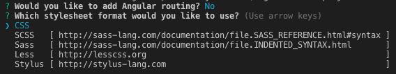
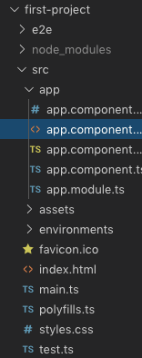
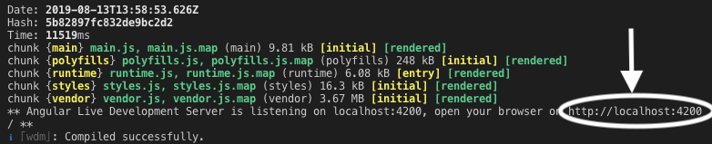

# Angular First Steps

The goal here is to create a minimum working template for a web page. It
will serve as a jumping-off point for your later exercises and studios,
so take as much time as you need to get comfortable with the basics.

## Starting a New Project

First, use the terminal to create a folder for all of your Angular
projects:

``` bash
$ mkdir angular_practice
```

Each new project you create will have its own folder inside this
container.

::: admonition
Note

You can use either the standalone Terminal application on your computer
or the built-in Terminal panel in VSCode.

For Angular projects, some programmers find it more convenient to work
entirely inside VSCode or another code editor. The IDEs provide a visual
tree for navigating between files and folders, and Angular generates
LOTS of these.
:::

Next, navigate into the new folder and create your first Angular
project.

``` bash
$ cd angular_practice
$ ng new my-project-name
```

This process will take some time, so be patient. You will also be
prompted twice:



Answer \"No\" to the routing question, and select the default \"CSS\"
for the stylesheet by pressing \"Enter\".

### Examine the Files Created



1.  The `src` folder holds the files and source code needed for the
    project.
2.  The `app` folder holds the content for the web page. Although the
    page is treated as a single entity, it actually consists of multiple
    pieces. `app` holds these different parts and establishes links
    between them. We will modify some of these files soon.
3.  `index.html` is the highest level for displaying content. Anything
    added to this HTML file will appear on every page within a website.
4.  `main.ts` imports the core methods required to make everything work.
    It also imports the content from the `app` folder.
5.  `styles.css` holds the global style settings for the entire website.

### What To Ignore

For every new project, Angular automatically sets up the code to make
the different parts communicate with each other. As your skills grow
during your career, you may need to learn how to modify these files. For
now, however, leave the following alone:

1.  `main.ts`, `test.ts`, and `polyfills.ts`. No touch!
2.  The `e2e`, `node_modules`, and `environments` folders. No touch!
3.  `.json` files. No touch!

The `assets` folder is a \"Maybe touch\". It holds user defined files
that support a project. Examples include JavaScript code, images, gifs,
or video clips. The exercises in the next chapter will use files stored
in this folder, but we will leave it empty for this lesson.

## Launch the Page

`ng new` creates all of the files required to launch a functioning web
page. You have not added any content yet, but Angular provides a
standard starting point that allows you to check if everything works.

Before sending an Angular project out into the world, you should preview
it *locally* in a browser. Any changes you make to the project files
will be reflected only on your screen, so you can play around with the
code without worry.

::: admonition
Note

Even though you view your work in a browser, \"local\" means no one else
can access your webpage, since it is stored on your computer. If you
want to share your local page with someone else, they will have to look
over your shoulder.
:::

To *launch* your new webpage, use the Terminal to navigate into the
project folder, then enter the command `ng serve`.

``` bash
$ cd my-project-name
$ ng serve
```

Be prepared to wait\... The compiler requires some time to build and
deploy even small projects, and it may be a few moments before you see
any action in the terminal. If no errors occur, a \"Compiled
successfully\" message eventually appears.

The important part of this feedback is the `localhost` line, which
provides a URL for viewing your work in a browser. Copy the URL and
paste it into the address bar of your web browser (Mac shortcut:
command-click automatically opens the URL in your default browser).



### What is `ng serve` Doing?

`ng serve` allows you to view your project in a browser by running a
series of tasks in the background. It\'s NOT magic, just the tedious
mechanics that you don\'t need to set up yourself.

`ng serve` performs these tasks:

1.  Compiles and analyzes your Angular files to *build* HTML and
    JavaScript files that can be run in a browser.
    a.  This step will throw errors if you try to serve code that
        contains syntax or other errors.
    b.  You will learn more about the different types of files that are
        compiled in the coming sections.
2.  Starts a web server on your computer that serves the built version
    of your Angular project.
    a.  Your Angular project is viewable at the web address
        <http://localhost:4200>

::: admonition
Note

Angular projects are written in TypeScript. Your web browser can run
HTML, CSS, and JavaScript. In order for your Angular project to run in
the browser, the TypeScript code has to be converted into JavaScript.
The conversion from TypeScript to JavaScript happens during the build
phase of `ng serve.`
:::

## Yay! A Webpage!

Congratulations! You have a functioning webpage. You should see the
following in your browser:


This is the default format created by `ng new`, but your chosen project
name will replace `my-project-name` in the title. The links lead back to
selected pages from the [angular.io](https://angular.io/) documentation.

Feel free to play around a little bit before continuing. Do not worry
about breaking anything. If necessary, you can always start another new
project.

### Try It {#try-it-Angular-intro}

In VSCode, open the four files within the `app` folder. Modify the code
to accomplish the following:

1.  Find where your project name is assigned to the `title` variable.
    Replace it with a different string.
2.  Change one `h2` heading to an `h3`.
3.  Change the color for the *Welcome to\...* heading.
4.  Change one of the links to send users to your favorite website.
5.  Replace the Angular shield with a different image.

After making each change, save your work. Your webpage should
automatically refresh.

::: admonition
Note

Which files did you modify?
:::

Do not worry if you got stuck on some of the tasks. This was a time for
experimentation. As long as you tried something and saw the result, you
still learned something valuable.

## Un-launching Your Page

`ng serve` continues to run until you press *control+c* in the terminal.
Go ahead and interrupt the process now. If you try refreshing your page,
you will see an error.

Now let\'s take a look at the different project files.
