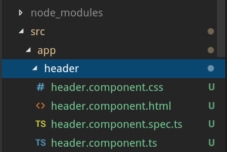
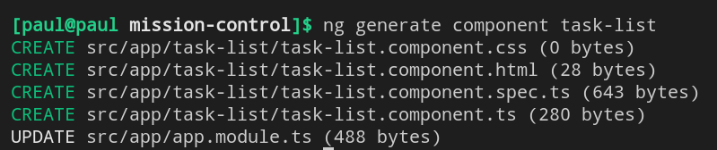
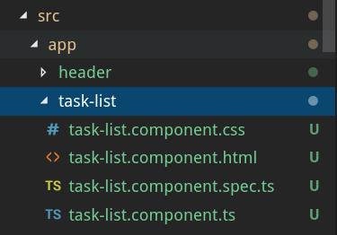
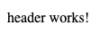
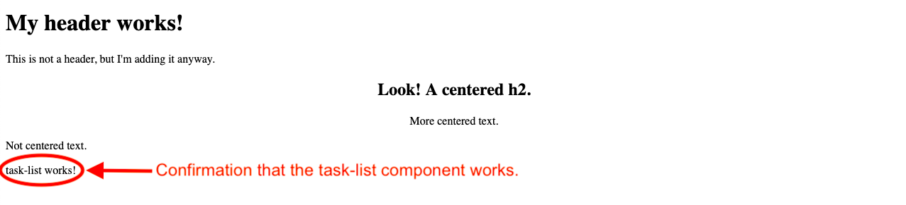
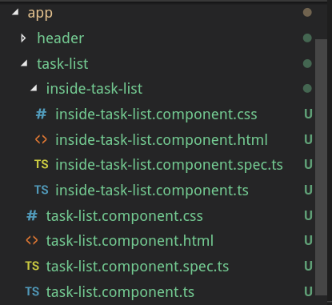

# Components

::: index
! angular-component
:::

In Angular a **component** controls one part of the page, called a
*view*.

Angular builds a web page by combining multiple components together.
Splitting our page into individual components makes our application more
organized. It also increases our ability to focus on one section of our
web application at a time.

Everything in Angular centers on the idea of building a webpage from
separate, smaller pieces. We must understand how to get these pieces to
work together, and that begins by exploring what makes up each
individual component. In order to build a reliable component, we must
understand how each of its parts work and interact.

## Start Fresh

In the terminal, navigate back to the `angular_practice` folder you
created on the
`Angular First Steps <angular-first-steps>`{.interpreted-text
role="ref"} page. Create a new project called `component-practice`.

``` bash
$ ng new component-practice
```

Open the `app.component.html` file in VSCode. Remove ALL of the code and
replace it with an empty `div` element.

``` {.html linenos=""}
<div>

</div>
```

OK, the stage is set for a closer look at components.

## Component Files

Angular components consist of 4 files:

1.  an HTML file (.html)
2.  a CSS file (.css)
3.  a typescript file (.ts)
4.  a test file (.spec.ts)

<figure>

<figcaption>Visual of file tree after adding a new component,
<code>header</code>, to the project.</figcaption>
</figure>

Looking at the file tree, we see that all four files contain the name of
the component\-\--`header`, in this case. Also, the files are located in
a folder named after the component.

If we add a new component named `task-list`, the four files created
inside the `task-list` folder would be called:

1.  `task-list.component.html`
2.  `task-list.component.css`
3.  `task-list.component.ts`
4.  `task-list.component.spec.ts`

Each file contains information specific to that component.
`task-list.component.html` holds the HTML required for the task-list and
no other component. `task-list.component.css` only styles html within
the `task-list` folder, the typescript code in `task-list.component.ts`
only applies to this component, and all the tests for `task-list` will
be found in `task-list.component.spec.ts`.

## Adding a New Component {#add-new-component}

Each component is a smaller part of an overall web application. The main
component, `app`, serves as a base structure, and it comes standard with
all Angular applications. It is the container that holds all of the
other components, and it organizes them into the web application.

When you generate a new component using the Angular CLI, it is
automatically added to `app`. Let\'s explore how this process works.

### `ng generate`

To create a new Angular component, the terminal syntax is:

``` bash
$ ng generate component component-name
```

::: admonition
Warning

A common mistake is to create a new component in the wrong location, say
in the `src` folder instead of in `app`.

`ng generate` places the new component folder within your current
directory. Use the terminal to navigate to where you want the component
to go BEFORE running the generate command.
:::

Creating a `task-list` component looks something like this:

<figure>

<figcaption>Terminal output when creating a new component.</figcaption>
</figure>

From the output, we see that the `ng generate` command created four new
files in the `src/app/task-list` folder.

::: note
::: title
Note
:::

Recall that `ng generate` can be shortened to `ng g`.
:::

### Try It

1.  Use the terminal panel in VSCode to navigate into the `app` folder.

    ``` bash
    $ ls
       first-project  component-practice
    $ cd component-practice
    $ cd src
    $ cd app
    $ ls
       app.component.css    app.component.spec.ts   app.module.ts
       app.component.html   app.component.ts
    ```

2.  Run `ng generate component task-list`.

3.  Add a `header` component by running `ng generate component header`.

When done, your file structure in VSCode should look something like:

<figure>

<figcaption>File tree of the newly added <code>task-list</code>
component.</figcaption>
</figure>

## `app.module.ts`

In order to communicate with the new components, `app.module.ts` needs
new `import` statements. Fortunately, `ng generate` updates the code
automatically. We do not need to worry about taking care of this task
ourselves.

Before `ng generate`:

``` {.typescript linenos=""}
import { BrowserModule } from '@angular/platform-browser';
import { NgModule } from '@angular/core';

import { AppComponent } from './app.component';

@NgModule({
   declarations: [ AppComponent ],
   imports: [ BrowserModule ],
   providers: [],
   bootstrap: [AppComponent]
})
export class AppModule { }
```

After generating the `header` and `task-list` components:

``` {.typescript linenos=""}
import { BrowserModule } from '@angular/platform-browser';
import { NgModule } from '@angular/core';

import { AppComponent } from './app.component';
import { TaskListComponent } from './task-list/task-list.component';
import { HeaderComponent } from './header/header.component';

@NgModule({
   declarations: [
      AppComponent,
      TaskListComponent,
      HeaderComponent
   ],
   imports: [ BrowserModule ],
   providers: [],
   bootstrap: [AppComponent]
})
export class AppModule { }
```

Angular updates `app.module.ts` by adding new `import` statements on
lines 5 and 6 as well as expanding the `declarations` array on line 9.

::: admonition
Note

Generating new components automatically updates `app.module.ts`.
However, if you *delete* a component, you must MANUALLY remove its
`import` statement and its name in the `declarations` array.
:::

## Arranging Components

Run `ng serve` to launch the webpage. The page shows up empty because we
removed all of the code from `app.component.html` except for the `div`
tags.

Modify `app.component.html` as follows:

``` {.html linenos=""}
<div>
   <app-header></app-header>
</div>
```

Save your change and wait for the webpage to refresh. You should now see
the text \"header works!\" at the top of the page.



This is another helpful feature with Angular\-\--when you correctly
implement a new component, confirmation text appears on the screen.

How did `<app-header></app-header>` make this happen? Open
`header.component.ts` in VSCode:

``` {.typescript linenos=""}
import { Component, OnInit } from '@angular/core';

@Component({
   selector: 'app-header',
   templateUrl: './header.component.html',
   styleUrls: ['./header.component.css']
})
export class HeaderComponent implements OnInit {

   constructor() { }

   ngOnInit() {
   }
}
```

Line 4 defines the HTML tag for the `header` component to be
`app-header`. If we try changing the string to `'orange'`, we would see
the \"header works!\" text disappear from the webpage. This is because
the HTML tag `<app-header>` is no longer linked to the component. The
string assigned in line 4 MUST match the tags used in
`app.component.html`.

### Modify the Header Text

Open `header.component.html` in VSCode:

``` {.html linenos=""}
<p>header works!</p>
```

Ah ha! The HTML file contains the text that appeared on our webpage.
Anything added to this file will appear between the
`<app-header></app-header>` tags in `app.component.html`.

::: admonition
Try It

1.  Replace line 1 in `header.component.html` with:

    ``` {.html linenos=""}
    <h1>My header works!</h1>
    <p>This is not a header, but I'm adding it anyway.</p>
    <div style="text-align: center">
       <h2>Look! A centered h2.</h2>
       <p>More centered text.</p>
    </div>
    <p>Not centered text.</p>
    ```

    Save your code and refresh the page. How does its appearance change?

2.  What happens if we use TWO `<app-header>` elements in
    `app.component.html`? Try it to find out.

    ``` {.html linenos=""}
    <div>
       <app-header></app-header>
       <app-header></app-header>
    </div>
    ```
:::

### Bring in `task-list`

Line 4 in `header.component.ts` defined the `app-header` tag, and line 4
in `task-list.component.ts` does something similar.

Modify `app.component.html` as follows:

``` {.html linenos=""}
<div>
   <app-header></app-header>
   <app-task-list></app-task-list>
</div>
```

Your webpage should look similar to:

<figure>

<figcaption>Confirmation that <code>task-list</code> is properly working
in your project.</figcaption>
</figure>

::: admonition
Try It

Move `<app-task-list></app-task-list>` above `<app-header></app-header>`
and see how the webpage changes.
:::

### THIS IS WHY TEMPLATES ARE AWESOME!

Trying to correctly format and place content on a webpage can be
difficult, especially if you need to present lots of data or mix
different formatting styles for headings, lists, plain text, etc.

Rather than deal with our header, task-list, and other content at the
same time, creating components allows us to:

1.  Create a simple HTML file that serves as a framework.
2.  Format each piece of our content separately, without worrying about
    how that formatting affects other parts of the webpage.
3.  Easily add content to the framework by using custom HTML tags.
4.  Quickly relocate the components on a page just by rearranging their
    custom tags.

## Component Nesting

Components can be put inside of other components. In essence, this is
how the `app` component works. It is the component that holds all other
components.

However, sometimes you might want to nest a new component inside of
another one rather than in `app`.

Let\'s assume we want to add a new component within our `task-list`
folder. In this case, we navigate into the `task-list` directory and
then run the `ng generate component` command.

``` bash
$ ls
   app.component.css    app.component.spec.ts   app.module.ts   task-list
   app.component.html   app.component.ts        header
$ cd task-list
$ ng generate component inside-task-list
```

Running this command nests our new folder inside of the `task-list`
folder, and it contains the four files we would expect.

<figure>

<figcaption>Nested components.</figcaption>
</figure>

When we place one component inside of another, we must pay attention to
how the components interact. The nested component is called the *child*,
while the original component is called the *parent*. In our example,
`task-list` serves as the parent, while `inside-task-list` is the child.

1.  Any CSS, HTML, or JavaScript we write for the nested component (the
    child) only affects that component. Changes to the child do NOT
    affect the parent.
2.  The parent component DOES influence the nested one. For example, any
    CSS within `task-list.component.css` applies to both
    `task-list.component.html` AND `inside-task-list.component.html`.
3.  If we want `inside-task-list` to have different styling, we need to
    add code to `inside-task-list.component.css` to override the parent.

## Check Your Understanding

If you have not already done so, use `ng generate` to *nest* the
`inside-task-list` component inside the `task-list component`.

::: admonition
Question

EXPERIMENT! Discover.

Where could we place the `<app-inside-task-list></app-inside-task-list>`
element to make \"inside-task-list works!\" appear on the screen? Select
ALL options that work.

1.  Place the element in `app.component.html`.
2.  Place the element in `task-list.component.html`.
3.  Place the element in `inside-task-list.component.html`.
4.  Place the element in `index.html`.
:::
