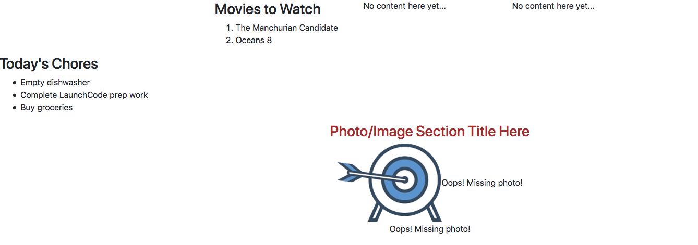
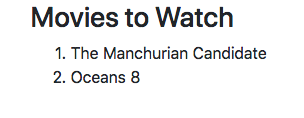
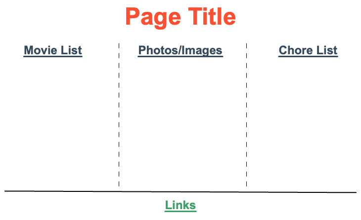
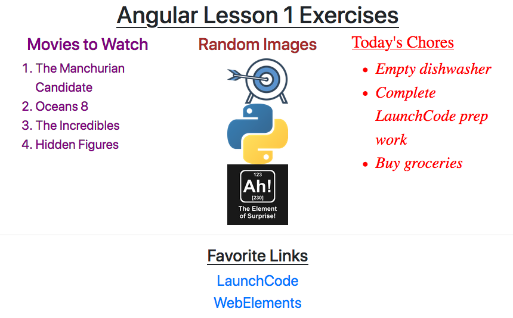

# Exercises: Angular, Lesson 1 {#angular-exercises-1}

The following exercises walk you through the process of modifying
existing components and generating new ones.

## Starter Code

For this set of exercises, you will need a copy of the LaunchCode
Angular projects repository. If you haven\'t done so already,

1.  Fork the [angular-lc101-projects
    repository](https://github.com/LaunchCodeEducation/angular-lc101-projects)
    on GitHub.
2.  Clone your fork. If you need a reminder for how to do this, refer to
    the `Git studio <clone-from-git>`{.interpreted-text role="ref"}.

Navigate into the lesson 1 exercises now:

``` bash
$ pwd
   angular-lc101-projects
$ ls
   lesson1 lesson2 lesson3
$ cd lesson1
$ ls
   exercises examples
$ cd exercises
```

The repository contains code but NOT the Angular modules necessary to
launch the webpage. In the terminal, run `npm install` to add these
modules. Next, enter `ng serve` and open the `localhost` URL in your
browser.

The starter page should look like this:

<figure>

<figcaption>Starting set up for the exercises. Lots of content is
missing.</figcaption>
</figure>

The page is not pretty yet, but you get to fix that.

## Part 1: Modify the CSS

The `movie-list` and `chores-list` components have been created, but so
far they appear pretty bland. Let\'s change that.

1.  Change the movie list text by adjusting the code in
    `movie-list.component.css` to accomplish the following:

    1.  The text for the heading and list items can be any color EXCEPT
        black. (HINT: Take advantage of the `movies` class).
    2.  The movie list should have a centered heading.
    3.  The font size should be large enough to easily read.

    `Check your solution <angular-lsn1-exercise-solutionsA1>`{.interpreted-text
    role="ref"}

2.  Change the chore list text by adjusting the code in
    `chores-list.component.css` to accomplish the following:

    1.  Use a different font, with a size large enough to easily read.
    2.  The text color should be different from the movie list, but not
        black.
    3.  The chores list should have an underlined heading.
    4.  The chores in the list should be italicized.

### Add More Movies



The list of movies is built using an array defined in
`movie-list.component.ts`:

``` TypeScript
export class MovieListComponent implements OnInit {
   movies = ['The Manchurian Candidate', 'Oceans 8'];
```

The titles in the `movies` array are referenced in the template
`movie-list.component.html` by adding *placeholders* in the HTML.

You can put almost any valid JavaScript inside the `{{ }}` in an Angular
template. For example, `{{ movies[0] }}` references the `movies` array,
and `movies[0]` returns the first item in the array.

``` {.bash linenos=""}
<div class="movies">
   <h3>Movies to Watch</h3>
   <ol>
      <li>{{ movies[0] }}</li>
      <li>{{ movies[1] }}</li>
   </ol>
</div>
```

Using references in your HTML allows you to easily modify the content on
your webpage. Instead of typing specific movie titles between the tags
every time the list changes, references allow us to modify the data in
one easy to find array.

3.  Add two more items to the `movies` array.

    `Check your solution <angular-lsn1-exercise-solutionsA3>`{.interpreted-text
    role="ref"}

4.  Add two more `<li></li>` elements to `movie-list.component.html` and
    use placeholders to reference the new movies in the array.

### Complete the `fav-photos` Component

5.  The `fav-photos` component has been generated, but it is incomplete.
    The page needs more images, which also need to be smaller in size.

    1.  In the `FavPhotosComponent` class, assign a better section
        heading to the `photosTitle` variable.

    2.  The `image` variables should hold URLs for images, but only one
        is is filled in. Complete at least one more, which can be from
        the web or personal pictures. To copy the URL for an image on
        the web, right-click (or control-click) on the image and select
        the \"Copy Image Location\" menu option.

    3.  In the `.html` file for this component, use placeholders in the
        `img` tags to display your chosen images.

        ``` html
        
        ```

    4.  Adjust the HTML to display one image per line.

    5.  Use the `.css` file for this component to make all the images be
        the same size.

    6.  Refresh the webpage to check the updated content.

    `Check your solution <angular-lsn1-exercise-solutionsA5>`{.interpreted-text
    role="ref"}

Before moving on, save and commit your work.

## Part 2: Add More Components

::: admonition
Note

You will be adding and modifying HTML elements for this project. If you
need to review this topic, look back at the
`HTML Tags <html-tags>`{.interpreted-text role="ref"} page, or try
[W3Schools](https://www.w3schools.com/tags/).
:::

6.  The page needs a title.

    1.  Use the terminal to navigate into `app` folder.

    2.  Generate the new component `page-title`:

        ``` bash
        ng generate component page-title
        ```

    3.  Open `page-title.component.ts` and note that the
        `app-page-title` tag has been defined next to `selector`.
        Shorten the tag name to just `page-title`.

    4.  In the `PageTitleComponent` class, define a `title` variable and
        assign it a string.

    5.  Add an `<h1>` to the `page-title.component.html` file. Use
        `{{title}}` as a placeholder for the title you defined. Style
        the text to be underlined and centered on the screen.

    6.  Add the `<page-title></page-title>` element to
        `app.component.html`.

    7.  Save all of your changes and refresh the page to see your new
        content.

7.  The page needs a set of links to favorite websites.

    1.  Generate a `fav-links` component. Open `fav-links.component.ts`
        and shorten the tag name to just `fav-links`.

    2.  In the `FavLinksComponent` class, define the variable `favLinks`
        and assign it an array that contains two or more URLs.

    3.  In the `.html` file for this component, add a set of `<a>` tags
        for the web links. Each link should be on its own line.

    4.  Inside each `<a>` tag, set the `href` attribute equal to a
        placeholder for an element in the `favLinks` array:

        ``` html
        <a href = "{{placeholder}}">Link text...</a>
        ```

    5.  Add `<fav-links></fav-links>` to `app.component.html`. Save all
        of your changes, then refresh the page to see your new content.

    `Check your solution <angular-lsn1-exercise-solutionsB7>`{.interpreted-text
    role="ref"}

::: admonition
Note

Opening the `app.module.ts` file shows that the components for the
movies, chores, title, links, and photos have all been automatically
imported and declared.

Angular automatically takes care of updating `app.module.ts` when you
generate new components. However, *deleting* a component does NOT remove
the references from the file.
:::

## Part 3: Rearrange the Components

The content on the page appears quite jumbled, since we gave you no
guidance on where to put the custom tags in `app.component.html`.
Fortunately, templates allow us to easily move items around the
framework.

8.  Rearrange the tags `fav-photos`, `fav-links`, `page-title`, etc. to
    create a specific page layout:

    1.  `app.component.html` has `<div>` tags to set up a three-column
        row. Use this to arrange the movie list, images, and chore list.
    2.  Center the title at the top of the page.
    3.  Add a horizontal line below the three lists with the `<hr>` tag.
    4.  Center the links below the horizontal line.

    `Check your solution <angular-lsn1-exercise-solutionsC8>`{.interpreted-text
    role="ref"}

Your final page should have this format (the dashed lines are optional):



### Optional Final Touches

9.  To boost your practice, complete one or more of the following:
    1.  Change the background to a decent color, image or pattern.
    2.  Add a border around one or more of the components on the page.
    3.  Add a fun, coding related gif to the page.

## Sanity Check

The `angular-lc101-projects` repository contains two branches:

1.  A `master` branch with all the starter code for lessons 1, 2, and 3.
2.  A `solutions` branch with completed code.

If you get stuck on a particular exercise:

1.  Try again.
2.  Try again again.
3.  Ask your TA, instructor, classmates, or Google for tips.
4.  Try again.
5.  Take a break and give your brain a chance to rest.
6.  Try again.
7.  Feel completely justified in switching to the `solutions` branch to
    check the code.

::: admonition
Note

If you jumped right to step 7, you missed out on a stellar learning
opportunity.
:::

<figure>

<figcaption>Customized and complete angular project
example.</figcaption>
</figure>
