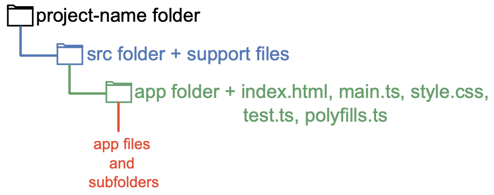

# Angular File Structure

Each Angular project contains a standard file structure, which is shown
in the figure below.



All of the project files (and there will be LOTS) are stored in the
single, top-level folder, `project-name`, which contains a `src` folder
and a set of support files.

::: admonition
Note

When you start a new Angular project, do not worry about the support
files. These will be generated automatically, and they take care of the
routine technical details for making your project run smoothly.
:::

`src` contains the `app` folder and five important files: `index.html`,
`main.ts`, `style.css`, `tests.ts` and `polyfills.ts`. We will explore
these files in more detail on the next page. For now, recognize that
they control how the Angular project operates.

The `app` folder contains the files and subfolders needed to control the
nitty-gritty details of displaying a webpage. For your projects, most of
your time and effort will be spent modifying the contents within `app`.

## Installing Angular

Angular uses its own set of command line instructions to create, update,
and launch projects. Before you dive too deeply into the Angular
lessons, you need to install the Angular command line interface (CLI) on
your computer. Fortunately, the process is relatively painless.

Open up the terminal (or the terminal panel in VSCode) and enter the
following command:

``` bash
npm install -g @angular/cli@12
```

::: admonition
Note

There are more recent versions of this package but we\'re using version
12 for generating new code. When you pull down starter code from Github,
you will have to run `npm install` which will set up that project to use
Angular 8. While you may notice differences between the two versions,
the core functionality of Angular will remain the same.
:::

::: admonition
Note

If the installer prompts you to make choices, just accept all of the
default options.
:::

This command installs the CLI *globally* on your computer, which means
that Angular commands will work regardless of the folder you have open.

Angular commands begin with the keyword `ng` (for A-ng-ular), and the
most commonly used include:

1.  `ng new`: Creates a new Angular project in the current directory.
    The shortcut syntax is `ng n`.
2.  `ng generate`: Creates new files within an existing project. The
    shortcut syntax is `ng g`.
3.  `ng serve`: Compiles a project and *launches* it in a form that can
    be displayed in a browser. The shortcut syntax is `ng s`.

For a complete list of commands, refer to the [Angular
documentation](https://angular.io/cli#command-overview).

### Check Your GitHub Account

For the \"HTML Me Something\" assignment, you created an account on
[GitHub](https://github.com) . Since you will modify Angular projects
over several lessons, you need access to GitHub to download starter code
and store your progress.

Follow the link and make sure you remember your login information, or
enroll if you have not yet created an account.

### What\'s in a Name?

If you Google \"Angular tutorial\", you will receive plenty of hits.
Some of the resources will be exceptional, others not. However, you will
probably notice that many of the results refer to *AngularJS*. This is a
previous version of the software, and it is NOT the same as modern
Angular.

AngularJS is NOT the same as Angular. Even the websites are different
(angularjs.org vs. angular.io). We recommend that you avoid AngularJS
resources for now. You can always learn how to use the old version later
if your job requires it.

## Ready To Go

As with any new coding skill or tool, the best way to learn is to
actively practice. Let\'s begin building your first Angular project.
