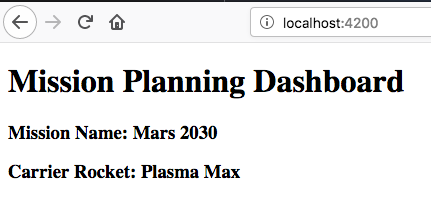

# Studio: Angular, Part 1

In this chapter, you learned about the Angular file structure,
templates, and components. Over the next three classes, you will build a
Mission Planning Dashboard using your Angular skills.

## Mission Planning Dashboard

A useful and common front end application is a *dashboard*. It shows a
summary of information about a topic, helping users of the web app make
informed decisions.

You will create a *Space Mission Planning Dashboard*.

## Create Angular Project

1.  Launch Visual Studio Code. If you created an `angular_practice`
    folder earlier in the chapter, use the *File* menu to open it. If
    you did not create a practice folder, make one!

2.  Open a terminal at the root of your `angular_practice` folder.

3.  Create a new Angular project by running
    `ng new angular-studio-part1`.

    a.  When prompted about using routing, enter \"N\" for No.
    b.  When prompted to select the stylesheet format, select CSS.

    ```{=html}
    <!-- -->
    ```
        $ ng new angular-studio-part1
        ? Would you like to add Angular routing? No
        ? Which stylesheet format would you like to use? CSS

4.  When the process finishes, use the *File* menu to open
    `angular-studio-part1` in VS Code.

5.  In the terminal, use `pwd` to check your position in the file tree.
    If necessary, navigate into the `angular-studio-part1` directory.

6.  Install dependencies by running `npm install`

7.  Verify that the application will run by running `ng serve`

8.  View the site in your browser at <http://localhost:4200>

    a.  You should see a header that says \"Welcome to
        angular-studio-part1!\"

9.  In the terminal,
    `initialize your project with git<repository-setup>`{.interpreted-text
    role="ref"}, then stage and commit your files locally before
    starting on the features.

::: admonition
Tip

You will likely still have `ng serve` running in your terminal. You can
stop `ng serve` by pressing the keys \"**control+c**\", or you can open
an additional terminal window to run the git commands.
:::

## Requirements

The mission dashboard you are creating will eventually look like this.


### Update Starter Page Content

The default stater page created by Angular contains default text,
images, and links. Your job is to remove the default content.

1.  Clear out the contents of file `app.component.html`.
2.  Type in the text `Add components here...` into `app.component.html`.
3.  Run `ng serve` if it\'s not already running.
4.  View the app in your browser to verify the words \"Add components
    here\...\" is the only thing that appears on the page.

### Header Component

You need to create a component that shows the title, mission name, and
carrier rocket.

1.  In terminal navigate to the folder `src/app` folder.
2.  Create a header component using `ng g component header`.
3.  In the file `header.component.html` add HTML:

``` {.html+ng2 linenos=""}
<h1>Mission Planning Dashboard</h1>
<h3>Mission Name: {{ missionName }}</h3>
<h3>Carrier Rocket: {{ rocketName }}</h3>
```

4.  Add the variables `missionName` and `rocketName` to the header
    component in `header.component.ts`

``` TypeScript
export class HeaderComponent implements OnInit {

    missionName: string = "Mars 2030";
    rocketName: string = "Plasma Max";
```

5.  Add a reference to the header component in `app.component.html`.

``` html+ng2
<app-header></app-header>
```

6.  View the app in your browser to verify that the title, mission name,
    and rocket name are visible.



### Crew Component

Next you need to make a component to show a list of crew members.

1.  Create the component by running `ng g component crew`.

2.  Set the contents of `crew.component.html` to be:

    ``` {.html linenos=""}
    <h3>Crew</h3>
    <ul>
       <li>Jessica Watkins</li>
       <li>Raja Chari</li>
       <li>Jasmin Moghbeli</li>
    </ul>
    ```

3.  Add a reference to the header component in `app.component.html`.

    ``` html+ng2
    <app-header></app-header>
    <app-crew></app-crew>
    ```


### Equipment Component

Now you need to create a component to show a list of equipment.

1.  Create an equipment component named `equipment`.

2.  The component should display the following:

    a.  An `<h3>` that contains \"Equipment\"
    b.  A `<ul>` that contains `<li>` for: Habitat dome, Drones, Food
        containers, Oxygen tanks

3.  Add the equipment component to `app.component.html` using the HTML
    below. Notice the `<div>` surrounding the crew and equipment
    components.

    ``` {.html+ng2 linenos=""}
    <app-header></app-header>
    <div class="box">
       <app-crew></app-crew>
       <app-equipment></app-equipment>
    </div>
    ```

4.  Add CSS to file `app.component.css` to horizontally align the crew
    and equipment lists. Without this CSS, the equipment list will
    appear below the crew list.

    ``` {.css linenos=""}
    .box {
       display: flex;
       padding: 10px;
    }
    ```


::: note
::: title
Note
:::

A full explanation of `display: flex;` is beyond the scope of this book.
For more information see [MDN flex box
docs](https://developer.mozilla.org/en-US/docs/Web/CSS/CSS_Flexible_Box_Layout/Basic_Concepts_of_Flexbox)
and [CSS Tricks flex box
guide](https://css-tricks.com/snippets/css/a-guide-to-flexbox/).
:::

### Experiments Component

1.  Finally, add an experiments component that contains the HTML below:

    ``` {.html linenos=""}
    <h3>Experiments</h3>
    <ul>
       <li>Mars soil sample</li>
       <li>Plant growth in habitat</li>
       <li>Human bone density</li>
    </ul>
    ```

2.  Make the list of experiments show up to the right of equipment list.

When done your dashboard should look like this:


## Commit Your Work

Be sure to stage and commit your changes!

1.  Verify the branch and status of the files.
2.  Commit your changes locally.
3.  Create a
    `new repository in your GitHub account <push-to-remote-repo>`{.interpreted-text
    role="ref"}, then `push your
    commits to origin <push-to-remote>`{.interpreted-text role="ref"}.

You will make different versions of the mission planning dashboard in
the next two studios.

## Bonus Mission

1.  Display crew members by adding an array of crew names.
    a.  In `crew.component.ts` add
        `crew: string[] = ["Jessica Watkins", "Raja Chari", "Jasmin Moghbeli"];`
    b.  In `crew.component.html` use references like
        `<li>{{crew[0]}}</li>` to display the crew names.
2.  Use CSS to add different colors, fonts, borders, etc. to your
    dashboard.
3.  Move the components around to see how that affects the display of
    the data.
