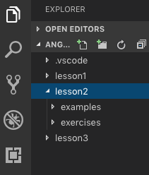

# Angular Directives

In the `DOM chapter <DOM-and-events>`{.interpreted-text role="ref"} you
learned how to wait for *events* and then change the appearance of the
web page in response. You practiced these skills in the
`DOM studio <DOM-studio>`{.interpreted-text role="ref"}. By waiting for
the users to click specific buttons, your code launched, guided, and
landed the LaunchCode rocket.

::: index
! directive
:::

Angular helps us manage website content and manipulate the DOM through
the use of *directives*. These simplify DOM changes by giving us
alternatives to `getElementById`, `addEventListener`, `innerHTML`, etc.

There are three types of Angular directives:

1.  **Components**: These control how a set of data gets displayed
    within a template.
2.  **Structural directives**: These change the layout of the DOM by
    adding or removing elements (`div`, `ul`, `a`, `li`, etc.).
3.  **Attribute directives**: These change the appearance of a specific
    element within the DOM.

We learned how to generate and modify components in the
`last chapter <fork-repo>`{.interpreted-text role="ref"}. In this
lesson, we will focus on how to use structural directives to enhance our
work.

## Open the Lesson 2 Folder

If you have not yet forked the Angular lessons repo, follow the
directions given in `lesson 1 <angular-1>`{.interpreted-text
role="ref"}.

Open the `angular-lc101-projects` folder in VSCode and find `lesson2` in
the sidebar.



Open the terminal panel and navigate to the lesson2 folder. You should
find subfolders for the examples and exercises used in this chapter.
Also, completed code to some of the tasks is located in the `solutions`
branch.

``` bash
$ ls
   lesson1 lesson2 lesson3
$ cd lesson2
$ ls
   examples        exercises
$ git branch
   solutions
   * master
```
