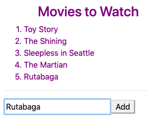
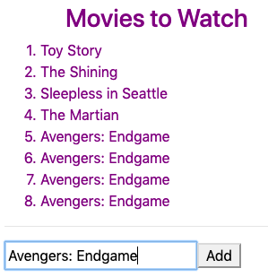
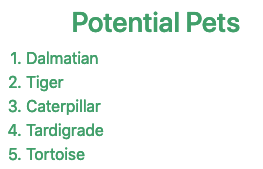

# Events Can Call Functions {#events-call-functions}

For the user input practice, we set the `keyup` and `click` events equal
to `true`. This just checks to see if these events occur. When they do,
the input is stored in `newMovie`, and the page refreshes.

To perform more complicated tasks in response to the user\'s actions, we
can call a function when an event occurs. The syntax for this is:

    (event) = "functionName(arguments...)"

Changing the movie list displayed on the web page requires us to modify
the `movies` array in the `movie-list.component.ts` file. We will do
this by creating an `addMovie` function and linking it to our event
handlers.

## Modify the HTML

Let\'s change our code in `movie-list.component.html` to call the
function `addMovie` and pass the new movie title as the argument.

1.  On lines 7 and 8, replace `true` with the function call:

    ``` {.html+ng2 linenos=""}
    <div class='movies col-4'>
       <h3>Movies to Watch</h3>
       <ol>
          <li *ngFor ="let movie of movies">{{movie}}</li>
       </ol>
       <hr>
       <input #newMovie (keyup.enter)='addMovie(newMovie.value)' type='text' placeholder="Enter Movie Title Here"/>
       <button (click)='addMovie(newMovie.value)'>Add</button>
       <p>{{newMovie.value}}</p>
    </div>
    ```

    Now when the user taps \"Enter\" or clicks the \"Add\" button after
    typing, the input `newMovie.value` gets sent to the function.

2.  Since our plan is to use a function to add the new movie to the
    array, we no longer need the title to appear below the input box.
    Remove `<p>{{newMovie.value}}</p>` from line 9.

## Define the Function

Open `movie-list.component.ts` and examine the code:

``` {.TypeScript linenos=""}
import { Component, OnInit } from '@angular/core';

@Component({
   selector: 'movie-list',
   templateUrl: './movie-list.component.html',
   styleUrls: ['./movie-list.component.css']
})
export class MovieListComponent implements OnInit {
   movies = ['Toy Story', 'The Shining', 'Sleepless in Seattle', 'The Martian'];

   constructor() { }

   ngOnInit() {
   }
}
```

The `movies` array stores the titles displayed on the web page, and we
want to update this when the user supplies new information.

3.  Declare a function called `addMovie` that takes one parameter:

    ``` {.TypeScript linenos=""}
    export class MovieListComponent implements OnInit {
       movies = ['Toy Story', 'The Shining', 'Sleepless in Seattle', 'The Martian'];

       constructor() { }

       ngOnInit() {
       }

       addMovie (newTitle: string) {

       }
    }
    ```

    Notice that we have to declare the data type for the `newTitle`
    parameter.

4.  Now add code to `push` the new title to the `movies` array:

    ``` {.TypeScript linenos=""}
    export class MovieListComponent implements OnInit {
       movies = ['Toy Story', 'The Shining', 'Sleepless in Seattle', 'The Martian'];

       constructor() { }

       ngOnInit() {
       }

       addMovie (newTitle: string) {
          this.movies.push(newTitle);
       }
    }
    ```

    The keyword `this` is required.

::: admonition
Note

It is a common practice to put `constructor` and functions like
`ngOnInit` AFTER the variable declarations but BEFORE any custom
functions.
:::

Save the changes and then refresh the page. Enter a new title to verify
that it appears in the movie list. Your page should look something like:



## Tidying Up the Display

Notice that after adding a new movie to the list, the text remains in
the input box. If we click \"Add\" multiple times in a row, we would see
something like:



Let\'s modify the code to try to prevent this from happening.

### Clear the Input Box

5.  After the user submits a new title, we can clear the input box by
    setting its value to be the empty string (`''`). Open
    `movie-list.component.html` and modify the input statement as
    follows:

    ``` html+ng2
    <input #newMovie (keyup.enter)="addMovie(newMovie.value); newMovie.value = ''" type="text" placeholder="Enter Movie Title Here"/>
    ```

    When `keyup.enter` occurs, the code calls `addMovie`. Once control
    returns from the function, `newMovie.value` is set equal to `''`,
    which clears any text from the input box.

6.  Since the user can also click the \"Add\" button to submit a title,
    we need to modify the `<button>` element as well:

    ``` html+ng2
    <button (click)="addMovie(newMovie.value); newMovie.value = ''">Add</button>
    ```

    Now `newMovie.value` is set equal to `''`, when \"Enter\" or \"Add\"
    are used to submit data.

::: admonition
Try It

Refresh the page and verify that the input box gets cleared after each
new title.
:::

### Check for Duplicates

Even though we clear the input box, there is nothing to prevent the user
from entering the same movie multiple times. While some fans may want to
watch a film twenty times in a row, let\'s have our code prevent
repeats.

Recall that the `includes method <includes-examples>`{.interpreted-text
role="ref"} checks if an array contains a particular element. The method
gives us several ways to check for a repeated title. One possibility is:

``` {.TypeScript linenos=""}
addMovie (newTitle: string) {
   if(!this.movies.includes(newTitle)){
      this.movies.push(newTitle);
   }
}
```

If the `movies` array already contains `newTitle`, then the `includes`
method returns `true`. The NOT operator (`!`) flips the result to
`false`, and line 3 is skipped.

::: admonition
Try It

Refresh the page and verify that you cannot enter a duplicate title.
:::

## Bonus

To boost your skills, try these optional tasks to enhance your work:

1.  Modify `addMovie` to reject the empty string as a title.
2.  Use `*ngIf` to display an error message if the user does not enter a
    title or submits a title that is already on the list.
3.  Add CSS to change the color of the error message.

The `example-solutions` branch of the Angular repo shows completed code
for the bonus tasks.

## Check Your Understanding

Assume that we have an Angular project that presents users with a list
of potential pets:



::: admonition
Question

Which of the following calls the `addPet` function when the user clicks
on one of the potential pets:

1.  `<li>{{pet}}</li>`
2.  `<li (click) = "true">{{pet}}</li>`
3.  `<li #addPet (click) = "true">{{pet}}</li>`
4.  `<li (click) = "addPet(pet)">{{pet}}</li>`
:::

::: admonition
Question

When the user moves the mouse over an animal, we want to store its name
in the `newFriend` variable. Which of the following accomplishes this?

1.  `<li (mouseover) = "pet.name">{{pet}}</li>`
2.  `<li #newFriend (mouseover) = "pet.name">{{pet}}</li>`
3.  `<li (mouseover) = "newFriend = pet.name">{{pet}}</li>`
4.  `<li (mouseover) = "newFriend">{{pet}}</li>`
:::
