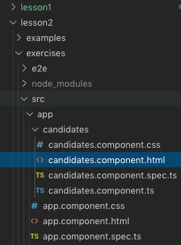
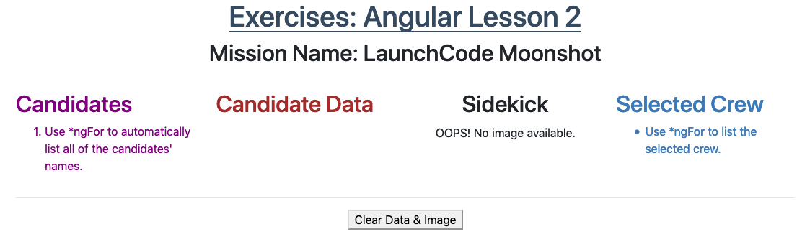
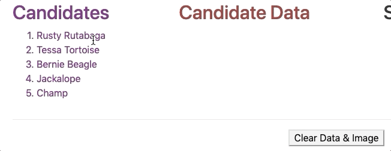
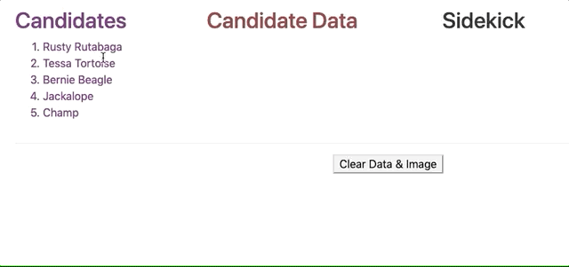

# Exercises: Angular, Lesson 2 {#exercises-angular-lsn2}

Let\'s build an interactive web page that allows us to review data for
our astronaut candidates and select crew members for a space mission.

## Starter Code

The starter code for the exercises is in the same
[repository](https://github.com/LaunchCodeEducation/angular-lc101-projects)
that you cloned for the chapter examples.

::: admonition
Note

Remember that the repository contains a `master` branch with all the
starter code as well as a `solutions` branch showing the completed
exercises.

The solutions provide a resource for you to check if you get stuck.
However, for best results you should make a *valiant* attempt at solving
the tasks before looking at \"the answers\".

Also, if your code works but is different from the solutions, that is
OK. There are usually multiple ways of solving the same problem.
:::

From the `lesson2` folder in VSCode, navigate into the
`exercises/src/app/candidates` folder. Open the
`candidates.component.html` and `candidates.component.ts` files.

In the terminal, navigate into the lesson 2 `exercises` folder. Enter
`npm install` to add the Angular modules, then run `ng serve`. When you
open the web page in your browser, it should look like this:

## Candidates Column {#exercises-angular-lsn2-candidates-column}

Examine the `candidates` array in `candidates.component.ts`. It contains
one object for each animal astronaut. We want to start by listing the
names of the animals in the \"Candidates\" column of the web page.

1.  Find the \"Candidates\" section in `candidates.component.html`. Use
    `*ngFor` in the `<li>` tag to loop over the `candidates` array and
    display each name in an ordered list.

    `Check your solution <angular-lsn2-exercise-solutionsA>`{.interpreted-text
    role="ref"}.

2.  We want each name to be interactive. Add a `click` event to the
    `<li>` tag. When a user clicks on a name, set the variable
    `selected` to be equal to the chosen candidate.

Properly done, your output should behave something like this:

## Candidate Data Column {#exercises-angular-lsn2-candidate-data-column}

When we click on a candidate\'s name, we want their information to
appear in the \"Candidate Data\" column. If no candidate is selected, we
want the space under the heading to remain blank.

1.  In the `

` element underneath the \"Candidate Data\" heading,
    add labels for a candidate\'s `Name`, `Age`, `Mass`, and `Sidekick`.

    `Check your solution <angular-lsn2-exercise-solutionsB1>`{.interpreted-text
    role="ref"}.

2.  Add placeholders to display the candidate\'s data next to each
    label.

3.  Use `*ngIf` inside the `
` tag to check if a candidate has been
    selected. If so, display the labels and the data.

    `Check your solution <angular-lsn2-exercise-solutionsB3>`{.interpreted-text
    role="ref"}.

4.  Next, create a way to clear the data. In the `<button>` tag for
    \"Clear Data & Image\", add a `click` event that sets `selected` to
    `false`.

Properly done, your output should behave something like this:

## Sidekick Image Column {#exercises-angular-lsn2-sidekick-image-column}

Every good hero needs a loyal sidekick, and our candidates are no
exception!

When we click on a candidate\'s name, we want an image of their sidekick
to appear under the \"Sidekick\" column. If no candidate is selected, we
want this area to remain blank.

1.  In the `` tag, use `*ngIf` to check if a candidate has been
    selected.

    `Check your solution <angular-lsn2-exercise-solutionsC>`{.interpreted-text
    role="ref"}.

2.  Replace the generic `{{placeholder}}` with the `image` property of
    the candidate.

Properly done, your output should behave something like this:

## Selected Crew Column {#exercises-angular-lsn2-selected-crew-column}

Once we select a candidate, we want an option to add them to the crew of
the next space mission.

1.  In `candidates.component.ts`, code an `addToCrew` function that
    takes an *object* as a parameter.

    `Check your solution <angular-lsn2-exercise-solutionsD1>`{.interpreted-text
    role="ref"}.

2.  If the candidate is NOT part of the crew, the function should push
    them into the `crew` array. Candidates who are already part of the
    crew should be ignored.

3.  In `candidates.component.html`, add a \"Send on Mission\" button
    next to the \"Clear Data & Image\" button.

    `Check your solution <angular-lsn2-exercise-solutionsD3>`{.interpreted-text
    role="ref"}.

4.  Add a `click` event to the button to call the `addToCrew` function.
    When clicked, pass the selected candidate as the argument.

5.  Under the \"Selected Crew\" section, use `*ngFor` to loop over the
    `crew` array and display each name.

    `Check your solution <angular-lsn2-exercise-solutionsD5>`{.interpreted-text
    role="ref"}.

### Clear Crew List

6.  Add a \"Clear Crew List\" button under the \"Selected Crew\" list.

7.  This button should only appear when the `crew` array contains data.
    Use `*ngIf` to make this happen.

    `Check your solution <angular-lsn2-exercise-solutionsD7>`{.interpreted-text
    role="ref"}.

8.  Add a `click` event that clears the `crew` array.

Properly done, your output should behave something like this:

## Bonus Missions

### Fine Tune the Buttons

1.  Update the `Send on Mission` button to appear only if a candidate
    has been selected.
2.  Make the `Send on Mission` button disappear if the selected
    candidate is already part of the crew.
3.  Make the `Send on Mission` button disappear once three crew members
    have been assigned to the mission.

### Change the Mission Name

We can make the Mission Name heading interactive. When clicked, we want
to present the user with an input box to enter a new name. For this
exercise, the `ng-template` code you need is at the bottom of
`candidates.component.html`.

1.  Replace line 2 in `candidates.component.html` with
    `<h2 class="centered" *ngIf = "!editMissionName; else editMission" (click)="editMissionName = true">Mission Name: {{missionName}}</h2>`.
2.  When clicked, the `ng-template` code executes. Update the `input`
    tag with a `keyup.enter` event. The event should call the
    `changeMissionName` function and pass the new name as an argument.
3.  In `candidates.component.ts`, code a `changeMissionName` function to
    update the name of the mission.
4.  After changing the mission name, set `editMissionName` to `false`.

## Bonus Results

After finishing the bonus missions, your output should behave something
like this:

