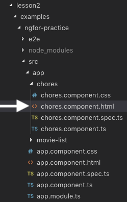

# `ngFor`

In the
`Angular lesson 1 exercises <angular-exercises-1>`{.interpreted-text
role="ref"}, you modified a `movie-list` component to display a series
of titles. The final code within `movie-list.component.html` probably
looked something like:

``` {.html linenos=""}
<div class='movies'>
   <h3>Movies to Watch</h3>
   <ol>
      <li>{{movies[0]}}</li>
      <li>{{movies[1]}}</li>
      <li>{{movies[2]}}</li>
      <li>{{movies[3]}}</li>
   </ol>
</div>
```

`movies[0]` - `movies[3]` reference an array assigned within the
`movie-list.component.ts` file.

To change the number of movie titles displayed in the ordered list, we
could manually add or remove `li` tags, or we could use the structural
directive `ngFor` to iterate through the movie options.

## `ngFor` Syntax

The example below shows the basic approach for using `ngFor` to iterate
through the contents of an array. For a more detailed guide to using
`ngFor` and all of its variations, refer to the following resources:

1.  [Angular
    documentation](https://angular.io/guide/template-syntax#ngFor),
2.  [Malcoded website](https://malcoded.com/posts/angular-ngfor/).

Just like a `for` loop in JavaScript requires a specific syntax in order
to operate, loops in Angular must follow a set of rules. Let\'s explore
these rules by adding `ngFor` to our movie list code.

``` {.html+ng2 linenos=""}
<div class='movies'>
   <h3>Movies to Watch</h3>
   <ol>
      <li *ngFor = "let movie of movies">{{movie}}</li>
   </ol>
</div>
```

Some items to note:

1.  Structural directives all begin with the `*` symbol.
2.  The string `"let movie of movies"` provides the instructions for
    running the loop.
    a.  The `let` keyword declares the `movie` variable.
    b.  `of movies` sets `movie` equal to the first element of the
        `movies` array. Each iteration of the loop sets `movie` equal to
        the next title in the array.
3.  The `*ngFor` statement is placed INSIDE the `<li>` tag.
4.  `{{movie}}` is the placeholder for the current value of `movie`.

By placing the `*ngFor` statement inside the tag, the loop generates
multiple `<li></li>` elements. Each iteration adds a new list item to
the HTML code, one for each title in the `movies` array.

::: admonition
Warning

The `*ngFor` statement generates a new HTML tag for each item in the
array. *Be careful where you put the statement!* If we had added
`*ngFor = "let movie of movies"` to the `<h3>` tag, then the
`Movies To Watch` title would have been repeated multiple times.
:::

In general, the syntax for `*ngFor` is:

    *ngFor = "let variableName of arrayName"

Where `variableName` is the loop variable, and `arrayName` represents
the array to iterate through.

::: admonition
Note

`*ngFor` only operates over the contents of an array. If we want to
iterate over the characters in a string, we must first convert it into
an array.

There is a technique for iterating over the key/value pairs of an
object, but that is a more advanced topic. We will not discuss that
method here.
:::

## Try It

From the `lesson2` folder in VSCode, open the
`examples/ngfor-practice/src/app/chores` folders and select the
`chores.component.html` file.



The starter code should match this:

``` {.html linenos=""}
<div class='chores'>
   <h3>Chores To Do Today</h3>
   <ul>
      <li>{{chores[0]}}</li>
      <li>{{chores[1]}}</li>
      <li>{{chores[2]}}</li>
   </ul>
   <hr>
</div>
```

In the VSCode terminal window, navigate to the `ngfor-practice` folder.

``` bash
$ pwd
   angular-lc101-projects/lesson2
$ ls
   examples        exercises
$ cd examples
$ ls
   input-practice  ngfor-practice  ngif-practice
$ cd ngfor-practice
```

Once you are in the folder, enter `npm install` in the terminal. This
will add all of the Angular modules needed to run the project.

Enter `ng serve` to launch the project, then:

1.  Modify `chores.component.html` with `*ngFor` to loop over the
    `chores` array:

    a.  Replace line 4 with
        `<li *ngFor = "let chore of chores">{{chore}}</li>`.
    b.  Delete lines 5 and 6.
    c.  Save your changes.
    d.  Reload the web page to verify that all the chores are displayed.

2.  Open `chores.component.ts`. Add \"Clean bathroom\" to the `chores`
    array, then save. Reload the web page to make sure the new chore
    appears. Your output should look like this:

    

3.  Remove two chores from the array. Reload the web page to make sure
    these items disappear from the list.

4.  Return to `chores.component.html`. Use `*ngFor` within the `<div>`
    tag to loop over the `todoTitles` array:

    a.  Replace line 1 with
        `<div class='chores' *ngFor = "let title of todoTitles">`.
    b.  Replace \"Chores To Do Today\" in line 2 with a placeholder for
        `title`.
    c.  Save your changes, then reload the page. Properly done, your
        page should look something like:

    

5.  Return to `chores.component.ts`. Add an item to the `todoTitles`
    array, then save. Check to make sure another list appears on the web
    page. Next, remove two items from the `todoTitles` array. Save and
    make sure the page reflects the changes.

### What If

1.  What if you placed the `*ngFor` statement inside the `<h3>` tag
    instead of the `<div>` tag? Try it and see what happens!
2.  What if you placed the statement inside the `<ul>` tag instead? Try
    it!

### Bonus What If

What if we want to have different chores listed for Yesterday, Today,
and Tomorrow?


Accomplishing this task is OPTIONAL, but it boosts your skill level and
makes your page look better.

1.  In the `chores.component.ts` file, replace the `chores` and
    `todoTitles` arrays with the following array of *objects*:

    ``` {.JavaScript linenos=""}
    chores = [
       {title: "Yesterday's Chores", tasks: ['Empty dishwasher', 'Start LaunchCode prep work', 'Buy groceries']},
       {title: "Today's Chores", tasks: ['Load dishwasher', 'Finish LaunchCode prep work', 'Buy the groceries you forgot']},
       {title: "Tomorrow's Chores", tasks: ['Empty dishwasher AGAIN', 'Play with LaunchCode practice code', 'Groceries AGAIN']},
    ]
    ```

2.  Update line 1 in `chores.component.html` to access each *object* in
    the `chores` array:

    a.  `<div class='chores' *ngFor = 'let list of chores'>`
    b.  Each iteration, `list` will be assigned a new object with
        `title` and `tasks` properties.

3.  Update the placeholder in line 2 to access the `title` property of
    `list`.

4.  Update line 4 to loop over the `tasks` array:
    `<li *ngFor = 'let chore of list.tasks'>`.

## Check Your Understanding

The following questions refer to this code sample:

``` {.html linenos=""}
<div>
   <h3>My Pets</h3>
   <ul>
      <li>{{pet}}</li>
   </ul>
</div>
```

Assume that we have defined a `pets` array that contains 4 animals.

::: admonition
Question

Adding `*ngFor = 'let pet of pets'` to the `<li>` tag produces:

1.  4 headings
2.  4 unordered lists
3.  4 list items
4.  4 headings each with 4 list items
:::

::: admonition
Question

Moving `*ngFor = 'let pet of pets'` from the `<li>` tag to the `<div>`
tag produces:

1.  1 heading and 4 unordered lists with 4 pets each
2.  4 headings and 4 unordered lists with 4 pets each
3.  1 heading and 4 unordered lists with 1 pet each
4.  4 headings and 4 unordered lists with 1 pet each
:::
