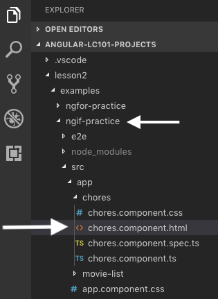
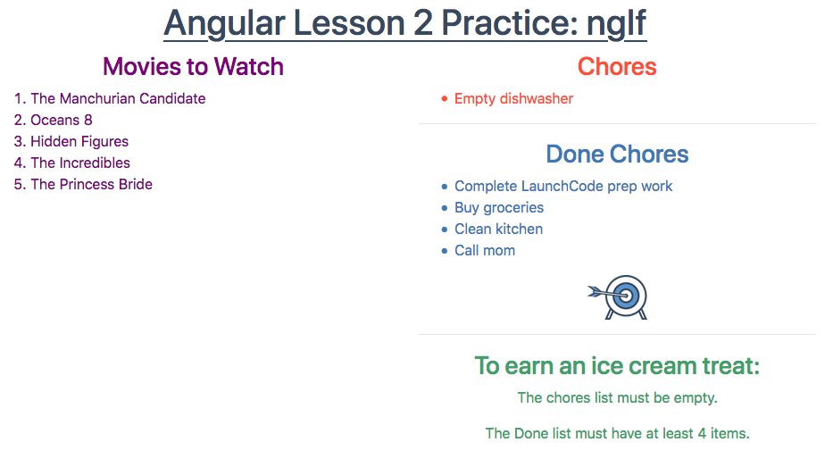

# `ngIf`

The `*ngIf` structural directive evaluates a boolean expression and then
adds or removes elements from the DOM based on the result.

The examples below show the basic usage of `*ngIf`. If you want to
explore more details about this directive, refer to the following
resources:

1.  [Angular
    documentation](https://angular.io/guide/template-syntax#ngif).,
2.  [Malcoded website](https://malcoded.com/posts/angular-ngif-else/).

## `*ngIf` Syntax

In general, the syntax for `*ngIf` is:

    *ngIf = "condition"

`*ngIf` statements are added inside an HTML tag. The `condition` can
either be a boolean or an expression that returns a boolean. If
`condition` evaluates to `true`, then the HTML tag is added to the web
page, and the content gets displayed. If `condition` returns `false`,
then the HTML tag is NOT generated, and the content stays off the web
page.

::: admonition
Note

`*ngIf` determines if content is *added or removed* from a page. This is
different from determining if content should be *displayed or hidden*.

*Hidden* content still occupies space on a page and requires some amount
of memory. *Removed* content is absent from the page\-\--requiring
neither space on the page nor memory. This is an important consideration
when adding items like images or videos to your website.
:::

::: admonition
Example

Let\'s modify our movie list code as follows:

``` {.html+ng2 linenos=""}
<div class='movies' *ngIf = "movies.length > 3">
   <h3>Movies to Watch</h3>
   <ol>
      <li *ngFor = "let movie of movies">{{movie}}</li>
   </ol>
</div>
```
:::

Adding the `*ngIf` statement inside the `<div>` tag determines whether
that element and any content it contains gets added to the web page. If
the condition `movies.length > 3` evaluates to `true`, then the `div`,
`h3`, `ol`, and `li` tags all get generated. If the condition returns
`false`, then none of the tags are added to the HTML code.

::: admonition
Note

Only one structural directive can be assigned to an element. Since the
`li` tag in the example above already contains `*ngFor`, we cannot add
an `*ngIf` statement.
:::

### Logical Operators With `*ngIf`

Just like `if` statements, we can use the operators AND (`&&`), OR
(`||`), and NOT (`!`) to modify the condition checked by `*ngIf`.

::: admonition
Examples

Logical AND:

``` html+ng2
<p *ngIf = "conditionA && conditionB">Some text</p>
```

`Some text` appears on the web page only if `conditionA` and
`conditionB` both return `true`.

Logical OR:

``` html+ng2
<p *ngIf = "conditionA || conditionB">Some text</p>
```

`Some text` appears on the page if either `conditionA` or `conditionB`
return `true`.

Logical NOT:

``` html+ng2
<p *ngIf = "arrayName.length !== 0">Some text</p>
```

`Some text` appears when `arrayName.length` is NOT equal to 0.
:::

### What About `if/else`?

With JavaScript, we know how to use an `if/else` block to decide which
set of code to execute:

``` {.JavaScript linenos=""}
if (num >  5) {
   //Execute this code if num is greater than 5.
} else {
   //Execute this code if num is NOT greater than 5.
}
```

We can do the same thing in Angular to decide which set of HTML tags to
generate. Unfortunately, setting this up with `*ngIf` is not as
efficient.

The general syntax for adding an `else` block in Angular is:

``` {.html+ng2 linenos=""}
<someTag *ngIf = "condition; else variableName">
   <!-- HTML tags and content --->
</someTag>

<ng-template #variableName>
   <!-- Alternate HTML tags and content --->
</ng-template>
```

Note that the `#` is required inside the `ng-template` tag.

::: admonition
Example

Let\'s modify the movie list example to create an alternate set of HTML
tags if `movies.length > 3` returns `false`.

``` {.html+ng2 linenos=""}
<div class='movies' *ngIf = "movies.length > 3; else needMoreMovies">
   <h3>Movies to Watch</h3>
   <ol>
      <li *ngFor = "let movie of movies">{{movie}}</li>
   </ol>
</div>

<ng-template #needMoreMovies>
   <div class='movies'>
      <h3>Not Enough Movies!</h3>
      <p>You only have {{movies.length}} movies on your watch list!</p>
      <p>What's up with that?</p>
      <p>You need to purchase expensive popcorn more often.</p>
   </div>
</ng-template>
```
:::

In line 1, the condition for `*ngIf` specifies what to do if
`movies.length > 3` returns `true` or `false`:

1.  If `true`, Angular executes lines 1 - 6.
2.  If `false`, Angular searches for alternate code labeled with the
    name `needMoreMovies`. In this case, Lines 9 - 14 hold the alternate
    HTML tags.

`<ng-template></ng-template>` is a special Angular element. It contains
content that *might* be required for a web page. When the `else`
statement in line 1 executes, Angular searches for an `ng-template`
block labeled with the matching variable name. Angular then ignores the
original `div` tags and anything they contain, and it replaces that
content with lines 9 - 14.

## Try It

In VSCode, return to your Angular Lesson 2 project. Use the terminal
panel to commit any changes to your `*ngFor` work, then switch to the
`ngif-practice` folder.

``` bash
$ cd ..
$ ls
   input-practice  ngfor-practice  ngif-practice
$ cd ngif-practice
```

In VSCode, open the `chores.component.html` file from the
`ngif-practice` folder:



The code should look like this:

``` {.html+ng2 linenos=""}
<div class="chores">
   <h3>Chores</h3>
   <ul>
      <li *ngFor = 'let chore of chores'>{{chore}}</li>
   </ul>
</div>
<hr>
<div class="doneChores">
   <h3>Done Chores</h3>
   <ul>
      <li *ngFor = 'let done of finishedChores'>{{done}}</li>
   </ul>
</div>
<hr>
```

Once again, you must install the necessary Angular modules. Run
`npm install` in the terminal, then enter `ng serve` to launch the
project.

Now use `*ngIf` to do the following:

1.  Display the text \"Work harder!\" under the `Chores` list if the
    length of the `chores` array is longer than the length of the
    `finishedChores` array. Use a `p` tag for the text and make the
    words a different color.
2.  Find the `chores` and `finishedChores` arrays in
    `chores.component.ts` and modify the number of items. Save your
    changes and reload the page to verify that your code works.
3.  If the `chores` array is empty OR the `finishedChores` array has at
    least 3 more items than the `chores` array, display `targetImage`
    under the `Done Chores` list. Otherwise, use a `p` tag to display
    the text, \"No allowance yet.\"
4.  Return to `chores.component.ts` and change the number of items in
    the arrays again. Check to make sure the web page correctly responds
    to your changes.
5.  Finally, if the `chores` array is empty AND `finishedChores`
    contains 4 or more items, display an `h1` underneath the lists with
    the text \"Ice cream treat!\" Otherwise, display `h3` and `p`
    elements that describe how to earn ice cream.

Properly done, your page should look something like:



## Check Your Understanding

Examine the following code:

``` {.html+ng2 linenos=""}
<div>
   <h3>Prep Work</h3>
   <ul>
      <li *ngFor = "let task of prepWork">{{task}}</li>
   </ul>
</div>

<ng-template #noHW>
   <p>This space intentionally left blank.</p>
</ng-template>
```

::: admonition
Question

Assume we have defined a `prepWork` array to hold the homework tasks for
our next class. We want the web page to always show the heading.
Underneath that we want to add either the list of tasks or the paragraph
text if the array is empty.

Where should we place an `*ngIf` statement to make this happen?

1.  In the `div` tag
2.  In the `h3` tag
3.  In the `ul` tag
4.  In the `li` tag
5.  In the `ng-template` tag
6.  In the `p` tag
:::

::: admonition
Question

For the same code sample, which of the following shows the correct
syntax for the `*ngIf` statement?

1.  `*ngIf = "prepWork.length === 0; else noHW"`
2.  `*ngIf = "prepWork.length !== 0; else noHW"`
3.  `*ngIf = "prepWork.length === 0; else #noHW"`
4.  `*ngIf = "prepWork.length !== 0; else #noHW"`
:::
