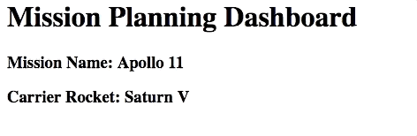
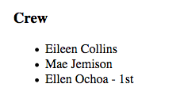
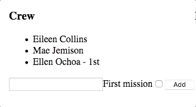
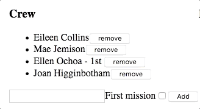
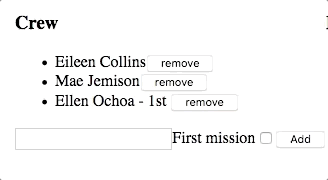

# Studio: Angular, Part 2

At the end of the first mission planner studio, multiple components
display data about the mission. Your job is to allow the user to update
the mission plan by adding user interaction.

## Getting Started

For this studio and the next, you will clone some starter code from
GitHub.

1.  Fork the [Angular Mission Planner
    repository](https://github.com/LaunchCodeEducation/angular-lc101-mission-planner).

2.  In the terminal, move into your root `angular_practice` directory.

3.  Create a new subdirectory for the Mission Planner repository

4.  `cd` into the new subdirectory. Do NOT `git init`.

5.  Clone your fork inside your new subdirectory.

    ::: admonition
    Warning

    Initializing a new Angular project inside of another one creates
    version control complications that are best avoided.

    Before running the `git clone` command in the terminal, make sure
    you are inside the subdirectory you just made! Cloning into a
    project that already has a repo of some kind will throw an error.

    Using the `ls` command in your terminal is a great way to verify
    your location.

    `Tips for repository organization and init vs clone <tidy-repos>`{.interpreted-text
    role="ref"}.
    :::

6.  Use `git status` to verify that you are on branch `studio-2`. If
    not, use `git checkout branch-name` to switch to it.

    ::: admonition
    Warning

    When you fork your repo over, `studio-2` may have been renamed
    `main` by GitHub. To verify you have the correct code, compare your
    `crew.component.html` to LaunchCode\'s `crew.component.html` on the
    `studio-2` branch.

    You can rename your branches to match the LaunchCode\'s branch
    names, or keep it as `main`.

    [How to rename a
    branch](https://education.launchcode.org/intro-to-programming-csharp/chapters/git/branches.html)
    (Scroll down to 15.4.5)
    :::

7.  Run `npm install` to download dependencies.

8.  Run `ng serve` to build and serve the project.

## Review the Starter Code

The starter code for this studio is similar to the *solution* for the
first mission planner studio, but with a few notable changes.

### Editable Mission Name

The mission name can now be edited by clicking on the text, changing the
text in the input box, and then updated by clicking save or pressing the
enter key. Review the code in `src/app/header/header.component.html` and
`src/app/header/header.component.ts` to see how this feature was
implemented.

<figure>

<figcaption>Example of mission name being edited.</figcaption>
</figure>

### Crew Array of Objects

Open `src/app/crew/crew.component.ts` in VSCode. Notice on line 10 that
a crew array is defined. This array of objects will be used to display
the crew. Each crew member has a `name` and `firstMission` property. If
`firstMission` is `true`, it means this is the first mission for that
person.

``` {.TypeScript linenos=""}
import { Component, OnInit } from '@angular/core';

@Component({
   selector: 'app-crew',
   templateUrl: './crew.component.html',
   styleUrls: ['./crew.component.css']
})
export class CrewComponent implements OnInit {

   crew: object[] = [
      {name: "Eileen Collins", firstMission: false},
      {name: "Mae Jemison", firstMission: false},
      {name: "Ellen Ochoa", firstMission: true}
   ];

   constructor() { }

   ngOnInit() {
   }

}
```

## Requirements

::: note
::: title
Note
:::

All of these features only *temporarily* alter the data. If you refresh
the page, the original data will reappear.
:::

### Edit Rocket Name

The rocket name should be clickable and editable like the mission name.
Alter `src/app/header/header.component.html` and
`src/app/header/header.component.ts` to allow the user to edit the
rocket name.

### Use `*ngFor` to Display Crew

Replace the static list of `<li>` tags in
`src/app/crew/crew.component.html` with an `*ngFor` that loops over the
`crew` array.

Add this code to `src/app/crew/crew.component.html`.

``` {.html+ng2 linenos=""}
<li *ngFor="let member of crew">{{member.name}}</li>
```

### Display 1st Mission Status

If a crew member\'s `firstMission` property is `true`, then display the
text \"- 1st\" next to their name.

<figure>

<figcaption>Example of first mission status being shown.</figcaption>
</figure>

Add this code right after the member name in
`src/app/crew/crew.component.html`.

``` {.html+ng2 linenos=""}
<span *ngIf="member.firstMission">- 1st</span>
```

### Add Crew Members

Allow crew members to be added to the list. To create a new crew member,
two pieces of information are required:

1.  crew member\'s name
2.  the first mission status

We will use an input box and a *checkbox* to collect the data.

<figure>

<figcaption>Example of crew member being added.</figcaption>
</figure>

Add this code to the *bottom* of `src/app/crew/crew.component.html`.

``` {.html+ng2 linenos=""}
<input #name type="text"/>
<label>First mission<input #firstMission type="checkbox"/></label>
<button (click)="add(name.value, firstMission.checked)">Add</button>
```

Line 1 creates an input that declares the local variable `name`. Line 2
defines a checkbox that declares the `firstMission` variable. Line 3
creates a button that, when clicked, sends the new `name` and `checkbox`
value to the `add` function. This function adds the new crew member to
the roster!

In the `src/app/crew/crew.component.ts` file, include this code for the
`add` function:

``` {.TypeScript linenos=""}
add(memberName: string, isFirst: boolean) {
  this.crew.push({name: memberName, firstMission: isFirst});
}
```

### Remove Crew Members

Allow removing of crew members by adding a button next to each person in
the crew list. When the remove button is clicked, the `remove` function
in the crew component will be called, which deletes that person from the
crew array.

<figure>

<figcaption>Example of crew member being removed.</figcaption>
</figure>

Add line 4 to file `src/app/crew/crew.component.html`. Be sure to put it
before the closing `</li>`, so that the button appears next to each item
in the crew list.

``` {.html+ng2 linenos=""}
<li *ngFor="let member of crew">
   {{member.name}}
   <span *ngIf="member.firstMission">- 1st</span>
   <button (click)="remove(member)">remove</button>
</li>
```

Add the `remove` function shown below to the crew component in the
`src/app/crew/crew.component.ts` file.

``` {.TypeScript linenos=""}
remove(member: object) {
  let index = this.crew.indexOf(member);
  this.crew.splice(index, 1);
}
```

### Edit Crew Members

Finally we are going to allow the user to edit crew members who have
already been added.

1.  If the crew member name is clicked, then their name should be
    replaced with a text input and a save button.

2.  When save is clicked, the input and save button are replaced by the
    text-only version of the name.

3.  Only one crew member can be edited at a time.

    <figure>
    
    <figcaption>Example of crew member name being edited.</figcaption>
    </figure>

We need to add a click event to the member name.

4.  Put `{{member.name}}` inside of a `<span>` that has a `(click)`
    handler.

5.  Make the `<li>` in `src/app/crew/crew.component.html` look like the
    code below.

    ``` {.html+ng2 linenos=""}
    <li *ngFor="let member of crew">
       <span (click)="edit(member)" class="editable-text">{{member.name}}</span>
       <span *ngIf="member.firstMission">- 1st</span>
       <button (click)="remove(member)">remove</button>
    </li>
    ```

We need a way of knowing which crew is being edited.

6.  Add this property to the crew component in file
    `src/app/crew/crew.component.ts`. The property `memberBeingEdited`
    represents the crew member who is currently being edited.

    ``` TypeScript
    memberBeingEdited: object = null;
    ```

7.  Next add a `edit` function to the crew component file
    `src/app/crew/crew.component.ts`. This function will set a
    `memberBeingEdited` variable to be equal to the crew member who was
    clicked.

    ``` TypeScript
    edit(member: object) {
       this.memberBeingEdited = member;
    }
    ```

Now we need to add an `*ngIf` that will show the two versions of the
member, the display state or the edit state.

8.  In the edit state, an input box with a save button will appear, but
    for now the input and save won\'t have any functionality. Make your
    `src/app/crew/crew.component.html` file look like the below code.

    ``` {.html+ng2 linenos=""}
    <h3>Crew</h3>
    <ul>
       <li *ngFor="let member of crew">

          <span *ngIf="memberBeingEdited !== member; else elseBlock">
             <!-- display state of member -->
             <span (click)="edit(member)" class="editable-text">{{member.name}}</span>
             <span *ngIf="member.firstMission">
                - 1st
             </span>
             <button (click)="remove(member)">remove</button>
          </span>

          <ng-template #elseBlock>
             <!-- edit state of member -->
             <input />
             <button>save</button>
          </ng-template>

       </li>
    </ul>
    <input #name type="text"/>
    <label>First mission<input #firstMission type="checkbox"/></label>
    <button (click)="add(name.value, firstMission.checked)">Add</button>
    ```

Finally, we are going to make the edit state update the member name when
save is clicked.

9.  Update the `<input>` and `<button>` tags to look like:

    ``` {.html+ng2 linenos=""}
    <ng-template #elseBlock>
       <!-- edit state of member -->
       <input #updatedName (keyup.enter)="save(updatedName.value, member)" value="{{member.name}}"/>
       <button (click)="save(updatedName.value, member)">save</button>
    </ng-template>
    ```

The last step is to add the `save` function to the crew component. This
function will be called when the `<button>` is clicked or when the enter
key is pressed and the `<input>` has focus.

10. Add the below `save` function to the crew component.

    ``` {.TypeScript linenos=""}
    save(name: string, member: object) {
    member['name'] = name;
    this.memberBeingEdited = null;
    }
    ```

11. Commit and push up your work.

## Bonus Missions

Before starting on any of these bonus features, be sure to commit and
push your work.

1.  Don\'t allow duplicate names to be added to the crew.
2.  Allow user to add equipment.
3.  Allow the user to edit equipment.
4.  Allow the user to remove equipment.
5.  Allow user to add experiments.
6.  Allow the user to edit experiments.
7.  Allow the user to remove experiments.

## Sanity Check

Complete code for this studio (without the bonus content) can be found
in the `studio-2-solution` branch of the repository.
