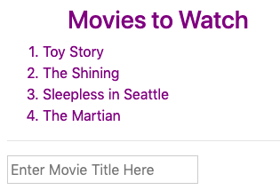
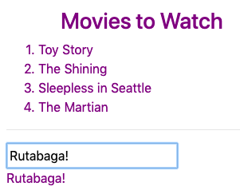
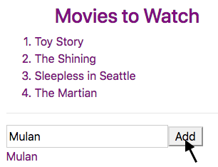

# Responding to User Input

So far, if we want to change the number of items in our movie and chore
lists, we have to go into the code and alter the arrays. This is
inefficient. It would be better if we could make the changes on the
screen.

## Change Practice Folder

From the `lesson2` folder in VSCode, open the
`examples/input-practice/src/app/movie-list` folders and select the
`movie-list.component.html` file.

The starter code should match this:

``` {.html+ng2 linenos=""}
<div class='movies col-4'>
   <h3>Movies to Watch</h3>
   <ol>
      <li *ngFor ="let movie of movies">{{movie}}</li>
   </ol>
   <hr>

</div>
```

In the terminal, navigate into the `input-practice` folder. Enter
`npm install` to add the Angular modules, then run `ng serve`. The web
page should look like this:


Now let\'s modify the code to accept user input. Be sure to code along
with each step.

## Setting Up an Input Box

Recall that the `HTML input tag <input-tag>`{.interpreted-text
role="ref"} creates a box where the user can enter data. This data is
retrieved by referencing the input element\'s `value` property.

1.  Add `<input type='text' placeholder="Enter Movie Title Here"/>` to
    line 7, then reload the page.



Typing characters into the box does not do anything yet, since we have
not included any instructions to deal with the data.

2.  Angular extends the `input` element by declaring a *reference
    variable* and also an *event* that triggers data collection. Modify
    the input element in line 7 by adding `#newMovie` inside the tag:

    ``` html+ng2
    <input #newMovie type='text' placeholder="Enter Movie Title Here"/>
    ```

3.  To store the typed characters in the `newMovie` variable, we need to
    wait for a particular event to occur. One of the simplest is to wait
    for a `keyup`. Modify line 7 one more time:

    ``` html+ng2
    <input #newMovie (keyup)='true' type='text' placeholder="Enter Movie Title Here"/>
    ```

    `(keyup)='true'` waits for the user to tap and release a key when
    the cursor is in the input box. When this happens, any characters in
    the box are stored in `newMovie`. However, we still need a place for
    the data to *go*.

4.  Add a `<p>` element to line 8 of your code, and include a
    placeholder for the value of `newMovie`. Save and reload the page:

    ``` {.html+ng2 linenos=""}
    <div class='movies col-4'>
       <h3>Movies to Watch</h3>
       <ol>
          <li *ngFor ="let movie of movies">{{movie}}</li>
       </ol>
       <hr>
       <input #newMovie (keyup)='true' type='text' placeholder="Enter Movie Title Here"/>
       <p>{{newMovie.value}}</p>
    </div>
    ```

When the `keyup` event is triggered, data gets stored in the `newMovie`
variable. The `newMovie.value` placeholder on line 8 displays that data
on the screen.

::: admonition
Try It

Save your work, reload the page, and then play! Type into the input box
to verify your code works.



As you add or remove characters from the input box, you should see a
real-time update of the text on the screen.
:::

## Changing the Event

In the example above, we used the `keyup` event to trigger data
collection. This choice stores data in `newMovie` every time a key is
released. For adding a new movie title to our list, however, it would be
better to wait for the user to finish typing.

### Modifying `keyup`

The `keyup` event waits for ANY key to be released, but Angular allows
us to modify the keyword to wait for a SPECIFIC key. If, for example, we
want to record data when the \'0\' key is released, then we would
replace `(keyup)='true'` with `(keyup.0)='true'`.

The general syntax for this modification is `keyup.key`, and `key`
refers to any character on the keyboard\-\--including `shift`, `enter`,
and `space`.

::: admonition
Try It

Change the `keyup` event in line 7 to:

1.  `keyup.enter`,
2.  `keyup.arrowup`,
3.  `keyup.q`

Refresh the page after each change and explore how each one affects
collecting user input.

Other key combinations are described at
[alligator.io](https://alligator.io/angular/binding-keyup-keydown-events/).
:::

### Wait for a Click

5.  Instead of waiting for a specific key to be pressed, let\'s wait for
    the user to click. Replace the `(keyup)` event with `(click)` in
    line 7:

    ``` html+ng2
    <input #newMovie (click)='true' type='text' placeholder="Enter Movie Title Here"/>
    ```

    Notice that the page now changes only when the user clicks inside
    the input box. This method is similar to `keyup.enter` because it
    gives the user a specific action to perform that records the entry
    without changing the text.

### Now Add a Button

Since most of us are used to pressing the \"Enter\" key to submit our
input, clicking inside the box might not be the best option.
Fortunately, we know how to add a button to our HTML.

6.  Add a `<button>` element with a `click` event to line 8. Also,
    change the event in line 7 back to `keyup.enter`:

    ``` {.html+ng2 linenos=""}
    <div class='movies col-4'>
       <h3>Movies to Watch</h3>
       <ol>
          <li *ngFor ="let movie of movies">{{movie}}</li>
       </ol>
       <hr>
       <input #newMovie (keyup.enter)='true' type='text' placeholder="Enter Movie Title Here"/>
       <button (click)='true'>Add</button>
       <p>{{newMovie.value}}</p>
    </div>
    ```

    Refresh the page and type a title into the input box. Tapping
    \"Enter\" or clicking the \"Add\" button should display your text
    below the box.

    

## Summary

We now have a way to collect user input and store it in a variable. We
also learned how to access the data and display it on the web page.

To accept user input, Angular requires three items:

1.  The HTML `input` tag,
2.  A variable to store the input, declared as `#variableName`,
3.  An event that triggers data collection.

On the next page, we will learn how to make that input appear in our
list of movies.
