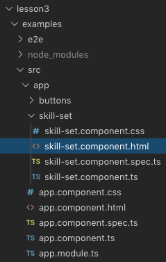
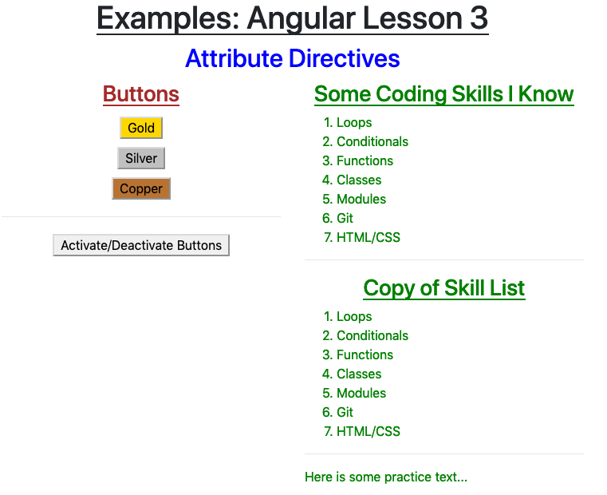
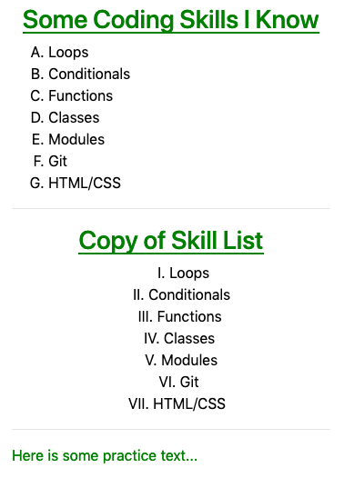

# Attribute Directives

In the previous two chapters, you learned about two of the three
`Angular directives <angular-directives>`{.interpreted-text
role="ref"}\-\--components and structural. You will now use data-binding
to practice *attribute directives*. These change the appearance of a
specific HTML element within the DOM.

## Open the Lesson 3 Folder

Open VSCode and return to the `angular-lc101-projects` folder. Find
`lesson3/examples/src/app` in the sidebar and open the
`skill-set.component.ts`, `skill-set.component.html`, and
`skill-set.component.css` files.



Open the terminal panel and navigate to the lesson3 `examples` folder.
Also make sure that you are on the `master` branch.

``` bash
$ git branch
   * master
   solutions
$ ls
   lesson1 lesson2 lesson3
$ cd lesson3
$ ls
   examples        exercises
$ cd examples
```

Once you are in the folder, enter `npm install` in the terminal, then
run `ng serve` to launch the project.

You should see the following:



## Update the Skill-Set Styling

Examine the code in the `skill-set.component.css` and
`skill-set.component.html` files:

::: admonition
Examples

CSS

``` {.css linenos=""}
h3 {
   text-align: center;
   text-decoration: underline;
}

.skills {
   color: green;
}
```

HTML

``` {.html+ng2 linenos=""}
<div class="skills">
   <h3>{{listHeading}}</h3>
   <ol>
      <li *ngFor="let skill of skills">{{skill}}</li>
   </ol>
   <hr>
   <h3>Copy of Skill List</h3>
   <ol>
      <li *ngFor="let skill of skills">{{skill}}</li>
   </ol>
   <hr>
   <p>Here is some practice text...</p>
</div>
```
:::

Right now, there is an awful lot of green on the page, which is set by
the `skills` class in the CSS file. Let\'s fix this with some attribute
directives.

### Inline Styling

To change the color and bullet type of the first list element, we could
override the CSS instructions with some inline code:

``` html
<ol style="color: black" type="A">
```

However, we can use what we learned about data-binding to replace these
hard-coded styles with variables:

``` html+ng2
<ol [style.color]="alternateColor" [type]="bulletType">
```

Ideas to note:

1.  Unlike the structural directives `*ngFor` and `*ngIf`, we can add
    more than one attribute directive to an HTML tag.

2.  The `style` attribute has different properties that can be assigned
    using dot notation. Examples include `style.color` and
    `style.background`. For properties with two-word labels, like
    `text-align`, the data-binding syntax accepts either hyphens or
    camel case (`style.text-align` or `style.textAlign`).

3.  The variables `alternateColor` and `bulletType` are assigned in the
    `skill-set.component.ts` file.

    ``` {.TypeScript linenos=""}
    export class SkillSetComponent implements OnInit {
       listHeading: string = 'Some Coding Skills I Know';
       skills: string[] = ['Loops', 'Conditionals', 'Functions', 'Classes', 'Modules', 'Git', 'HTML/CSS'];
       alternateColor: string = 'black';
       bulletType: string = 'A';
       changeColor: boolean = true;

       constructor() { }

       ngOnInit() { }

    }
    ```

4.  NEAT! Reassigning the `alternateColor` variable in the `.ts` file
    causes EVERY tag with `[style.color]="alternateColor"` to change
    color.

::: admonition
Try It

Change the values for the `alternateColor` and `bulletType` variables.
Save your work and refresh the web page to see the results.

Note that `bulletType` takes options of numbers (`1`), upper and lower
case letters (`A`, `a`), or upper and lower case Roman numerals (`I`,
`i`). For a detailed description of using the `type` attribute in an
ordered list, check out the [W3 schools
documentation](https://www.w3schools.com/tags/att_ol_type.asp).
:::

### Changing Styles with Booleans

We can accomplish the same results by applying a class to the second
`ol` tag:

1.  Add the following code to `skill-set.component.css`:

    ``` {.CSS linenos=""}
    .ol-style {
       color: black;
       text-align: center;
       list-style-type: upper-roman;
    }
    ```

    ::: admonition
    Note

    The CSS property `list-style-type` defines the look of the list item
    markers, similar to the `ol` element\'s `type` attribute. The values
    available to the CSS property are different, however. You can find a
    full list at [W3
    schools](https://www.w3schools.com/cssref/pr_list-style-type.asp).
    :::

2.  Next, modify line 8 in the starter HTML:

    ``` {.html+ng2 linenos=""}
    <div class="skills">
       <h3>{{listHeading}}</h3>
       <ol [style.color]="alternateColor" [type]="bulletType">
          <li *ngFor="let skill of skills">{{skill}}</li>
       </ol>
       <hr>
       <h3>Copy of Skill List</h3>
       <ol [class.ol-style]="changeColor">
          <li *ngFor="let skill of skills">{{skill}}</li>
       </ol>
       <hr>
       <p>Here is some practice text...</p>
    </div>
    ```

    After saving these updates, the skills list changes appearance:

    

3.  Instead of setting `[class.ol-style]` equal to a string, the
    `changeColor` variable is a boolean defined in the
    `skill-set.component.ts` file. If `changeColor` is `true`, Angular
    adds the `ol-style` class of the tag. If `changeColor` is `false`,
    the class remains absent from the tag.

::: admonition
Try It

1.  Set `changeColor` to `false` and verify that the second ordered list
    changes back to green, left-aligned, and numbered.
2.  Create a `p-style` class in the CSS file and modify line 12 in
    `skill-set.component.html` to make the color and alignment of the
    `p` element depend on `!changeColor`.
:::

## What About the Buttons?

Nice display of eagerness! We will deal with the buttons on the next
page.

## Check Your Understanding

The `reversed` attribute labels ordered lists from highest to lowest
values (9, 8, 7\... instead of 1, 2, 3\...). Unlike the `class` or
`style` attributes, `reversed` is not set equal to a string inside the
HTML tag. Just having it in the tag flips the numbering of the bullets.

``` html
<ol style="color: blue" reversed>
```

::: admonition
Question

How could we data-bind the `reversed` attribute in an `ol` tag? Indicate
ALL working options.

1.  Bind the attribute to a variable that holds the string `"reversed"`
    or `"notReversed"`.
2.  Bind the attribute to a boolean variable set as `true` or `false`.
3.  Bind the attribute to a boolean statement like
    `variable1 > variable2`.
4.  Bind the attribute to the empty string `""`.
5.  Just put square brackets around `reversed` and hope for the best.
:::
