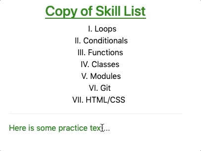
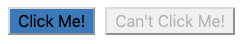
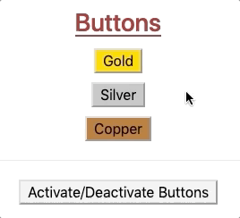
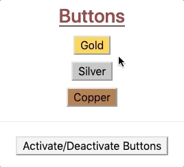
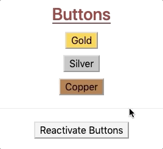
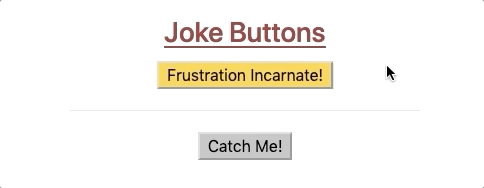

# Dynamic Style Changes

By adding `event listeners <angular-events>`{.interpreted-text
role="ref"} to our Angular projects, we can make any element on our web
page interactive. This allows us to change the styling on the page in
response to user actions.

Before we add functionality to the buttons, let\'s first update our text
styling a little bit.

## Interactive Elements

Let\'s make the paragraph element respond to user clicks.

Change line 12 in `skill-set.component.html` by adding a `(click)`
event:

``` {.html+ng2 linenos=""}
<div class="skills">
   <h3>{{listHeading}}</h3>
   <ol [style.color]="alternateColor" [type]="bulletType">
      <li *ngFor="let skill of skills">{{skill}}</li>
   </ol>
   <hr>
   <h3>Copy of Skill List</h3>
   <ol [class.ol-style]="changeColor">
      <li *ngFor="let skill of skills">{{skill}}</li>
   </ol>
   <hr>
   <p [class.p-style]="!changeColor" (click)="changeColor = !changeColor">Here is some practice text...</p>
</div>
```

Since `changeColor` is a boolean, `(click)="changeColor = !changeColor"`
flips the value of the variable between `true` and `false` whenever the
text is clicked.



Notice that since the style of the ordered list also depends on
`changeColor`, its appearance changes as well.

::: admonition
Try It

1.  Replace `(click)` with `(mouseover)` in line 12 and examine how the
    interactivity changes.
2.  What happens if we add `(click)="changeColor = !changeColor"` to the
    `<li>` tag in line 9? Does this make a single list element clickable
    or all of them?
:::

## Button Styling

The `button` tag accepts `class` and `style` just like other HTML
elements, but `button` also has its own set of special attributes.
Detailed descriptions of these attributes appear at [W3
schools](https://www.w3schools.com/tags/tag_button.asp) and
[MDN](https://developer.mozilla.org/en-US/docs/Web/HTML/Element/button).
However, for these examples we will focus on `disabled`.

Adding the `disabled` attribute inside the tag deactivates the button.
Any time you see a greyed out button on a web page, `disabled` is the
cause.

::: admonition
Example

Code:

``` {.html+ng2 linenos=""}
<button [style.background]="lcLightBlue">Click Me!</button>
<button disabled>Can't Click Me!</button>
```

Result:


:::

The `disabled` attribute overrides any other function calls or events
within the `button` tag.

### Dynamic Button Activation

Data-binding lets us activate or deactivate buttons based on user
actions or variables we control.

Open the `buttons.component.html` and `buttons.component.ts` files and
examine the code.

::: admonition
Examples

HTML file:

``` {.html+ng2 linenos=""}
<div class="buttons">
   <h3>{{buttonHeading}}</h3>
   <button class="gold">Gold</button> <br>
   <button class="silver">Silver</button> <br>
   <button class="copper">Copper</button> <hr>
   <button>Activate/Deactivate Buttons</button>
</div>
```

`ButtonsComponent` class in the `.ts` file:

``` {.typescript linenos=""}
export class ButtonsComponent implements OnInit {
   buttonHeading: string = "Buttons"
   inactive: boolean = false;

   constructor() { }

   ngOnInit() { }

}
```
:::

To dynamically activate or deactivate a button, we need to bind the
attribute to a boolean. In this case, we can use the `inactive` variable
defined in the `buttons.component.ts` file.

1.  Modify line 3 in the HTML file as follows:

    ``` html+ng2
    <button [class.gold]="!inactive" [disabled]="inactive" (click)="inactive = true">Gold</button> <br>
    ```

    Save your changes and refresh the web page. Now when you click on
    the \"Gold\" button, `inactive` gets set to `true`. This adds the
    `disabled` attribute to the HTML tag, turning it off. In addition,
    the `gold` class is removed, changing the color of the button.

2.  Since the \"Gold\" button is no longer active, clicking on it again
    will not trigger any events. To re-enable the button, we need to tie
    `inactive` to another tag and event.

3.  Modify line 6 in the HTML file as follows:

    ``` html+ng2
    <button (click)="inactive = !inactive">Activate/Deactivate Buttons</button>
    ```

The buttons on the page should now behave something like:



#### Silver and Copper

Modify the `button` tags for \"Silver\" and \"Copper\" so that they also
depend on `inactive`. Properly done, clicking ANY of the buttons
deactivates ALL of them:



If we want to disable only the button that gets clicked, then we will
need to create a separate boolean variable for each element. We must
also update the \"Activate/Deactivate\" button to reset all of the
booleans to `true`. (Hint: How about setting the `(click)` event to a
function call?)

## Try It!

Modify the code in `buttons.component.html` and `buttons.component.ts`
to make the buttons behave like this:



::: admonition
Note

If you find yourself stuck after trying, and trying, and TRYING,
remember that there is a `solutions` branch in the repository.
:::

## Bonus Try It!

Just for fun, use what you have learned about events and data binding to
create buttons that behave like this:



::: admonition
Warning

These bonus options are ONLY FOR FUN. Using any of these on a business
website would be a poor choice.
:::

## Check Your Understanding

::: admonition
Question

To include dynamic styles in a component:

1.  Only data-binding is needed,
2.  Only an event handler is needed,
3.  Data-binding and event handling are both necessary,
4.  Angular, data-binding, and event handling are all necessary.
:::

::: admonition
Question

Which of the following shows the three Angular directives arranged from
the most general to most specific?

1.  Components, structural directives, attribute directives
2.  Components, attribute directives, structural directives
3.  Structural directives, components, attribute directives
4.  Structural directives, attribute directives, components
5.  Attribute directives, structural directives, components
6.  Attribute directives, components, structural directives
:::

::: admonition
Question

Consider the following code samples:

CSS:

``` css
.special {
   background-color: blue;
}
```

TypeScript:

``` {.TypeScript linenos=""}
export class Component implements OnInit {

   specialFactor: boolean = false;

   constructor() { }

   ngOnInit() { }

}
```

HTML:

``` {.html+ng2 linenos=""}
<div [class.special]="specialFactor">Very Special Content</div>
```

Which of the following, when added to the HTML tag, will render the
`<div>` element blue when clicked?

1.  `(click)="!specialFactor"`
2.  `(click)="specialFactor = 5 < 3"`
3.  `(click)="specialFactor = !specialFactor"`
4.  `(click)="specialFactor = false"`
:::
