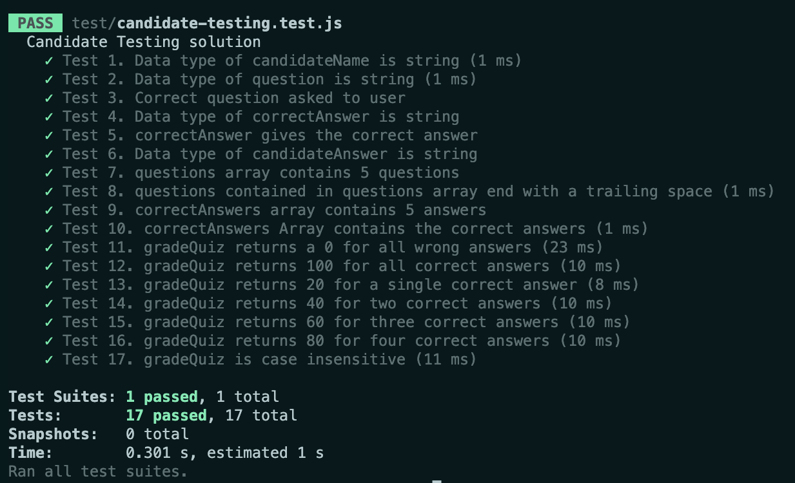

Finally, calculate the candidate's score and print the results. Look for `TODO 3.2`.  The rest of the steps involve updating code you have written and adding more code. 

Don't remove anything in the file that you haven't written. Doing so may cause your program to behave unexpectedly - and we might not be able to grade it!

**Your task here is to:**

   1. Compare the candidate answers with the correct answers,

   1. Calculate the candidate's score as a percentage,

   1. Convey to the candidate if they have passed the quiz with an 80% or if they have failed.

Some tips:
   1. Checking for the correct answer should be case insensitive (e.g. "Orbit" is the same as "orbit").

   1. `TODO 3.2` you should see a variable declaration for `grade`. Use this to calculate the candidate's score as a percentage, using this equation:

      _(Number of Correct Answers) / (Number of Quiz Questions) * 100_

## Testing Part 3

In the terminal run `npm test`.  This will run the autograding tests.  The results will display in the terminal.

   > To pass Part 3, you need to pass tests 11-17.  

You should still pass tests 1-10 from Parts 1 and 2. 


   


When you pass all 17 tests, push up your work.  Your repo should receive a green check mark. Let your TA know you have this checkmark.  You need to walk your TA through your code in order to be marked complete.

## Congratulations!  

You have completed Graded Assignment 1!  Great Work!
