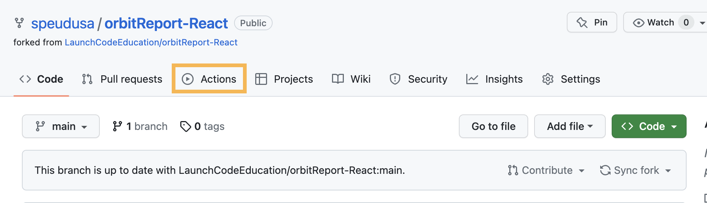
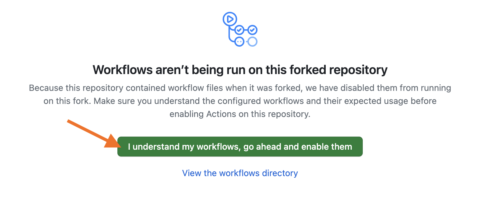
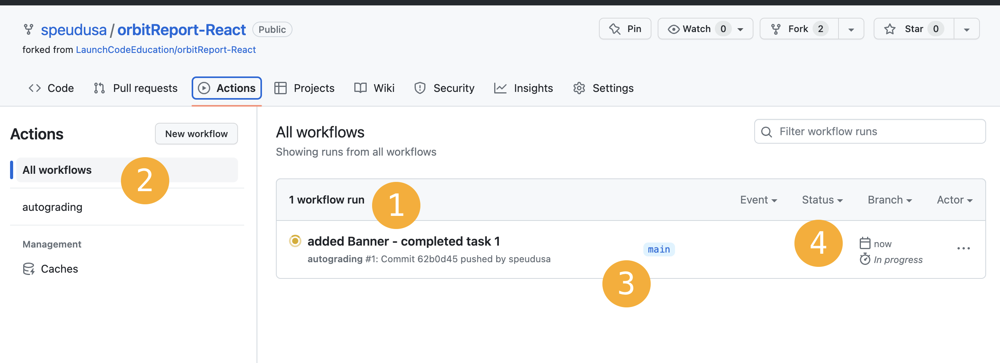
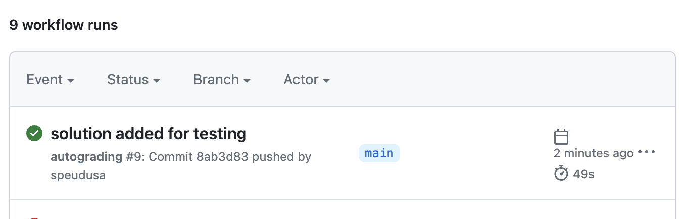
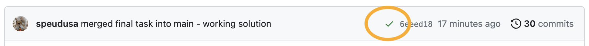
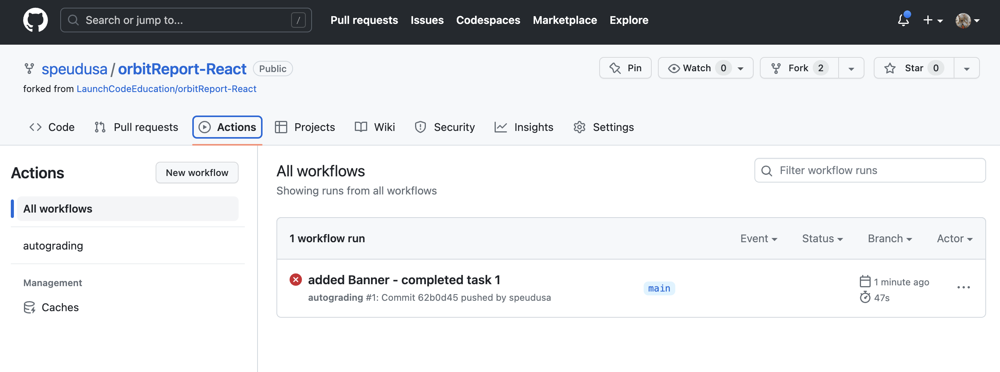
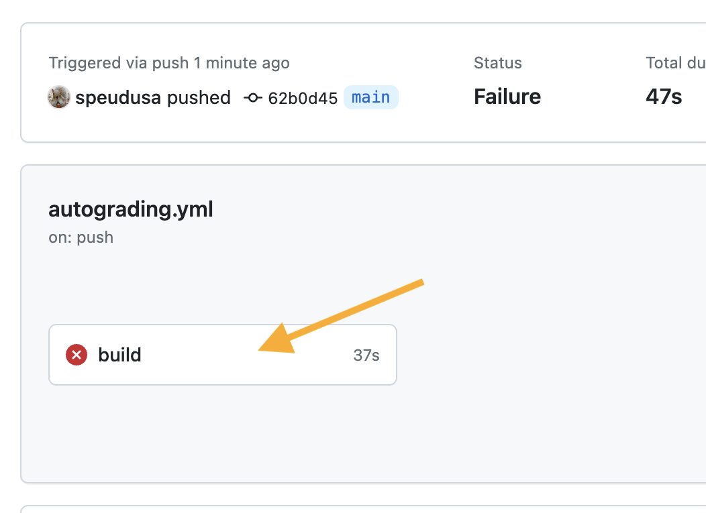
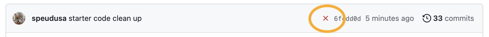

We use unit tests in your graded assignments to provide feedback on your progress. We will refer to them as auto-graded or auto-grading tests in these projects. Use the tests to check your work as you complete the assignment. The goal is to pass all tests.

There are 2 ways to work with auto-grading tests:
1. Using GitHub Actions in GitHub
1. Inside your terminal

## Using GitHub Actions

Your Graded Assignment is not complete until you receive a green check mark from GitHub Actions.

## Using GitHub Actions

1. Fork and clone the repository.
1. Select the `Actions` Button.
   
      
   

1. Enable workflows by clicking on the green button.
   
      
   

1. You will not have any workflows at this time.  They will trigger when you push up from any branch locally.
1. Work on your assignment. 
1. When you receive a green check mark, inform your TA and review your code together.

## Working with GitHub Actions
As you work on your assignment, you may push up your branch at any time.  This will trigger the actions to run.  You do not have to wait for a complete solution before you push up.  GitHub Actions will run regardless of how far through the project you are.

### Workflows
The auto-grading tests are contained in a **workflow**.  This runs when the action is triggered.  If you are on the Actions page, you'll see the following:

   
      
   
   1. The commit message for the last commit pushed up. The number of workflows running. The status of the workflow, in this case, it's yellow for pending.
   1. The selection of workflows.  You can select All or the one named `autograding`.  In this repo, all unit tests were combined in a single workflow, `autograding`.
   1. The branch that is being tested.  For these tests, we have set the actions to run whenever any branch pushes up to the repo.  You can check any of your branches before you merge them into the `main` branch.
   1. A progress check.  In forms you when the last test was run and how long it took to either pass or fail.  (Failures are usually faster than passes)

### Passing Workflows

If you pass your workflows, you will see a green circle with a checkmark inside.
   
      
   

You can pass on any branch you push.
Make sure your `main` branch passes once your project is complete.

You will also see a checkmark on the `main` repo page if you passed all of the tests in the workflows.

   
      
   

### Failing Workflows
If you failed the workflow, you will see a red circle with an `x` inside.  
   
      
   

Click on the commit message, "added Banner - completed task 1" in this example, to explore the cause of failure.

   
      
   

Click on the **build** button to see the more detailed report.  This can identify exactly which test(s) failed. You may have to scroll through this file to find out what is not passing.
   
      
   

You will also see a red `x` on the repo page if you have not passed any part of the workflow:
   
      
   

Keep coding until you pass all of the tests.

## Using the Terminal

Testing in the terminal will vary by project.  Instructions are included in each Graded Assignments for running tests in the terminal.

Most Graded Assignments will use the command `npm test` to run the tests locally.  If any other instructions are needed, they will be found in the actual assignment section.
