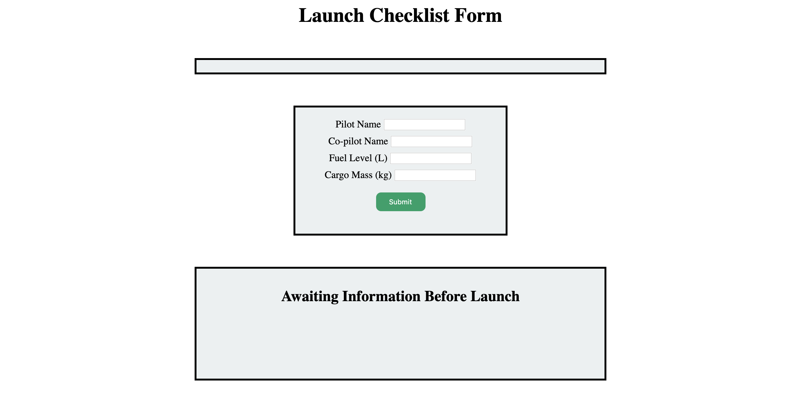

Fork and clone the starter code [repository](https://github.com/LaunchCodeEducation/Launch-Checklist-Autograded).

To get started, navigate to the directory with your copy of the starter code. 

1. Run `npm install`.
1. Open `index.html` with Firefox to verify that your starter code is working.

When you open `index.html` in the browser, you should see the Launch Checklist form with a rectangle above it for the mission destination and a rectangle below it that simply says "Awaiting Information Before Launch".

Before starting work, go ahead and check out the various files in your starter code. You may notice a file called `bundle.js`. This file contains no code except for a comment. Do NOT delete or edit this file.
The only files you should be editing when working on this project are `script.js` and `scriptHelper.js`. To modify styles or update HTML, do NOT modify `styles.css` or `index.html`.

{}

   If you open up your browser's dev tools, you may see a warning stating that the `require` statement in `scriptHelper.js` is not working.
   This is okay! That `require` statement is necessary for the autograder to function and this warning will not impact your site's ability to function.

{}