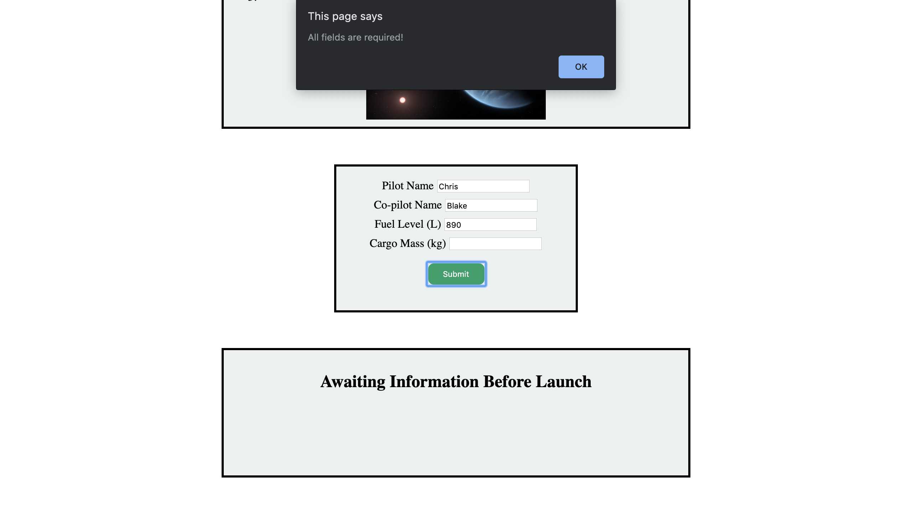

## The End Result

After you implement everything, the following form submission would result in the proper updates to the `launchStatus` and `faultyItems` list.

With only 890 liters of fuel, the status of the launch becomes red and states that the shuttle is not ready. 
The list has also updated to indicate that that is not enough fuel for the shuttle to launch.

If the user forgets to enter the cargo mass, then an alert pops up letting the user know that all fields are required.

If the user switches up the information that needs to go in the fields, then an alert pops up letting the user know that they have tried to enter invalid information.

## Submission

Even if everything is working perfectly with your site, the autograder may still be counting something as wrong.
Here are some steps you can take to make sure your great work is counted as such!

1. Make sure that all of your methods are complete in `scriptHelper.js`! The autograder needs to check your logic for each of the methods.
   `script.js` should contain calls to these functions.
1. If the tests are failing, make sure that you did not modify `bundle.js` or remove `` from `index.html`.
   The autograder needs `bundle.js` linked as a script in `index.html` in order to run properly.