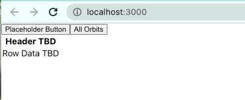

### Explore the Starter Code
<!-- TODO: link to repo it needs to be added to GitHub Classroom-->
1. Fork and Clone the [starter code] (LINK HERE) repo.
   1. Run `npm install` 
   1. Run `npm start` to run the starter code.

1. Open the project and examine the following parts:
   1. `components` directory
      1. `satData.js` contains the data used for this assignment.  It is an array of objects.  Note the key/value pairs.  
      1. `Buttons.js` contains two `<button>` tags.  The both `<button>` tags are placeholders.  We will be updating these buttons as we work in this component.  When the project is complete, it will render 4 buttons.
      1. `Table.js` contains a very basic table structure.  You will expand the table so that it displays the required data for each satellite.  
         1. "TBD" stands for "To Be Determined" 
         <!-- TODO: link to styling step -->
      1. `styling.css` contains CSS stylings.  Styling is **_optional_** for this assignment.  If you want to use the styling provided, read the [LINK TO STEP] to see where to import this file.
      
1. If you have not started the project yet, run `npm start` in the terminal.  You should see the following:


   


[Next]()