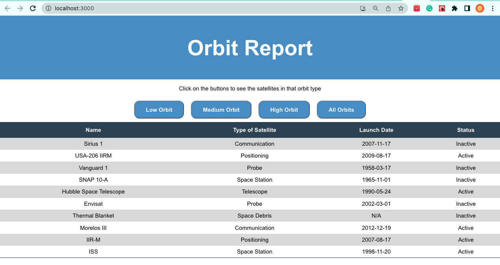
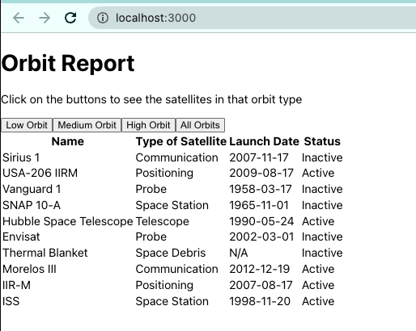

## Introduction and Background
There are thousands of satellites orbiting the earth. You are tasked with updating a searchable, sortable table of satellites. For the purposes of this assignment, a **satellite** will be defined as any object purposefully placed into orbit.

For this assignment, you will create a table that shows satellites based on their orbit paths.  There are three [types of orbit paths](https://earthobservatory.nasa.gov/features/OrbitsCatalog) for satellites: Low, Medium, High.  

Your completed assignment will have the following features:
1. A **banner** that introduces the project and provides instructions on how to use the application.
1. A **table** that renders satellite information based on the orbit path.  
1. Multiple **buttons** that show satellites in an orbit path. When a user clicks a button the table will render the satellites with that designated orbit path.

## Getting Started
Fork and clone the Graded Assignment's [starter code](https://github.com/LaunchCodeEducation/orbitReport-React). Open the project in Visual Studio Code.

### Starter Code Check

When you first pull down the starter code, your running application will look something like this:


   


### Completed Code Check

When you completed you have the option to apply CSS styling or not.  The end result of the assignment will look like one of the following:

**With Styling Applied**

   


**Without Styling Applied**

   


[Start The Assignment]()
