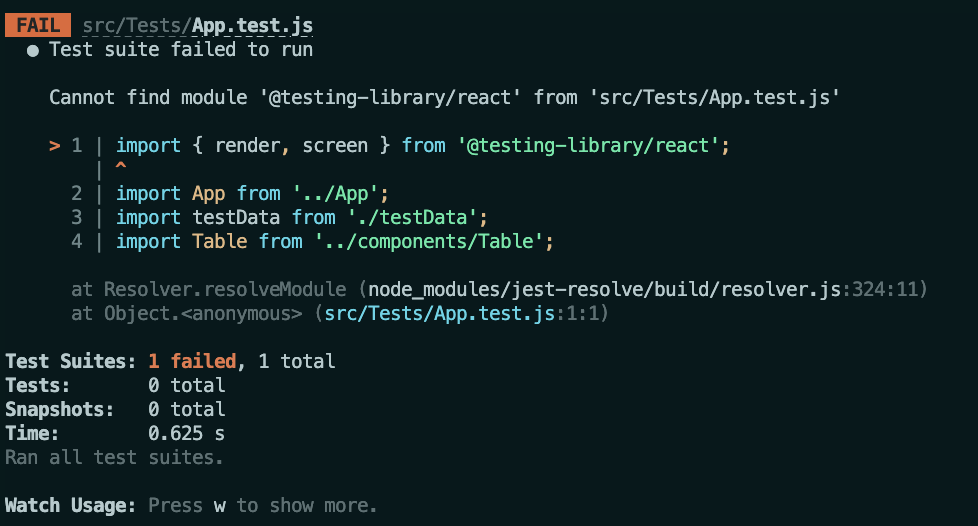
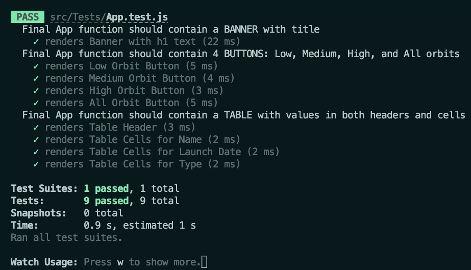
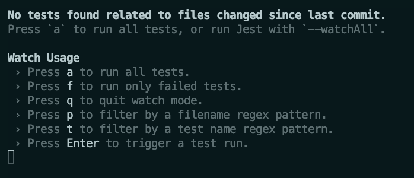

## Run the Tests

This project uses unit tests to help auto-grade your work. The tests should pass based on the 
files you create and their behavior.

Run the tests when you reach this section of the instructions. You may run them as you work on the project. These tests are looking to see if your components render. They do not provide help in creating the project.

{} 
 In order to pass this assignment, you must pass the workflow tests in [GitHub Actions]() .  
{}

### To Run the Tests in Your Terminal
Use these steps to start the tests:

1. In the terminal, `cd` into the project directory.
1. Run the following commands to start the tests: `npm test`

You should see the following _BEFORE_ you do any of the project:

   


_AFTER_ completing your project, you should see the following test results:


   


### Testing Information

`"Final App function should contain a BANNER with title"` tests verify that you created a `Banner` component and it contains a title of sorts.  In this case, it says "Orbit Report"

`"Final App function should contain 4 BUTTONS: Low, Medium, High, and All Orbits"` tests verify the behavior of your application.  The buttons will not render in the `App` function if you don't code them properly.

`"Final App function should contain TABLE with values in both headers and cells"` tests use a testing data set to check the behavior of your table.  The test data is passed, and should be rendered into the table correctly using your `map` functions.

## Troubleshooting Jest

Create React App uses the [Jest testing framework](https://jestjs.io/).  It should already be part of your project.

1. If you are not able to get the tests to run, make sure you are running the command inside the project repo. 

1. If you see the following output:

   
      
   

   It is likely that you haven't changed anything since your last commit.  To restart the tests, follow the instructions in your terminal:
   `press 'a' to run all tests`

   You can try any of the commands this output suggests.

