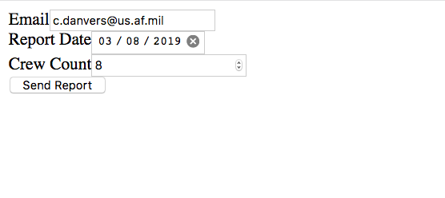

# Specialized Text Inputs

For these text inputs the browser will validate and provide feedback to
the user based on rules for the declared type.

  Type     Syntax                                        Description                                                                                  Demo
  -------- --------------------------------------------- -------------------------------------------------------------------------------------------- ----------------------------------------------------
  date     `<input type="date" name="flightDate"/>`      Browser validates the value is a valid date format. Some browsers provide a *date picker*.   `<input type="date" name="flightDate"/>`{=html}
  email    `<input type="email" name="emailAddress"/>`   Browser validates the value is a valid email address format.                                 `<input type="email" name="emailAddress"/>`{=html}
  number   `<input type="number" name="fuelTemp"/>`      Browser validates the value is a valid number format.                                        `<input type="number" name="fuelTemp"/>`{=html}

## Example

::: admonition
Example

``` html
<form action="https://handlers.education.launchcode.org/request-parrot" method="post">
  <label>Email<input type="email" name="emailAddress"/></label>
  <label>Report Date<input type="date" name="reportDate"/></label>
  <label>Crew Count<input type="number"
  name="crewCount" min="1" max="10"/></label>
  <button>Send Report</button>
</form>
```



**Submitted Values**

    emailAddress=c.danvers@us.af.mil
    reportDate=2019-03-08
    crewCount=8

[Run it](https://repl.it/@launchcode/specialized-inputs-example)
:::
