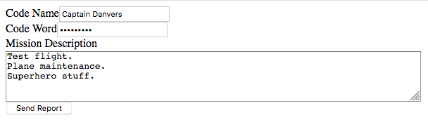

# Text Inputs

As you know from interacting with web forms, it\'s possible to use more
than simple text inputs. There are additional input *types*, each with
different uses. Many of the elements are `<input>` tags with a different
`type` value, however some have entirely different tag names. The next
few sections contain lists of input types.

To start, here are three types of text inputs. These input types can
contain text of any value.

  Type       Syntax                                              Description                                                       Demo
  ---------- --------------------------------------------------- ----------------------------------------------------------------- ----------------------------------------------------------
  text       `<input type="text" name="username"/>`              A single line text field.                                         `<input type="text" name="username"/>`{=html}
  textarea   `<textarea name="missionDescription"></textarea>`   A larger, multi-line text box. Must have open and closing tags.   `<textarea name="missionDescription"></textarea>`{=html}
  password   `<input type="password" name="passCode"/>`          A text field that obscures the text typed by the user.            `<input type="password" name="passCode"/>`{=html}

::: admonition
Note

Form inputs will NOT look exactly the same in all browsers. However, the
inputs *should* function the same way. Use <https://caniuse.com>, if
there is ever a question of browser support for a certain feature.
:::

## Example

::: admonition
Example

``` {.html linenos=""}
<form action="https://handlers.education.launchcode.org/request-parrot" method="post">
   <label>Code Name<input type="text" name="codeName"/></label>
   <label>Code Word<input type="password" name="codeWord"/></label>

   <!-- textarea must have open and closing tags -->
   <label>Mission Description<br/>
      <textarea name="description" rows="5" cols="75"></textarea>
   </label>

   <button>Send Report</button>
</form>
```



**Submitted Values**

    codeName=Captain+Danvers
    codeWord=avengers!
    description=Test+flight.+Plane+maintenance.+Superhero+stuff.

    Notice that the textarea value does NOT include new lines, even though it was typed that way.

    `Run it <https://repl.it/@launchcode/basic-inputs-example>`__
:::

## Check Your Understanding

::: admonition
Question

Which input type should be used if the user is going to enter a large
amount of text?
:::
