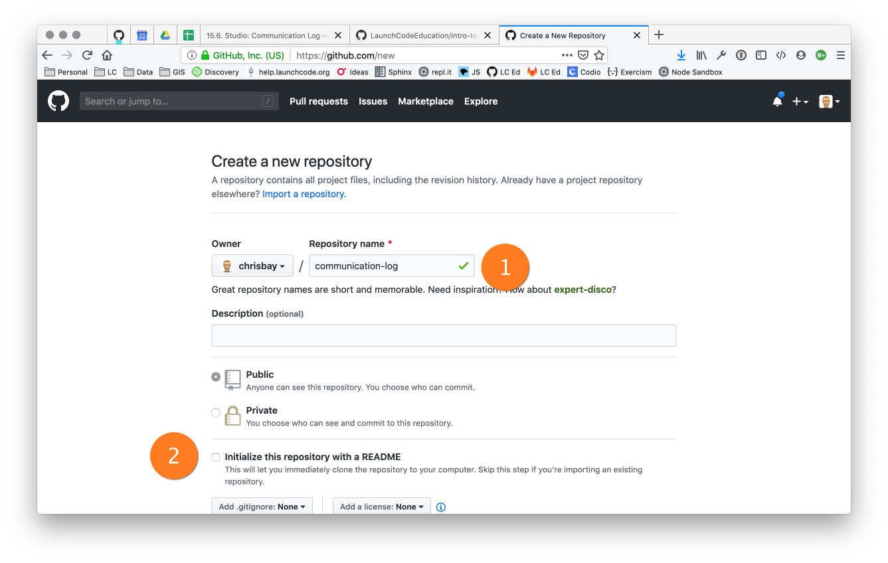
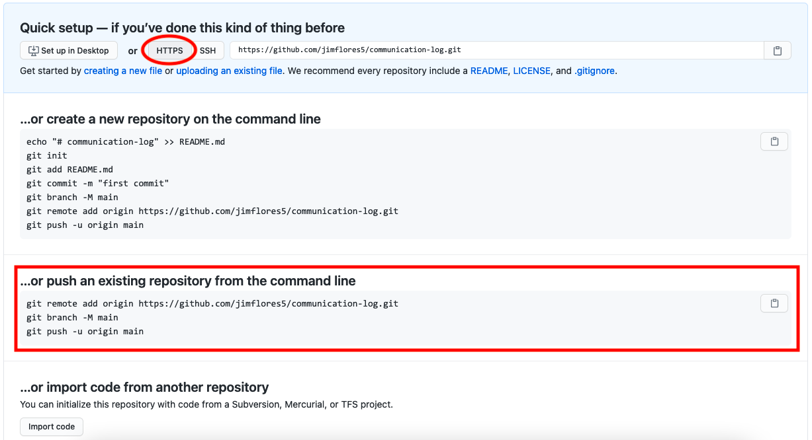
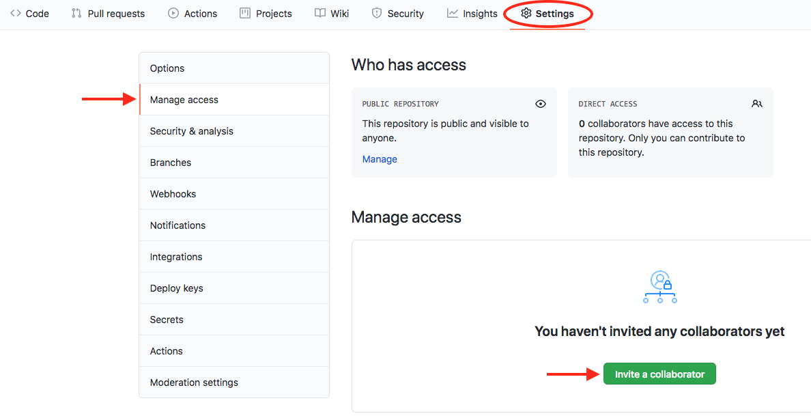
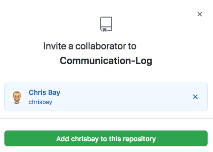
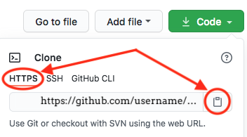

## Code Together

Coding together allows you to work as a team so you can build bigger projects
faster.

In this studio, we will practice the common Git commands used when
multiple people work on the same code base.

You and a partner will code in tag-team shifts. By the end of the studio, you
should have a good idea about how two people can work on the same code at the
same time. You will learn how to:

1. Quickly add code in pull + push cycles *(Important! This is the fundamental
   process!)*
1. Add a collaborator to a GitHub Project
1. Share *repositories* on GitHub
1. Create a *branch* in Git
1. Create a *pull request* in GitHub
1. Resolve merge conflicts (which are not as scary as they sound)

This lesson reinforces:

1. Creating repositories
1. Cloning repositories
1. Working with Git concepts: Staging, Commits, and Status.

## Overview

The instructor will discuss why GitHub is worth learning. You already know how
to use a local Git repository with one branch, giving you the ability to move
your code forward and backward in time. Working with branches on GitHub extends
this ability by allowing multiple people to build different features at the
same time, then combine their work. Pull requests act as checkpoints when code
flows from branch to branch.

Students *must* pair off for this exercise. If you have trouble finding a
partner, ask your TA for help.

## Gitting Ready

You are going to simulate a radio conversation between a shuttle pilot and
mission control. You and your partner will alternate tasks, so decide who will
be the **Pilot** and who will be the **Control**.

Before you and your partner can begin your collaboration, some preparation is
required first. You will both start by creating a new repository on your
separate GitHub accounts.

### Step 1: Create a New Local Repository

**Control and Pilot**: Both of you need to complete steps 1 - 6 on your own
machines.

1. In the terminal, navigate to your development folder. Enter the following 3
   commands to create a new project. Replace `-ROLE` with your part in this
   studio, either `-pilot` or `-control`.

   ```console
   $ mkdir communication-log-ROLE
   $ cd communication-log-ROLE
   $ git init
   ```

   {}
   **IMPORTANT**: To avoid confusion later, it's critical that you and your
   partner give different names to your repositories.

   For the remainder of this studio, we will refer to the repo as
   `communication-log`.
   {}

1. Launch Visual Studio Code. Use the *File* menu to open the
   `communication-log` folder.
1. Create a new file called `index.html` and open it in the workspace.
1. Paste this code into `index.html`:

   ```html {linenos=table}
   <!DOCTYPE html>
   <html>
      <body>
         <p>Radio check. Pilot, please confirm.</p>
      </body>
   </html> 
   ```

1. Save your work, then stage and commit it.

   a. First, check the `status`.

      ```console
      $ git status
      On branch main

      Initial commit

      Untracked files:
      (use "Git add <file>..." to include in what will be committed)

         index.html

      nothing added to commit but untracked files present (use "git add" to track)
      ```

   b. The output shows is that `index.html` is not staged. Let's `add`
      everything in this directory, then check the `status` again.

      ```console
      $ git add .
      $ git status
      On branch main

      Initial commit

      Changes to be committed:
      (use "git rm --cached <file>..." to unstage)

         new file:   index.html
      ```

   c. The output tells us that the file is staged. Now let's `commit`. After
      that, we can see a record of our progress by using `git log`.

      ```console
      $ git commit -m "Started communication log."
      [main (root-commit) e1c1719] Started communication log.
      1 file changed, 5 insertions(+)
      create mode 100644 index.html

      $ git log
      commit 679de772612099c77891d2a3fab12af8db08b651
      Author: Chris <chrisbay@gmail.com>
      Date:   Wed Apr 5 10:55:56 2021 -0500

         Started communication log.
      ```

1. Use the command `git branch` to check the name for the default branch. If
   necessary, change the name to `main`.

   ```console
   $ git branch
   * default_name

   $ git branch -m default_name main.
   ```

   GitHub uses `main` for its default branch. To make things easier, you
   should always try to match your local and remote branch names.

Great! You've got your project going locally. The next step is to push it up to
GitHub.

### Step 2: Push Your Repository To GitHub

**Control and Pilot**: Complete steps 1 - 5 on your separate devices and GitHub
accounts.

1. Go to your GitHub profile in a web browser. Click on the "+" button to add a
   new repository (called a *repo* for short).

   

   The *New Repository* link is in the dropdown menu at top right on GitHub.

1. On the next page, fill in the *Name* and *Description* fields. Also, uncheck
   the *Initialize this repository with a README* option, then click 
   *Create Repository*.

   

   {}

   If you initialize with a README, Git will refuse to merge the remote repo
   with your local one. There are ways around this, but it's faster and
   easier to just create an empty repo on GitHub.

   {}

1. After clicking, you should see something similar to:

   

1. Now go back to your terminal and copy/paste the commands shown in the GitHub
   instructions. These should be very similar to:

   ```console
   $ git remote add origin https://github.com/your-username/communication-log.git
   $ git branch -M main
   $ git push -u origin main
   ```

1. Confirm that GitHub has the same version as your local project. Click around
   and make sure that everything is as you expect it to be.

## Git the Teamwork Started!

You've successfully created a new GitHub repository and pushed content to it.
Now it's time for you and your partner to start collaborating on the same repo.

For the remaining sections of this studio, keep an eye on the *Control* and
*Pilot* role tags. Make sure that you both perform your tasks in the
recommended order. Mixing things up won't destroy the universe, but it will
make finishing the studio more complicated.

Even when it is not your turn to complete a task, read and observe what your
partner is doing. The steps here mimic a real-world collaborative Git workflow.

### Step 3: Add A Collaborator

**Control**, the first step is yours. In order for **Pilot** to make changes to
your GitHub repository, you must invite them to collaborate.

1. **Control**: In your web browser, go to your `communication-log` repo.
   Click the *Settings* button then select the *Manage Access* option.

   

1. **Control**: Click on the green *Invite a collaborator* button. Enter your
   partner's GitHub username and click *Add to repository*.

    

1. **Pilot**: You should receive an email invitation to join this repository.
   View and accept the invitation.

{}

**Pilot**: If you don't see the email, check your Spam folder. If you still
don't have the email, login to your GitHub account. Visit the URL for 
Control's copy of the repo. You should see an invite notification at the
top of the page.

{}

### Step 4: Clone Project from GitHub

{}

**Pilot**, did you and your partner give different names
to your `communication-log` repositories?

If not, take a moment to find your *local* `communication-log` folder on
your machine and rename it!

{}

1. **Pilot**: Go to Control's GitHub profile and find their
   `communication-log` repo. Click on the green *Code* button. Select the
   HTTPS option and copy the URL to your clipboard.

   

1. **Pilot**: In your terminal, navigate back to your development folder and
   clone Control's repo. You should be OUTSIDE of any other Git repositories.
   
   The clone command looks something like this:

   ```console
   $ git clone https://github.com/username/communication-log.git
   ```

   Replace the URL with the address you copied from GitHub.

1. **Pilot**: You should now have a copy of **Control's** project on your
   machine.

## Git Talking

Whew! That was quite the setup experience. Now you're ready to dive into the
main part of the studio.

On to Part 2!