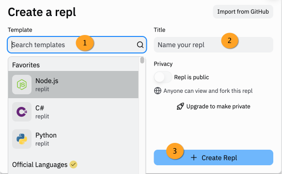
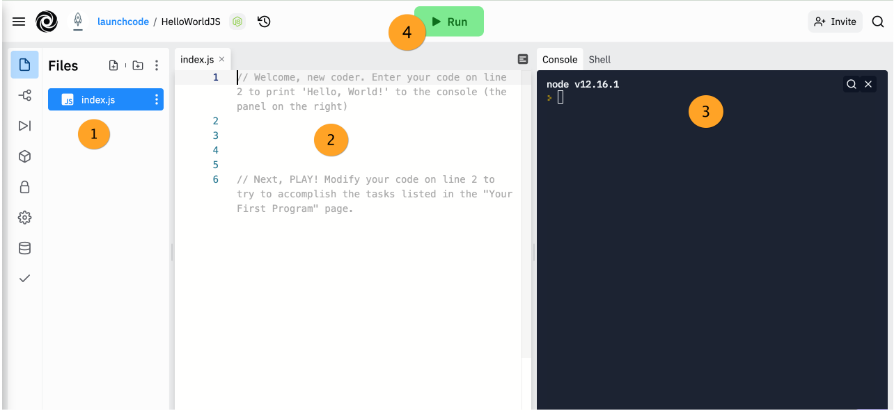

# Your First Program[]{#hello-world} {#create-replit-account}

We haven't learned how to code yet, but we can still write and run our
first program. This exercise asks you to create and run small amounts of
code, and it reinforces the LaunchCode principle of learning by doing.

We have used the phrase `Hello, World` as an example throughout this
chapter because it represents the traditional first program for a new
coder. Printing a single message is one of the simplest tasks a program
can carry out.

`Hello, World` will be your first program as well. Welcome to the club!

::: admonition
Note

Below is a guide to walk you through setting up a Replit account,
creating a new repl, and working with repls made by other people. The
images are there to help guide you, but Replit.com may update or change
how it looks. Don\'t hesitate to explore the site on your own.
:::

## Create a Replit Account

Throughout this book, you will need to access a code editor to complete
practice problems, exercises, studios, and assignments. If you have not
already done so, create a new account with
[Replit.com](https://repl.it/signup). The site provides a free space to
practice coding.

After you have created your account, sign in. You will see your
**dashboard**, which displays any saved folders or projects. Since you
are just starting out, your dashboard will be empty.

::: admonition
Note

If your dashboard is completely empty, click on the \"Hamburger\" button
in the top left corner. The three stacked horizontal lines. This will
reveal a drop-down menu that allows you to create new repls, access your
saved repls, etc.
:::

### Creating a New Repl

From your dashboard, click on *+ Create* or any of the *+* buttons to
open the \"Create a repl\" window.

Steps to create a new repl:

1.  You need to **select the coding language template** you want to work
    with. Select \"Node.js\" to code in JavaScript.
2.  **Name your project** to help you remember what the repl contains.
3.  **Click** \"Create Repl\".

These steps will create a blank repl workspace where you can start
programming in JavaScript.

### The Replit Workspace

Before you dive into your `Hello, World!` program, let\'s take a look at
how to use Replit. The workspace consists of three main panels and
several menu functions.

Features to note:

1.  **File panel and menus**: This allows you to add extensions, update
    settings, and add, open, or delete files.
2.  **Editor panel**: Your code goes here. Click on a file to open it in
    the editor. For most new projects, an `index` file will be created
    and opened by default.
3.  **Console panel**: Any output produced by your code will appear in
    this panel. The console also displays error messages, test results,
    and other information.
4.  **Run button**: Executes any code written in the `index` file.

::: admonition
Note

The workspace shown above uses the \"light\" theme (dark text on a light
background). If you prefer the reverse (light text on a dark
background), click the gear icon and select the \"dark\" theme.
:::

## Begin Your Coding Journey

### Working with a Prepared Repl

We have prepared a repl for you. You will not be allowed to code into it
since you did not create it. To add your own code, you will need to
**fork** it. Forking creates a copy of the original codebase into your
repl account. You can code in the forked project without risk of
changing the original codebase.

Follow this [Hello World link](https://repl.it/@launchcode/HelloWorldJS)
to open a prepared workspace for your first program.

Your forked copy will open in your workspace. On line 2 of the editor
panel, type:

> `console.log("Hello, World!");`

When you finish typing, click the green \"Run\" button and observe the
output in the console panel.

::: admonition
Warning

Do NOT just copy/paste the code. You will learn best by typing, trying,
changing, and fixing.
:::

If you typed correctly, you saw the output `Hello, World!` If you
omitted or mistyped any characters, then you either saw a misspelled
output or an error message with some tips on what might have gone wrong.
Do not worry if you make mistakes! These experiences still teach you
something. Fix any errors and try again.

### Now Play

Once you print `Hello, World!` successfully, go back and play around
with the code. Make a change, click \"Run\", and see what happens. Try
to:

1.  Change the message that is printed.
2.  Figure out what the parentheses do. Will the code work without them?
3.  Remove one or both quotation marks. Do we need to include both
    opening and closing quote marks? Is there a difference between using
    a single or a double quote (`'` vs. `"`)?
4.  Remove the semi-colon, `;`.
5.  Print a number. (Bonus: Print two numbers added together).
6.  Print multiple messages one after the other.
7.  Print two messages on the same line.
8.  Print a message that contains quote marks, such as
    `Quoth the Raven "Nevermore"`.
9.  Other. You choose!

Spend a few minutes trying these changes. Do not worry if you miss some
of the targets. Learning comes through experience, and you WILL learn
all the details behind `console.log` soon. Once you finish practicing
(and hopefully making some mistakes), you will have a pretty good idea
of how the `console.log` function in JavaScript works.

::: admonition
Try It

On paper (or in a document on your computer), write one or two sentences
about `console.log`. You should provide more detail than, "It prints
things."
:::

## Check Your Understanding

::: admonition
Question

Which of the following correctly prints `Coding Rocks`? There may be
more than one valid option.

a.  `console.log(Coding Rocks)`
b.  `console.log(Coding Rocks);`
c.  `console.log('Coding Rocks')`
d.  `console.log("Coding Rocks');`
e.  `console.log("Coding Rocks");`
:::
