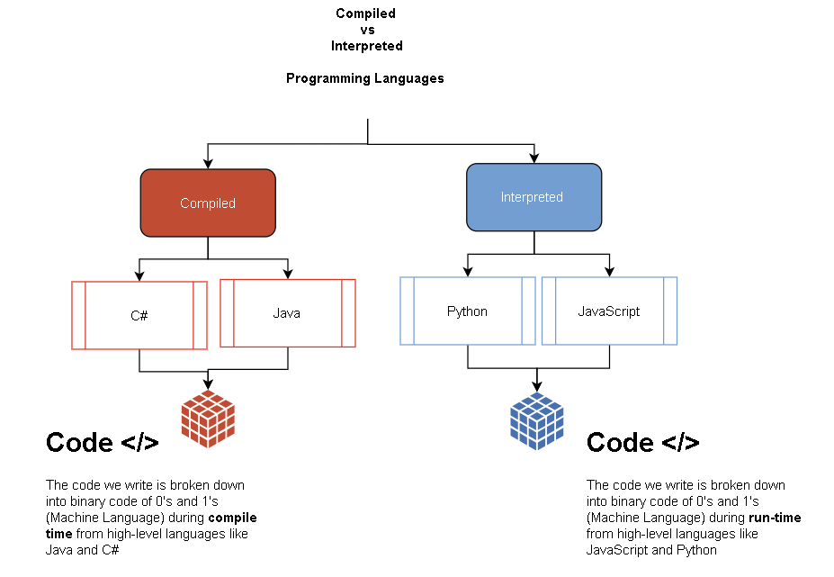

   > "Computer, scan the surface for lifeforms."

   > "Hey Siri, what movies are playing nearby?"

Even though today's tech makes it seem like computers understand spoken language, the devices do not use English, Chinese, Spanish, etc. to carry out their jobs. Instead, programmers must write their instructions in a form that computers understand.

Computers operate using `binary code`, which consists only of 0s and 1s. For example, here is the binary version of the text `Hello World`:

   > `01001000` `01100101` `01101100` `01101100` `01101111` `00100000` `01010111` `01101111` `01110010` `01101100` `01100100`

Each set of 8 digits represents one character in the text.
To make things a little easier, binary data may also be represented as **hexadecimal** values. Here is `Hello World` expressed in _hex_:

   > `48 65 6c 6c 6f 20 57 6f 72 6c 64`

To run an algorithm, all of the steps must be written in binary or hex so the computer can understand the instructions.

{} 
 Fortunately, we do not need to worry about binary or hexadecimal code to make our programs work!
{}

## Languages

Writing code using only 0s and 1s would be impractical, so many clever individuals designed ways to convert between the text readable by humans and the binary or hexadecimal forms needed by machines.

A **programming language** is a set of specific words and rules for teaching a computer how to perform a desired task. Examples of programming languages include Python, JavaScript, Basic, COBOL, C++, C#, Java, and many others.

These _high-level languages_ can be written and understood by humans, and each one has its own characteristic vocabulary, style, and syntax.

### How Computers Run Programs

Since computers only understand binary code, every programming language contains a special set if instructions that translate a programmer's work into the 0s and 1s that the machines need.

If we want to print `Hello, World!` on the screen, we would write the instructions in our chosen programming language, then select "Run". Our code gets **compiled** or **interpreted**, which converts our typed commands into something the computer can use. The instructions are then executed by the machine, and we observe the results.


   


In the example above, the syntax for printing `Hello, World!` varies between the Python, JavaScript, and Java languages, but the end result is the same.

### How Many Programming Languages Are There?

Ask Google, "How many programming languages are there?" and many results get returned. Even with all these options, there is no specific answer to the question.

There are hundreds, if not thousands, of programming languages available. However, most are either obsolete, impractical or too specialized to be widely used.

Arguments occur whenever someone makes a top 10 list for programming languages, but regardless of the opinions, one fact remains. Once you learn one language, learning the next is much, much easier. Adding a third becomes child's play.

The reason for this is that thinking like a coder does not change with the language. Your logic, reasoning, and problem-solving skills apply just as well for JavaScript as they do for Python, Swift, and C#. To display text on the screen in Python, we use `print()`, for JavaScript we use `console.log();`, for C# the command is `Console.WriteLine();`. The **syntax**, or code, for each language varies, but the results are identical.

