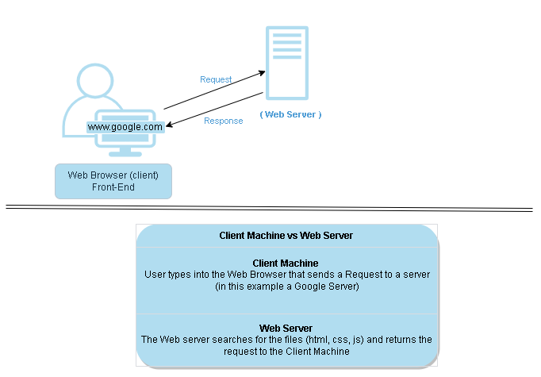

**JavaScript** is one of many programming languages, each of which serves different purposes. Programmers mainly use JavaScript for web development, and it is currently the most popular language that runs inside a web browser. Running inside the browser means that the code loads at the same time as a web page and can modify the content. JavaScript can add or remove text, change colors, produce animations, and react to mouse and keyboard clicks. This makes the web page _dynamic_---it responds to user actions in real-time, and changes occur without having to refresh the page.

This cool feature allows immediate updates to your profile when you post a status, change the color of the “Submit” button after you complete a form, generate a map when you request directions, or create a sparkly trail that follows the mouse pointer. All of the changes to what you see on the web page are part of **front-end** development. They are present on your computer.

**Back-end** development involves passing data between web pages and servers. JavaScript can be used for back-end development, but other languages like Java and C# are industry standards. When you fill out a form online and click "Submit", the back-end code transfers the information you entered to the company that posted the form. Your information now exists on the company’s servers.

The ins and outs of how the internet works will be covered throughout this book. While important to understand why we are learning JavaScript, we won’t quiz you on servers and front-end development now!

## Client Machine vs. Web Server


   
