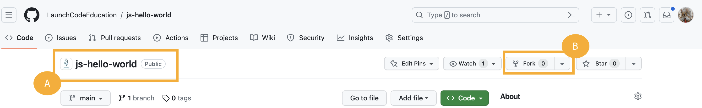
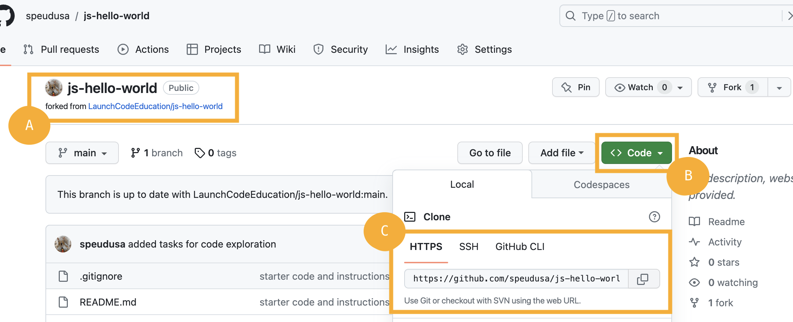
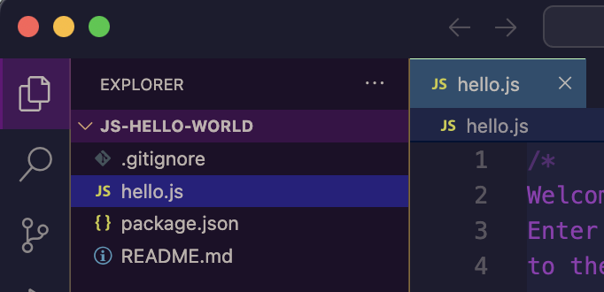
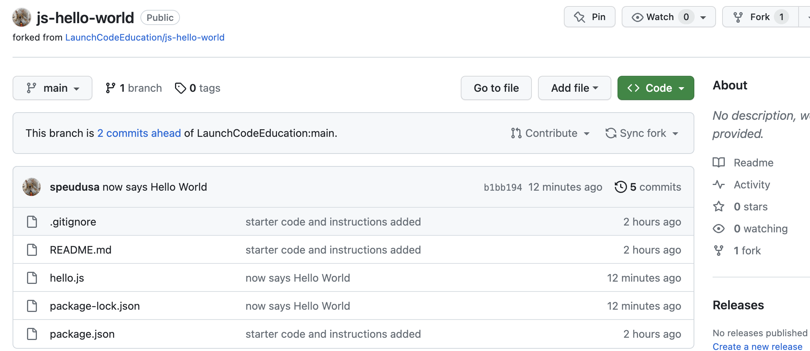

## Your First Program

We are going to walk you through a very simple **workflow**, or sequence of steps, to start coding.

## Read the Instructions

Every starter code repository (repo) in this course will contain instructions.  We strongly suggest you read ALL of the instructions before writing any code.  This will help you understand the output of your code, may explain any processes you should take while creating your code, etc.

We suggest reading the rest of this page before diving into the code.  Since this is the first time you are pulling from our GitHub repository, you will need to set up your new PAT, create a directory on your computer to store your work, and practice with the terminal.  You will do great!

## Open your terminal

You will use the terminal to create a location to store the code repos.  The terminal will also communicate with GitHub.

1. Run the following command: `ls`
This will list any files or directories (folders) at the level of your terminal. 

   It may look like this:
   ```bash
   computer:~ username$ ls
   Applications   
   Desktop
   Downloads
   Documents
   ...
   ```
1. Select a location where you would like to store your course work. The example is storing work on the Desktop, you may choose a different location if you desire.

   1. Use the following command to move into that location: `cd <location-name>`
      ```bash
      computer:~ username$ cd Desktop
      ```
   1. Create a directory (folder) to save your course work: `mkdir <directory-name>`
      ```bash
      computer:~ username$ mkdir LaunchCode
      ```
   1. To verify if your directory exists run the `ls` command again.  You should see your new directory listed.
   1. Move into your new directory with the following command: `cd <directory-name>`
      ```bash
      computer:~ username$ cd LaunchCode
      computer:LaunchCode username:
      ```

You are now ready to add the repo to your directory.  


## Go to GitHub

You will be provided links to all of the repos in the course.  You will need to **fork** and **clone** them to your computer.  When you fork a repo, you are making a copy of the original code.  Any changes you make to the forked repo will not be applied to the original code.  This keeps the original starter code in tact for the next student.  Cloning the repo moves the repo code onto your computer.  If the code is not on your computer, you will not be able to work with it.  

1. Make sure you are signed into your GitHub account.
1. Go to the starter code repo and fork it.
   
      
   
   A. The original repo.  Notice the Lauchcode rocket next to the name.
   
   B. The _Fork_ button.  Click this to create a fork. You should be redirected to your fork once you click this button.

1. Your forked repo will look like this:
   
      
   
   
   A. The repo will have the same name, but below it will be a link to the original repo.

   B. Click the green _<> Code_ button.  This will open a new dropdown menu.

   C. In the dropdown menu, select _HTTPS_.  A URL will appear. Copy that URL.


GitHub has documentation on [Forking a repository](https://docs.github.com/en/get-started/quickstart/fork-a-repo#forking-a-repository) and [Cloning your forked repository](https://docs.github.com/en/get-started/quickstart/fork-a-repo) if you would like more guidance. 

## Back to the Terminal

Return to your terminal.  You should be in the directory for your course work.

Run the following command: `git clone <paste-the-URL-here>`

   ```bash
   computer:LaunchCode username: git clone https://github.com/YOUR-GITHUB-USERNAME/REPO-NAME.git
   ```

Your PAT will act as your password to perform HTTPS Git operations. For example, if you are working on a repo with the URL, https://github.com/username/repo.git, your terminal might look like the following:

   ```bash
   $ git clone https://github.com/username/repo.git
   Username: your_username
   Password: your_token
   ```

If you will be pushing and pulling from a repository multiple times in quick succession, you can save your PAT in memory for a short time. Run the command:

   ```bash
   $ git config credential.helper 'cache --timeout=3600'
   ```
The next time you access your remote repo, Git will ask for your username and PAT. It will then remember your credentials for a certain amount of time. In the example above, `timeout=3600` saves your information for 1 hour (3600 seconds). You can adjust the amount of time up or down as needed.

## Open Visual Studio Code

We haven’t learned how to code yet, but we can still write and run our first program. This exercise asks you to create and run small amounts of code, and it reinforces the LaunchCode principle of learning by doing.

We have used the phrase `Hello, World` as an example throughout this chapter because it represents the traditional first program for a new coder. Printing a single message is one of the simplest tasks a program can carry out.

`Hello, World` will be your first program as well. Welcome to the club!

1. Open your IDE, and open your new repo.  You should see a file tree with the same files from the repo.
   
      
   

1. Double click on `hello.js` to open the file.  You should see instructions and `console.log("Hello");`.  You can type in this file now.  Follow the instructions to complete your first program.  
   1. Enter your code on line 7 to print 'Hello, World!
   1. Open a terminal inside Visual Studio Code.  If you need a refresher, checkout the [installation guide]().
   1. Inside your terminal type the following commands
      1. `npm install` (We will explore this more in future chapters).  You will see that more files and directories have been added to your project. That is expected.
      1. Next type the command `node hello.js`.  This should run the program, which in this case prints your message in the terminal.  
      ```bash
      computer:js-hello-world username: node hello.js
      Hello World!
      ```
      1. Another way to run your program is to use the _Run and Debug_ button found on the left icon menu of Visual Studio Code.  Set it to `Node.js` for this project.
      
         
      
   1. Try out the other prompts starting at line 10.
   1. When you are done with this code, you will need to `push` it up to your GitHub repo.  This will keep track of your changes.
      1. `git status` This will show you all the files you changed in red.
      1. `git add .` This will add all the files your changed inside this directory to your repo soon.
      1. `git status` This will show you all the files ready to send to GitHub in green.
      1. `git commit -m "<type a message here>"` Between the quote replace the text between the `< >` with a short message.  This will help you remember what you did as you work in a project.
      1. `git push` This will actually push your latest code that you staged into your GitHub repo. 

   {} 
   
   Colors may not match exactly as in your terminal.

   ```bash{linenos=table,hl_lines=[],linenostart=1}
   computer:js-hello-world username$ git status
   On branch main
   Your branch is ahead of 'origin/main' by 1 commit.
   (use "git push" to publish your local commits)

   Changes not staged for commit:
   (use "git add <file>..." to update what will be committed)
   (use "git restore <file>..." to discard changes in working directory)
      modified:   hello.js

   Untracked files:
      (use "git add <file>..." to include in what will be committed)
         package-lock.json

   no changes added to commit (use "git add" and/or "git commit -a")

   scomputer:js-hello-world username$ git add .
   computer:js-hello-world username$ git status
   On branch main
   Your branch is ahead of 'origin/main' by 1 commit.
      (use "git push" to publish your local commits)

   Changes to be committed:
      (use "git restore --staged <file>..." to unstage)
         modified:   hello.js
         new file:   package-lock.json

   computer:js-hello-world username$ git commit -m "now says Hello World"
   [main b1bb194] now says Hello World
   2 files changed, 3457 insertions(+), 1 deletion(-)
    create mode 100644 package-lock.json
   computer:js-hello-world username$$ git push 
   Enumerating objects: 9, done.
   Counting objects: 100% (9/9), done.
   Delta compression using up to 10 threads
   Compressing objects: 100% (7/7), done.
   Writing objects: 100% (7/7), 31.59 KiB | 15.80 MiB/s, done.
   Total 7 (delta 3), reused 0 (delta 0), pack-reused 0
   remote: Resolving deltas: 100% (3/3), completed with 1 local object.
   To https://github.com/USERNAME/js-hello-world.git
      408d555..b1bb194  main -> main
   computer:js-hello-world username$ 
   ```

   1. Line 1 `git status` used to check on the latest version of the project. 
   1. Line 6 notes Changes not staged for commit.  We need to add these.
   1. Line 17 `git add .` will add these to GitHub when we are ready to push up.
   1. Line 18 `git commit -m "now says Hello World"` A commit is like taking a photo of the latest version of your code.  The message (`-m`) acts like a caption to keep track of the changes. 
   1. Line 32 `git push` sends our latest code up to GitHub.

   We will learn more about these in a later chapter.

   {}
   
   ## Back to GitHub

   You should see your latest version of your code along with your commit message.

   
      
   


## Check Your Understanding
{} 
Which of the following correctly prints Coding Rocks? There may be more than one valid option.

1. `console.log(Coding Rocks)`
1. `console.log(Coding Rocks);`
1. `console.log('Coding Rocks')`
1. `console.log("Coding Rocks');`
1. `console.log("Coding Rocks");`
<!-- ans: 3 and 5 -->
{}