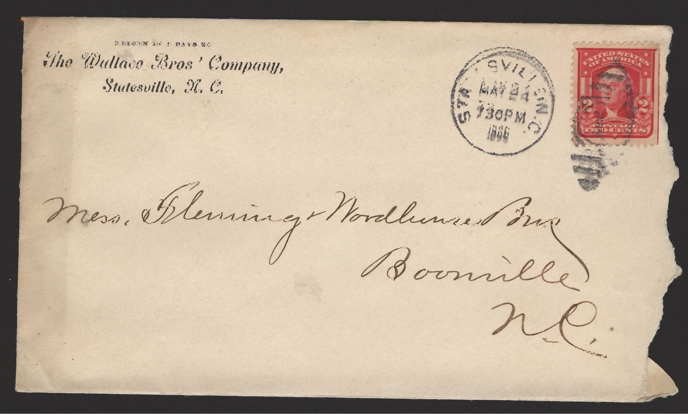

# HTTP at a Glance

While web developers can often get away with a minimal understanding of
TCP/IP and DNS, they must understand HTTP much more deeply. Before
diving into the details of HTTP, let\'s gain a high-level understanding.

## Requests and Responses

::: index
single: HTTP; request single: HTTP; response
:::

The fundamental units of HTTP are **requests** and **responses**. A
client (usually a web browser) makes a request to a web server. Based on
the details of the request, the server formulates and sends a response.
The response is parsed and displayed by the browser.

{height="400px"}

As long as the server is available, *every* request receives a single
response.

Requests contain several types of data, including:

-   The URL being requested.
-   The type of action the client is asking the browser to take.
-   Metadata about the request, such as the type of browser making the
    request and the type(s) of data the client can accept in return.
-   Optionally, a request message.

Responses include:

-   The status of the response, including success or failure reasons.
-   Metadata about the response, including the size and data format of
    the response message.
-   Optionally, a response message.

## The Postal Service of the Internet

HTTP can seem complicated, but it is actually very similar to a system
that you are already familiar with: The United States Postal Service.

Suppose you want to mail a letter to your friend in Alaska, asking them
their favorite cheese. To do so, you write your question on a piece of
paper and enclose it in an envelope. On the envelope, you write your
friend\'s address, along with your return address. Finally, you affix a
stamp to the top-right corner.

<figure>

<figcaption>Image is in the public domain</figcaption>
</figure>

Each of these pieces of information is necessary for your letter to be
delivered. When your letter enters the postal system, it will travel
from one post office to another, via land, air, and maybe even sea. As
long as you follow their rules, the postal service will get your letter
to its destination.

This is very similar to how an HTTP request works. The letter is like a
request message. The envelope contains the location and metadata needed
for the letter to be delivered, just like an HTTP request specifies a
URL and other metadata necessary for the request to reach the server and
be processed.

When you drop the letter in your mailbox, you know it will be delivered
since you followed the postal service\'s rules. When we make HTTP
requests, we don\'t know *how* our request will get to the server, but
as long as we properly structure a request, it *will* be delivered.

<figure>

<figcaption>Both the postal service and the Internet deliver messages,
as long as you follow their formatting rules. Images used with
permission. L: via <a
href="https://www.af.mil/News/Article-Display/Article/1399724/deployed-airmen-volunteer-to-enhance-morale-downrange/">US
Air Force</a>, R: via Flickr user <a
href="https://www.flickr.com/photos/verkeorg/24501780183">verkeorg</a></figcaption>
</figure>

And just as your friend will respond with a letter telling you their
favorite cheese (sharp white cheddar!), an HTTP request will result in a
response from the server.

As we wade into the details of HTTP, keep this analogy in mind. It will
help simplify the concepts and make them more concrete.

## Check Your Understanding

::: admonition
Question

In your own words, explain the role of HTTP in enabling communication
over the Internet.
:::

::: admonition
Question

Answer true or false for each of the following statements.

1.  A web server can send multiple responses for a single HTTP request.
2.  The postal service will deliver your HTTP requests, if you ask
    nicely.
3.  When creating an HTTP request, we must specify every network
    connection and server between our client and the server.
4.  The postal service is a good analogy for HTTP.
:::
