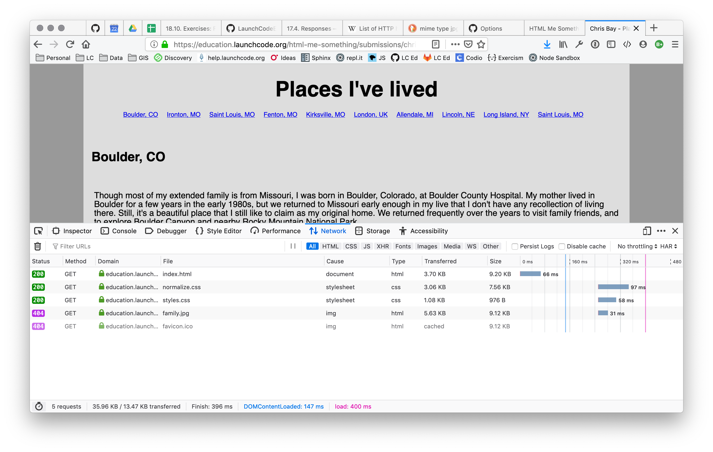

While we have covered all of the HTTP concepts you need to know at this point, it's worth spending some time explaining how web browsers submit requests and receive responses.

## Viewing Requests and Response Using Developer Tools

{}

   This section requires you to use Firefox's developer tools. If you need a refresher or just a reference, visit [MDN](https://developer.mozilla.org/en-US/docs/Tools).

{}

Open a web browser and visit some web page, say, [our example from the HTML Me Something assignment](https://education.launchcode.org/html-me-something/submissions/chrisbay/index.html). After the page loads, open your browser's developer tools and select the *Network* tab.

You'll see something like this:

The *Network* pane displays all HTTP requests and responses involved in loading a page. However, it only tracks and displays such data if it is open during the request. To see some data in this tab, refresh the page.

Now you'll see something like this:

Each entry within the pane represents a single HTTP request. A summary of the request is shown in a table format, including the resource requested, server name, response code, and more. Clicking on one of the entries shows more detailed information about the request.

On the right, we see additional request and response details, including response headers and (scrolling down) request headers. We can even view the response body by clicking on the *Response* label.

{}

   Navigate to a different page with the *Network* pane open. Find the response code and `Content-Type` header for the first request shown in the pane.

{}

## Browser Flow

As you can see from using the *Network* pane, loading a single web page usually involves *several* HTTP requests. Each resource *within* the page is loaded in a separate request. 

Let's examine the flow of loading a page. We'll consider the case of an HTML page with CSS, JavaScript, and images, loaded via a `GET` request.

1. Browser requests a page from the server.
1. Browser receives the HTML page and parses it.
1. For *each* image, external CSS file, and external JavaScript file the browser issues a *new* HTTP request for the given file.
1. As additional responses are received, the browser processes the data or media and updates the page. 

This process explains why you will sometimes load a web page, only to see an image on that page load a few seconds later. In such situations, the HTTP request fetching the image takes substantially more time, making it noticeable.

## Check Your Understanding

{}

   For the first screenshot on this page, answer these questions:

   1. What is its file name?
   1. How large is it?   

{}