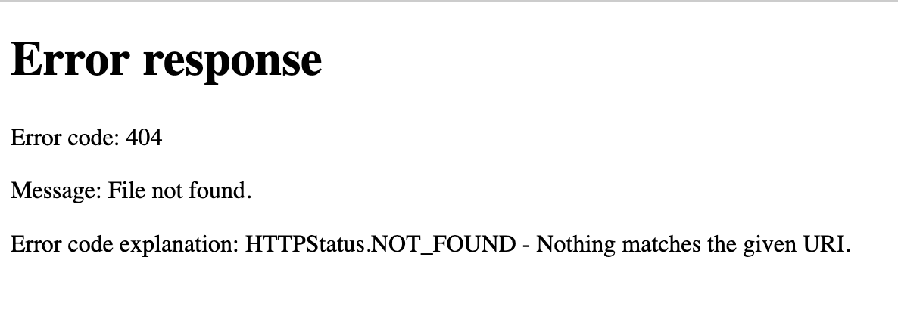

Each HTTP request that reaches a web server results in an HTTP response to the client.

A generic HTTP response looks like this:

```console
HTTP/2.0 200 OK
Date: Wed, 22 May 2019 17:36:50 GMT
Content-Type: text/html; charset=UTF-8
Content-Length: 8050
Last-Modified: Wed, 22 May 2019 17:33:45 GMT

<!DOCTYPE html>
<html>
<head>
<meta charset="UTF-8">
<!--Rest of HTML page -->
</html>
```

The structure has these components:

1. **Status line:** The first line of the response is the **response line**, which contains status information about the response including the **response code**. In this example, the response code is 200, which indicates the request was fulfilled successfully.
1. **Response headers:** Below the response line are the **response headers**. Similar to request headers, these are key-value pairs that contain metadata about the response.
1. **Blank line:** This signifies the end of the response headers.
1. **Response body (Optional):** Below the blank line, the request body takes up the remainder of the HTTP response. This is usually HTML, CSS, JavaScript, etc.

## Response Codes

HTTP **response codes** are standardized codes that servers use to convey the result of attempting to fulfill the client's request. They are always three-digit numbers that fall into one of five categories based on the first digit.

* 1xx (Informational): The request was received but processing has not finished
* 2xx (Successful): The request was valid and the server successfully responded
* 3xx (Redirection): The client should go elsewhere to access the requested resource
* 4xx (Client Error): There was a problem with the client's request
* 5xx (Server Error): The client's request was valid, but the server experienced an error when fulfilling it

Specific codes will have all 3 digits specified, such as 201, 302, or 404. Each specific code has a specific meaning. One of the most commonly experienced error codes is 404. You have likely encountered a message like this at some point:



A 404 response code indicates that the requested resource does not exist on the server. This can occur when, for example, you make a typo when typing a URL into the address bar. Referring back to our postal service analogy, a 404 is similar to receiving a letter marked "Return to Sender" because the addressee doesn't live there anymore. 

We don't expect you to memorize all of the response codes, but you should be able to quickly recall the most common codes.

| Code | Description | Example |
|------|-------------|---------|
| 200 | The requested resource exists and was successfully returned. | Visiting any existing web page on the Internet. |
| 301 | The requested resource has moved, and the client should look for it at the URL included in the `Location` header. | A site moves a page, but wants users with old links to be redirected to the page's new location. |
| 404 | The server received the request, but the requested resource does not exist on the server. | Requesting an image or HTML file that does not exist on the server. |
| 500 | The server experienced an error while fulfilling the request. | The server lost its database connection and cannot retrieve requested data. |

## Response Headers

There are [quite a few response headers](https://en.wikipedia.org/wiki/List_of_HTTP_header_fields#Response_fields), but only a few will be useful to us.

| Header | Purpose | Example |
|--------|---------|---------|
| `Content-Type` | The type of data included in the response body. | `text/html`, `text/css`, `image/jpg` |
| `Content-Length` | The size of the response body in bytes. | `348` |
| `Location` | The URL that the client should visit to find a relocated resource. | `https://www.launchcode.org/new-blog/` |

## Response Body

While requests often don't have a body, responses almost *always* have a body. The response body is where the data that a request asked for is located. It can contain HTML, CSS, JavaScript, or image data.

When a response is received by a browser, it is loaded into the browser's memory, with additional processing in some cases. For HTML files, the markup is rendered into a web page. For CSS files, the style rules are parsed and applied to the given HTML page.

## Check Your Understanding

{}

   A 404 response indicates that:

   1. The server is offline.
   1. The user needs to log in.
   1. The requested resource does not exist.
   1. The server's database crashed.

{}

{}

   Visit [Wikipedia's article on HTTP response codes](https://en.wikipedia.org/wiki/List_of_HTTP_status_codes). Which response code is used to signify that the user must authenticate themselves (that is, log in) before viewing the given resource? 

{}