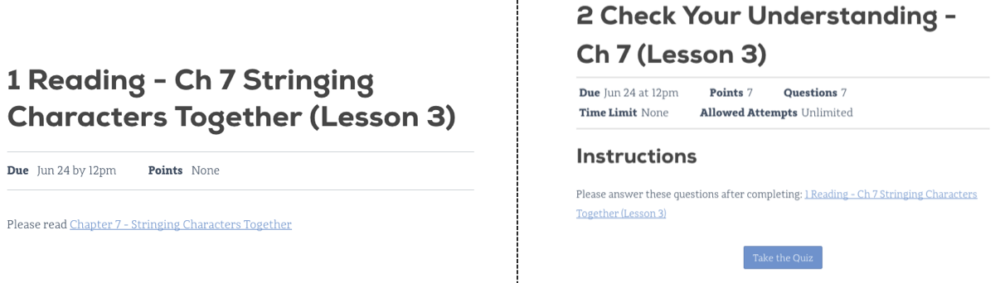

# Class Platforms

Besides this book, this class uses additional platforms for enrollment,
assignments, and grading.

::: index
! Canvas
:::

## Canvas

LaunchCode monitors your progress in this class through a management
system called **Canvas**. It provides a central location to manage the
flow of information, but it does not hold the actual course content.
Instead, it links to the lessons you need, and it keeps a record of your
completed assignments and scores.

### Login to Canvas

Access Canvas and the course materials at
<https://launchcode.instructure.com/>. To login, use your launchcode.org
username and password, which are the same ones you used to apply for
this class.

::: index
! Canvas dashboard
:::

### Canvas Dashboard

After logging in, you will arrive at your **dashboard**. Your Canvas
dashboard displays the LaunchCode courses you can access, upcoming due
dates, and several menu items.

Clicking on a course title takes you to that class\' homepage. This page
shows upcoming due dates, announcements, general information, and menu
options. You will probably use the *Syllabus* and *Assignments* options
the most often.

### Syllabus Page

The syllabus page provides general information, such as a description of
the class, the timeline for the course, a calendar, and a todo list.
Scrolling down on the page shows the *Course Summary*, which holds links
to individual tasks (reading, quizzes, assignments, etc.).

This page is a good place to answer the questions \"What do I need to do
next?\" and \"How can I quickly find and review an old topic?\".

### Assignments Page

This page sorts required tasks by date or type. We regularly add new
tasks to this list so check back here often. Old content remains active,
allowing you to use the links for reference and review.

Clicking on a specific title brings up information about that task,
including the due date, points possible, instructions, and links.

Even though much of the course content can be accessed without logging
in, the best choice is to begin your course work from within Canvas.
That way your progress gets recorded and your scores will update
smoothly as you complete quizzes. Also, submitting files for the larger
assignments should only be done through Canvas.

::: index
! Repl.it
:::

## Repl.it

[Repl.it](https://repl.it) is a free online code editor, and it provides
a practice space to boost your programming skills.

For this class, Repl.it provides opportunities to respond to prompts,
questions, \"Try It\" exercises, and studios embedded within the
reading. These tasks are neither tracked nor scored.

### Repl.it Account Creation

Creating a Repl.it account is covered in
`Chapter 2 <create-replit-account>`{.interpreted-text role="ref"}.
You\'ll need to create an account to use Repl.it.

### Online Code Editor

Repl.it is an online code editor for various languages. Coders
collaborate by sharing Repl.it URLs.

Repl.it is used for:

1.  Publicly sharing code examples and starter code
2.  A place to practice new concepts by writing and running code

::: admonition
Tip

You never have to click save when using Repl.it. Repl.it automatically

:   saves your code on their servers.
:::

::: {#github-classroom}
::: index
version control
:::
:::

## GitHub Classroom

GitHub Classroom provides online code storage. For this class, it also
allows for graded assignment submission and evaluation.

GitHub is a web application that uses *version control*. We\'ll learn
more about GitHub and what version control is in a future lesson.

::: admonition
Note

Results from work submitted in GitHub classroom, appear in Canvas after
being verified.

Remember, Canvas holds student grades and quizzes but NOT the course
content. Instead, it provides *links* to the reading and other
assignments.
:::
