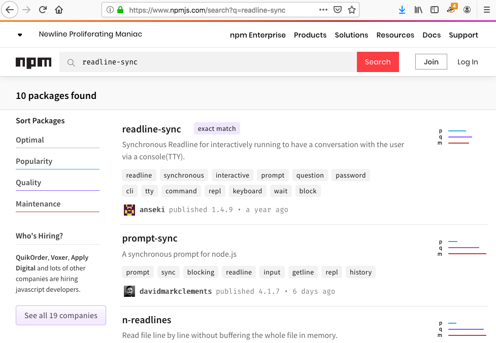
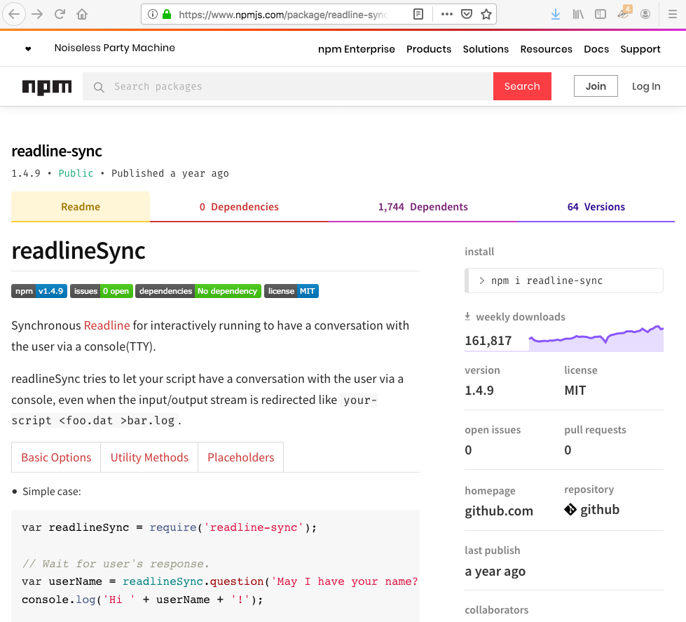
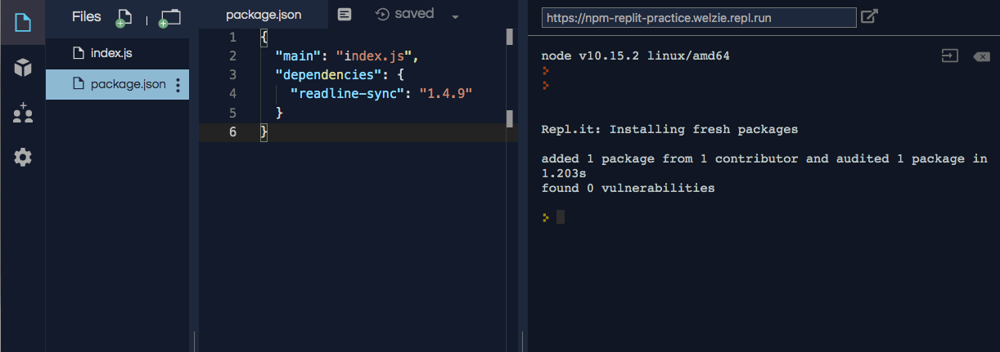

# NPM {#npm-page}

::: index
! NPM
:::

::: index
single: TDD; node package manager
:::

**NPM**, Node Package Manager, is a tool for finding and installing Node
modules. NPM has two major parts:

1.  A registry of modules.
2.  Command line tools to install modules.

## NPM Registry

The NPM registry is a listing of thousands of modules that are stored on
a remote server. These can be `required` and downloaded to your project.
The modules have been contributed by other developers just like you.

There is an [online version of the registry](https://www.npmjs.com/)
where you can search for a module by name or desired functionality.

::: admonition
Example

Go to [online NPM registry](https://www.npmjs.com/) and enter
\"readline-sync\" into the search packages input box.



An exact match appears as the first result. That is the `readline-sync`
module we required. Clicking on the first result leads to the NPM page
that describes the `readline-sync` module.

On the details page you will see:

1.  Usage statistics (how often the module is used)
2.  Instructions on how to use the module (example code)
3.  Version information
4.  The author(s)
5.  Sourcecode repository


:::

## NPM Command Line Interface (CLI) {#npm-cli}

The NPM command line tool, **CLI**, is installed with Node. The NPM CLI
is used in a computer\'s *terminal* to install modules into a Node
project. There is no need to panic! You will learn how to use the
terminal in a later chapter.

For now, recall that we coded many Node projects inside of repl.it,
which allows us to simulate a development environment WITHOUT having to
install any software on our computers. As such, repl.it automatically
handles much of the work of installing external modules.

## NPM CLI With repl.it

Login to your repl.it account, fork [this
example](https://repl.it/@launchcode/npm-with-replit-starter), and then
follow these instructions:

::: admonition
Example

We will use the repl.it interface to add new modules to a project.

1.  Click on the Packages icon in the left menu (it looks like a box).

2.  Enter \"readline-sync\" in the search box.

3.  Click on the top matching result.

    

4.  Verify this is the module you want, then click on the plus icon.

    

5.  Clicking the plus icon adds a `package.json` file that includes a
    dependency listing for `readline-sync`.

    
:::

Even though we added `readline-sync` to `package.json`, our code still
fails because `input` is not defined. The final step of requiring
`readline-sync` is to assign it to a variable.

Add `const input = require("readline-sync");` to line 1.

``` {.js linenos=""}
const input = require("readline-sync");

const name = input.question("What is your name?");
console.log(`hello ${name}`);
```

::: note
::: title
Note
:::

So far, we used repl.it without a `package.json` file. That worked
because repl.it tries to make the development experience as easy as
possible. It hides some details in order to let us pay more attention to
our code.
:::
