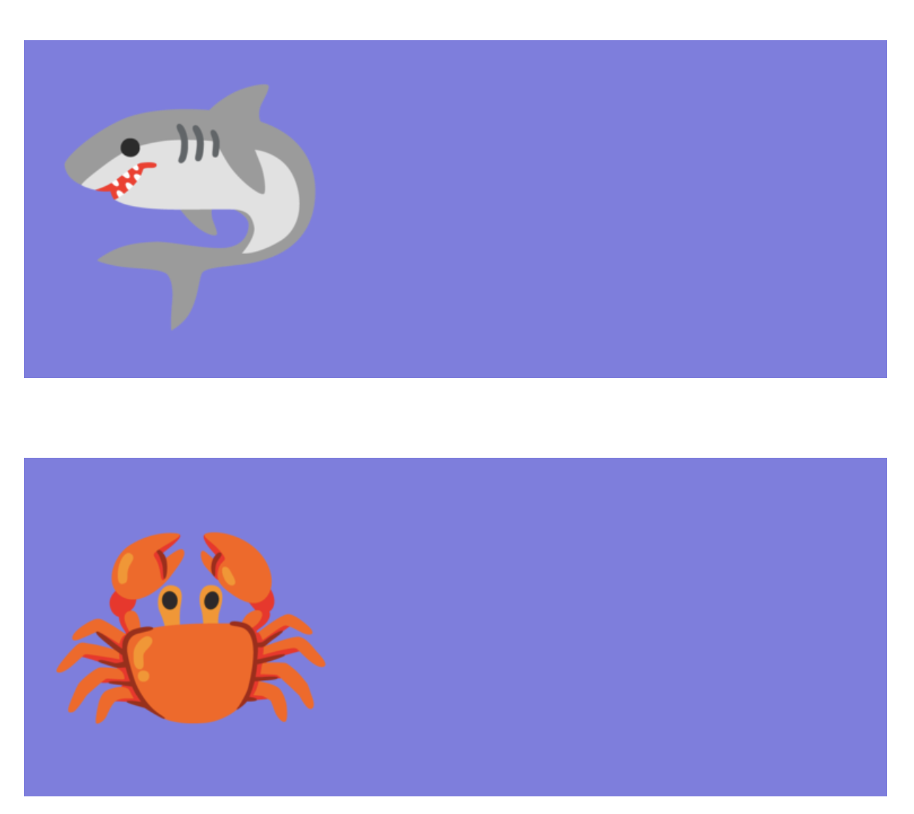
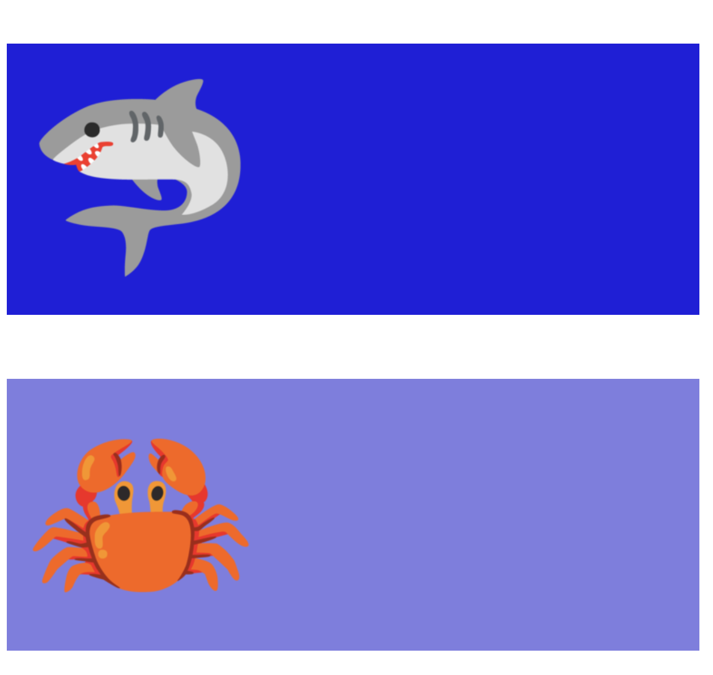
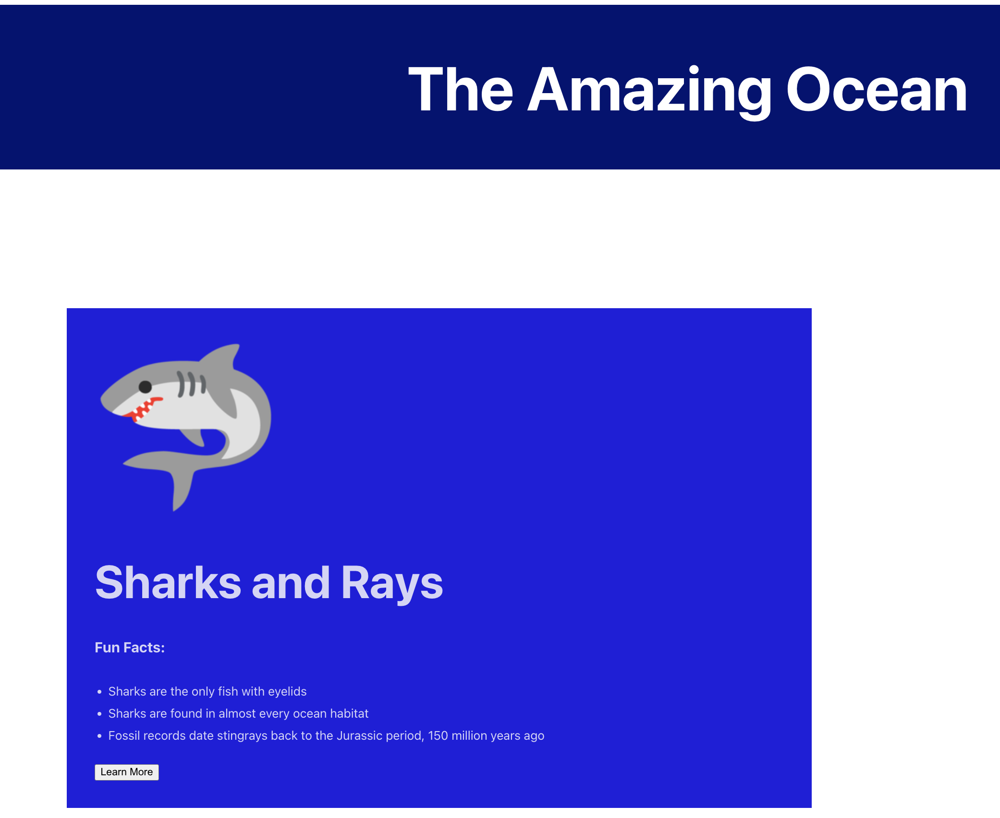

## Getting Started:
Check out the [starter branch](https://github.com/LaunchCodeEducation/react-exercises-and-studios/tree/exercises2-starter)

### Code Review
1. `App` is returning 2 components: `Profile` and `Banner`.
1. Open the `components` directory to see what it contains.
   1. You should see the following files:
      - `Banner.js`
         - Creates a banner for the application
      - `Button.js`
         - Creates a button for the application that uses the `alert` Window method.
      - `oceans.json`
         - holds multiple objects, which we will use in our application
      - `Profile.js`
         - Will become a list template that holds an image, name, facts, and a button for each `json` object in `oceans.json`.
      - `styles.css` contains the styling we will add to our application.

      These are the files we will be working with for this project.

### Part 1: The Banner Component

We would like to update the `Banner.js` to fit the application better.

1. Update the `Banner` function to return an <h1> level header that says "The Amazing Ocean" instead of "Hello World!".  
1. Apply the CSS styling for `header`.

{}

```react{linenos=table,hl_lines=[],linenostart=4}
   return(
      <h1 className="header">The Amazing Ocean</h1>
   );
```
{}

### Part 2: `Button.js`
We would like the button to do something.  Right now, when you click on it nothing happens.  For this application, we will create an [alert method](https://developer.mozilla.org/en-US/docs/Web/API/Window/alert) that will share a message with a water or ocean theme.

1. Inside the `Button` function, create a new function called `onLearnMore`.  This function will hold the `alert` method.  Your method should display a message like "Slipsh Splash" or something related to the ocean or water.  
1. Update the `return` statement of the `Button` function.  It should activate the `onLearnMore` alert when clicked.

{}

```react{linenos=table,hl_lines=[],linenostart=3}
function Button() {

   function onLearnMore(){
      alert("Splish Splash!");
   };   

   return ( 
      <button onClick={onLearnMore}>
         Learn More
      </button>
   );
}
```
{}

### Part 3: Profiles Component

This last component will create a list of profile objects.  Each profile object will contain headers, an image, a list, and a button.  We will use the `map` function to help us create this list.  

There are a lot of steps to make these profile objects.  We are going to work on each part separately.

**A. Create the `listItems` function**

1. Open the `oceans.json` file.  It contains 7 `JSON` objects.  Each object has multiple key/value pairs, such as a `name` and `image`.  We will use these key/value pairs to create our list.
1. Import the `oceans.json` file.  Give it a meaningful alias, such as `oceans`.
1. In the `Profile` function, remove the `<h3>` placeholder, but keep the `<Button />`. 

{}

```react{linenos=table,hl_lines=[],linenostart=3}
import oceans from './oceans.json';

 function Profile()
 {
   return(
      <>
         <Button />
      </>  
   );
 }

export default Profile;

```
{}

**B. Add the Profile Image**

Each profile object will have an emoji to represent it.

1. We will use `map` to help us iterate through the `image` values in the JSON file.
   1. Declare a variable called `listItem` and instantiate it equal to `oceans.map()`.
   1. Set the callback parameter of `listItem` to `ocean =>` 

   

   1. The map function should return `ocean` which will include all elements required to create a profile object.
1. Each profile will be contained in its own `<div>`.  To keep each `<div>` unique, we will need to add a `key` which is set to the `id` property of each JSON object.  We are working with JSON objects, so you will need curly braces. 
1. Using an image tag, set the `src` attribute equal to the image's url.  This is stored in the JSON file.  The `alt` attribute should be set to the `name` property.
1. The starter code contains some CSS styling for the image called `img`.  Apply the styling to the image by using the `className` attribute.
1. Make sure we have all the correct closing tags.
1. The `Profile` function needs to return an list of `listItems` and the `<Button />`.


{}

```react{linenos=table,hl_lines=[],linenostart=5}

const listItem = oceans.map(ocean =>
   <div key={ocean.id}>
           
   </div>
);

function Profile()
{
   return(
      <>
         <ul>
            {listItem}
         </ul>  
         <Button />
      </>
   );
}
export default Profile;

```
{}

**C. Background Colors**

1. Before we start adding more details, let’s add some styling to help us visualize our list.
1. In the same `<div>` where you declared the key, add the styling “profile”.   
1. You should see a small window of color for each emoji.  There should be space between each block.  

   {}

   ```react{linenos=table,hl_lines=[],linenostart=7}
      const listItem = oceans.map(ocean =>
         <div key={ocean.id} className="profile" >
            
         </div>
      );
   ```
   {}

   {}

   **Quick sanity check for your application.**

   Here is a peek at the first 2 profile objects.  
   - There should be 7 total. 
   - You should have a background color and an emoji.  
   - You will find the button at the very bottom of the browser window.

   

   {}

1. Let's use the background colors to help organize ocean creatures by type.  If the creature is a fish, apply the `isAFish` styling.  Else, keep the `profile` styling.  Use the `fishCheck` property of the JSON file to add conditional rendering to this project.

   {}

   ```react{linenos=table,hl_lines=[],linenostart=8}
   <div key={ocean.id}  className={`${ocean.fishCheck === "true" ? "isAFish" : "profile"}`}>
   ```
   {}

      {}

   **Quick sanity check for your application.**  

   Here is a peek at the first 2 profile objects.  
   - The shark's background is blue, the crab background is that purple-blue.
   - The fish's background should be blue in your browser.

   


   {}

**D. Names**
1. Let's add names to the profile objects.
1. Create an `<h1>` tag to display the `name` property of the JSON file.

   {}

   ```react{linenos=table,hl_lines=[],linenostart=11}
   <h1>{ocean.name}</h1>
   ```
   {}

**E. Fun Facts**

Inside the JSON file, you will see that each JSON object has 3 facts.  We are going to share those facts in a list within the profile.
1. Create a new header for the name of your list.  Make sure that is smaller than the name.
1. You decide if you want an ordered list or unordered list.
1. Each list element should be a fact property.

   {}

   Notice that the example is using an `<h3>` header and an unordered list.  These are aesthetic choices only.  Your header and list may differ.  

   ```react{linenos=table,hl_lines=[],linenostart=13}
    <h3>Fun Facts:</h3>
      <ul>
         <li>{ocean.fact1}</li>
         <li>{ocean.fact2}</li>
         <li>{ocean.fact3}</li>
      </ul>
   ```
   {}

**F. Learn More**
1. Let's move the button into each profile object.
   1. Relocate `<Button />` inside `listItems` below the list of fun facts.

   {}

   ```react{linenos=table,hl_lines=[],linenostart=17}
      //…fun facts list
      </ul>
      <Button />
   </div>
   ```
   {}

**G. _OPTIONAL_ Code Clean Up**

Since `Profile` is no longer returning multiple elements, you can remove the unnecessary fragment tags.  

   {}

   ```react{linenos=table,hl_lines=[],linenostart=22}
   return(
      <ul>
         {listItem}
      </ul>  
   );
   ```
   {}


### Final Steps

Congrats you have used the map function to iterate through a collection of JSON objects to create small profiles of various creatures found in the ocean.

   {}

   **Quick sanity check for your application.**

   Here is a peek at the first profile object and the Banner. 
   - The Banner should cross the entire browser window. 
   - There should be 7 profiles total. 
   - If the profile is for a fish, it will have a blue background.
   - Else it will have a more purple background.
   - Each profile will have a name, emoji, and list of 3 fun facts
   - The `Learn More` button will be contained within each profile. 

   

   {}