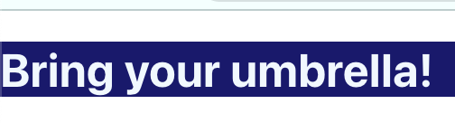

React components may need to display different things depending on certain conditions.  This is called **Conditional Rendering**. Conditional rendering allows you to change the output with logical operators.   This includes `if`, `if/else`, logical AND (`&&`) operator, and the ternary operator.

## `if` statements

We can use `if` statements to create conditions.  Those conditions then determine the output of our application.

In the example below, we have two functions, `Rainy` and `Sunny`.  Each one returns a simple `<h1>` message.

In the `App` function, we use an `if` statement and `props` to render which statement will appear in the browser.  The `if` block starts at line 15, and declares `isRainy` as `true`.  This will return the message from the `Rainy` function.  When `isRainy` is not `true`, it will return the ` <h1>No rain today!</h1>` message instead.

{}


[Try it!](https://codesandbox.io/s/rainorshine-if-49kscs?file=/src/App.js)
   ```react{linenos=table,hl_lines=[14],linenostart=1}
   function Rainy(){
      return(
         <h1>Bring your umbrella!</h1>
      );
   }

   function RainOrShine(props){
      const isRainy = props.isRainy;
      if(isRainy){
         return(
            <Rainy />
         );
      }
      return(
         <h1>No rain today!</h1>
      );
   }

   export default function App(){
      return(
      <div>
         <RainOrShine 
            isRainy={true}
         />
      </div>
      );
   }
   ```
{}

{}
   ## Bring your umbrella!
{}


We don't always need to include the `else` statement if there are only two conditions.  
In fact, we could even compare two different functions with a single `if` statement.

In the example below, we added a second function, `Sunny` which will run if `isRainy` is not `true`.  
When `isRainy` is `false` or not `true`, the `Sunny` function will run and you will see a different message in the browser.
 
Currently, we are hardcoding these outcomes.  In the next chapter, you will learn about making this functionality more dynamic.

{}
   ```react{linenos=table,hl_lines=[14],linenostart=1}
   function Rainy(){
      return(
         <h1>Bring your umbrella!</h1>
      );
   }

   function Sunny(){
      return(
         <h1>Bring your sunglasses!</h1>
      )
   }

   function RainOrShine(props){
      const isRainy = props.isRainy;
      if(isRainy){
         return(
            <Rainy />
         );
      }
      return(
         <Sunny />
      );
   }

   export default function App(){
      return(
         <div>
         <RainOrShine 
            isRainy={false}
         />
      </div>
      );
   }
   ```
{}


{}
Try it out in this sandbox!  

Explore CodeSandbox:
1. Click the black left border.  
1. Click the hamburger menu in the top left corner.  
1. Select `App.js` to explore.


<iframe src="https://codesandbox.io/embed/rainorshine-if-rainy-sunny-s6on88?fontsize=14&hidenavigation=1&theme=dark&view=preview"
     style="width:100%; height:500px; border:0; border-radius: 4px; overflow:hidden;"
     title="RainOrShine-if-Rainy-Sunny"
     allow="accelerometer; ambient-light-sensor; camera; encrypted-media; geolocation; gyroscope; hid; microphone; midi; payment; usb; vr; xr-spatial-tracking"
     sandbox="allow-forms allow-modals allow-popups allow-presentation allow-same-origin allow-scripts"
   ></iframe>


{}

{}
   ## Bring your sunglasses!
{}

### `if/else`

What about the `else`?  In the examples above, we are not using else.
You could add an `else` block to the `RainOrShine` function.  It would have the same behavior and output.  

{}
   ```react{linenos=table,hl_lines=[14],linenostart=1}
   function RainOrShine(props){
      const isRainy = props.isRainy;
      if(isRainy){
         return(
            <Rainy />
         );
      }
      else { 
         return(
            <Sunny />
         );
      }
   }
   ```
{}

## `&&` statements

The logical `&&` operator is often used with `if` blocks.  It is often used for comparison between expressions.  It will be `true` if both expressions it is comparing are true.

| A  | B  | Returns |
|:---:|:---:|:---:|
| `true`  | `true`  | `true`  |
| `true`  | `false` | `false` |
| `false` | `true`  | `false` |
| `false` | `false` | `false` |

We can pair the logical `&&` operator with an `if` statement if we want to render an element or nothing.  

We could update our `RainOrShine` function to use the logical `&&` like this:

{}
   ```react{linenos=table,hl_lines=[14],linenostart=1}
   function RainOrShine(props){
      const isRainy = props.isRainy;
      const testWord = props.testWord;
      if((isRainy) && (testWord === "thunder")) {
         return(
            <Rainy />
         );
      }
   }
   ```
{}


We would need to add the `testWord` to the `App` function.

{}
```react{linenos=table,hl_lines=[14],linenostart=1}
   export default function App(){
      return(
         <div>
         <RainOrShine 
            isRainy={true}
            testWord={"thunder"}
         />
         </div>
      );
   }
   ```
{}

{}
   ## Bring your umbrella!
{}


If `testWord` was not `"thunder"`, then nothing would render.

{}
   ```react{linenos=table,hl_lines=[14],linenostart=1}
   export default function App(){
      return(
      <div>
         <RainOrShine 
            isRainy={true}
            testWord={"kangaroo"}
         />
      </div>
      );
   }
   ```
{}

{}
   ##  

   (Nothing is rendered.  This output represents a blank browser)
{}

{}
   You could also try using the logical Or `||` and the logical not `!` in your application too.

   These will work, but are not as useful as the `&&`.
{}


## Ternary Operator

The **ternary operator** is a single-line expression of an `if/else` statement.  

### Syntax
{}
   ```js{linenos=table,hl_lines=[],linenostart=1}
   condition ? ifTrueExpression : ifFalseExpression
   ```
{}

This would look like the following in JavaScript:
{}
   ```js{linenos=table,hl_lines=[],linenostart=1}
   let creature = "cat";
   let creatureSound = creature = "cat" ? "Meow!" : "Woof!";  
   console.log(creatureSound)
   ```
{}

{}
   Meow! 
{}

Ternary statements are simplified `if/else` blocks.  We could update our `RainOrShine` function with a ternary operator like this:

{}
   ```react{linenos=table,hl_lines=[1,11],linenostart=1}
    function RainOrShine(props){
      const isRainy = props.isRainy;
      return isRainy ?  <Rainy /> : <Sunny />
   }


   function App() {
      return (
         <div>
            <RainOrShine
            isRainy={true}
            />
         </div>
      });
   }
   ```
{}

{}
   ## Bring your umbrella!
{}


## Other applications for Conditional Rendering

Conditional Rendering can also be applied to the styling of elements. 
Let's add some to our `RainOrShine` function.  We will need set the conditional as part of the `className`.

{}
   ```react{linenos=table,hl_lines=[1,11],linenostart=1}
   const isRainy = true;

   function RainOrShine(props){
      const isRainy = props.isRainy;
      return isRainy ? <Rainy /> : <Sunny />
   }


   function App() {
      return (
         <div className={`${isRainy === true ? "dark" : "light"}`}>
            <RainOrShine />
         </div>
      });
   }
   ```

```css{linenos=table}
//inside App.css

   .dark {
   background-color: midnightblue;
   color:aliceblue;
   }

   .light {
   background-color: paleturquoise;
   color:darkorange;
   }
```

{}

{}
   
{}

In the code example above, we had to refactor `isRainy`. First, we declared `isRainy` outside of `RainOrShine`. Remember that React, like JavaScript compiles from top to bottom. We need to declare it before the `className` in line 11 else it renders as undefined. By declaring `isRainy` outside of a function, it doesn't need curly braces.  We can declare it as we would in a typical JavaScript application.

In line 11, we placed the ternary statement inside a template literal. The ternary operator is a code block; use the `$` escape symbol to ensure it renders like a code block and not a string.`

We placed the styling inside the `<div>`. The styling will only apply to the `<div>` with that `className`.


## Check Your Understanding

{} 
Given the following code, select the output message.

 ```react{linenos=table,hl_lines=[],linenostart=1}
//inside App.js

function Trees(props) {
  const isEvergreen = props.isEvergreen;
  const name = props.name;
  if (isEvergreen) {
    return <h1>{name} is an Evergreen tree</h1>;
  }
}

export default function App() {
  return (
    <div className="App">
      <Trees isEvergreen={true} name="Silver Fir" />
      <Trees isEvergreen={false} name="Sweet Gum" />
    </div>
  );
}
```

1. Silver Fir is an Evergreen tree
1. Sweet Gum is a Deciduous tree
1. undefined

<!-- answer: A -->
{}

{} 

Refactor `HowToSeason` so that it returns a ternary statement

 ```react{linenos=table,hl_lines=[],linenostart=1}
function AddSalt() {
  return <p>Add some salt</p>;
}
function HowToSeason(props) {
  const isBland = props.isBland;
  if (isBland) {
    return <AddSalt />;
  }
  return <p>Just right!</p>;
}

export default function App() {
  return (
      <div>
        <HowToSeason isBland={false} />
      </div>
  );
}

```

 
1. ```react{linenos=table,hl_lines=[],linenostart=1}
   function HowToSeason(props) {
   const isBland = props.isBland;
   return isBland : <AddSalt /> ? <p>It's just right</p>;
    }
   ```
1. ```react{linenos=table,hl_lines=[],linenostart=1}
   function HowToSeason(props) {
   const isBland = props.isBland;
   return isBland ?  <p>It's just right</p> : <AddSalt />;
    }
   ```
1. ```react{linenos=table,hl_lines=[],linenostart=1}
   function HowToSeason(props) {
   return isBland ?  <p>It's just right</p> : <AddSalt />;
    }
   ```
    
1. ```react{linenos=table,hl_lines=[],linenostart=1}
   function HowToSeason(props) {
   const isBland = props.isBland;
   return isBland ? <AddSalt /> : <p>It's just right</p>;
    }
   ```

   <!-- answer: D -->

{}

{} 

The code should render the "Add some spicy spices!" message.  Help debug the issue.

 ```react{linenos=table,hl_lines=[],linenostart=1}
let spicySpices = ["Cayenne", "Chili powder", "Gochugaru"];

function TurnUpTheHeat(props) {
  const isBland = props.isBland;

  if (isBland && spicySpices.length < 0) {
    return <h1>Add some spicy spices!</h1>;
  }
}
```

1. The issue is in line 1. The array is not declared correctly.

1. The issue is in line 4.  Props are used incorrectly.

1. The issue is in line 6. It should be greater than 0.

1. The issue is in line 6.  `isBland` should be encased in curly braces.

<!-- answer: C -->

{}
