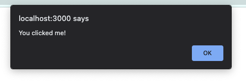

## Using JavaScript in React

React is a JavaScript library which means we can use JavaScript in our React applications.

You can use JavaScript expressions to create loops, variables, functions, conditionals, objects, and strings in React projects.

With some slight syntax differences, we can use DOM and Window events, such as `alert` or `onclick` in our React applications.  

{} 

While you can use the event handlers you learned about in previous lessons, the syntax may vary.

In React part 1, we used `className` to apply CSS stylings instead of `class`. This is because `class` is a JavaScript keyword.  React adapted by using `className`.  Note the use of camelCase.

We can use the `onclick` method in React, but we need to apply camel casing to the name: `onClick`.   

W3 Schools created some nice examples of [React Events](https://www.w3schools.com/react/react_events.asp) if you would like to learn more.

{}

### JavaScript Variables
We can render variables inside our components and function by encasing them in curly braces `{ }`. The curly braces act as escape characters for JSX.   

{} 
   ```react{linenos=table,hl_lines=[],linenostart=1}
   const name = "Willow"

   function Hello(){
      return(
         <p>Hello! My name is {name}!</p>
      );
   };

   export default Hello;
   ```
   {}

{}

Hello! My name is Willow!

{}

`name` was declared in line 1, as a JavaScript string.  We can render it inside the `Hello` function by using curly braces.  The curly braces let the JSX and HTML know that we want to use the variable `name` and its value.  If we left off the curly braces, the word name would appear in the browser.  The message would read "Hello! My name is name".  


### Template literals

You can use template literals to work with strings.  This can be easier than concatenation and more flexible than hard coding.  These can be very useful with loops, conditionals, and lists. 

Template Literal syntax:
- Encase the entire template literal within `{ }` since it is a JavaScript string 
- Enclose the entire string in backticks `` 
- Variables need to be inside curly braces `{variableNameHere}`
- `$` are escape tokens and introduce each variable within the template literal `${variableNameHere}`

Should look something like this when you put it all together: `{'Hello, ${variableNameHere}'}`

{} 
```react{linenos=table,hl_lines=[],linenostart=1}
let num1 = 4;
let num2 = 7;
num2 = 8

function TemplateLiteral(){
   return(
      <div>
         {`(${num1} * ${num2}) is ${num1 * num2} and (${num1} + ${num2}) is ${num1 + num2}`}
      </div>
   );
};

export default TemplateLiteral;
```
{}

{}

   (4 * 8) is 32 and (4 + 8) is 12

{}


### Arrow Functions
**Arrow functions** are simplified functions.  They can be used as arguments and passed to other functions because they do not affect the global scope of the project.  This makes them very useful for defining props, working with loops, and conditional statements.  These functions will return values without using the `return` keyword.

Why not only use arrow functions?  For long functions.  They are great for short expressions but longer functions can be hard to read.

{} 
```react{linenos=table,hl_lines=[],linenostart=1}
//comparing functions

function Greeting(){
  return( 
      <h1>Hello!  I am a standard function.</h1>   
   );
}

const ArrowGreeting = () => (
      <h1>Hello! I am an arrow function.</h1>
);
```
{}

{}

## Hello! I am a standard function.

## Hello! I am an arrow function.

{}

{} 
```react{linenos=table,hl_lines=[],linenostart=1}
//function with an arrow function

function ShinyButton(){
   const handleClick = () => {
      alert("You clicked me!");
   }
   return(
      <button onClick={handleClick}>
         Click This Button!
      </button>
   );
}

export default ShinyButton;
```
{}

{}



{}


### Working with Props and JS
//TODO: format as relref link

If you recall from the [PREVIOUS CHAPTER](react-lsn1/reading/components/#functional-components), props are arguments passed to and between functions.  We can use anything as a prop, since props are placeholders.

We can use props to pass data between components.

{} 
```react{linenos=table,hl_lines=[],linenostart=1}
function GreetFriend(props) {
   return(
      <h1>Hello, {props.name}!</h1>
   );
}

function Greeting(){
   return(  
      <>
         <GreetFriend 
            name="Willow" 
         />
      </>
   );
}

export default Greeting;
```
{}

{}

## Hello, Willow!

{}

We can declare our props.  This can make the code more meaningful and easier for humans to understand.

{} 
```react{linenos=table,hl_lines=[],linenostart=1}
function GreetFriend(name) {
   return(
      <h1>Hello, {name}!</h1>
   );
}

function Greeting(){
   return(  
      <>
         <GreetFriend 
            name="Willow" 
         />
      </>
   );
}

export default Greeting;
```
{}

{}

## Hello, Willow!

{}

We can also set default variables for props.  

{} 
```react{linenos=table,hl_lines=[],linenostart=1}
function GreetFriend(name ="Tacocat") {
   return(
      <h1>Hello, {name}!</h1>
   );
}

function Greeting(){
   return(  
      <>
         <GreetFriend 
            name="Willow" 
         />
         <GreetFriend />
      </>
   );
}
export default Greeting;
```
{}

{}

## Hello, Willow!
## Hello, Tacocat!

{}


{} 
   Lines 9 and 14 in the example above are empty tags.
   These are called **Fragments**.  [Fragments](https://react.dev/reference/react/Fragment#usage) allow you to group multiple elements and treat them as a single element.  You will often find fragments in return statements.
{}

### Importing and Exporting 

**Exporting Components**

There are multiple ways to export.  We recommend you pick one way and remain consistent with it throughout your codebase. It will help with readability.

{} 
**Option 1:** After the function
```react{linenos=table,hl_lines=[],linenostart=1}
function GreetFriend(name ="Tacocat") {
   return(
      <h1>Hello, {name}!</h1>
   );
}

export default GreetingFriend;
```

**Option 2:** As part of the declaration
```react{linenos=table,hl_lines=[],linenostart=1}
export default function GreetFriend(name ="Tacocat") {
   return(
      <h1>Hello, {name}!</h1>
   );
}
```
{}

**Importing Components**

You can import components to other components, not just `App.js`.  
In the example above, `GreetFriend` and `Greeting` are in the same file.  We could create separate files for them and import `GreetFriend` into `Greeting`.  

**Importing Other Things**

You can import non-component portions of your codebase. JSON files are a commonly imported item.  

Data stored in a JSON file.  In this example, it is a name.  Component for `GreetFriend` importing the JSON file and using it to complete the greeting message.  

{} 
```react{linenos=table,hl_lines=[],linenostart=1}
// File is nameData.json
{
   "name": "Hermes"
}
```
When you import something that you plan to use in a function, be sure to give it a name if none exists.  In this example, there is only a file name.  We assigned it the name `data`.  This `data` is an object, so we can use dot notation to access the object's values with the keys.

```react{linenos=table,hl_lines=[],linenostart=1}
import data from './nameData.json'

function GreetFriend() {
   return(
      <h1>Hello, {data.name}!</h1>
   );
}
```
{}

{}

## Hello, Hermes!

{}

## Check Your Understanding

{} 
What structure is used to contain JavaScript variables?

   1. Brackets `[ ]`
   1. Parentheses `( )`
   1. Double Quotes `" "`
   1. Curly Braces `{ }`

<!-- answer: A -->
{} 

{} 
   ```react{linenos=table,hl_lines=[],linenostart=1}
   const bookInfo = {
      title: "Dracula",
      author: "Bram Stoker",
      published: 1897 
   }

   function Book(){
      return(
         <p>My favorite book is {title}</p>
      );
   };

   export default Book;
   ```

   Is returning the following error:
   ```bash
   'title' is not defined  no-undef
   ```

   Which syntax will correctly assign a value to `title`?

   1. 
      ```react
      <p>My favorite book is Dracula</p>
      ```
   1. 
      ```react
      <p>My favorite book is {bookInfo.title}</p>
      ```
   1. 
      ```react
      const BookInfo = () => {
         return(
            <p>My favorite book is {title}</p>
         );
      }
      ```
   1. 
      ```react
      function Book(props){
         return(
            <p>My favorite book is {props.title}</p>
         );
      };
      ```

   <!-- answer: B -->
{}

{} 
How would you rewrite the following arrow function as a regular function?
```react
const SayHello = () => {
   
   return(
      <h1>Hello!</h1>
   );
}

export default SayHello;
```

1. 
   ```react
      function SayHello(){
            return(
            <h1>Hello!</h1>
         );
      }
   ```  

1. 
   ```react
      function SayHello("Hello"){
            return();
      }
   ```  

1. 
   ```react
      const SayHello(){
            return(
            <h1>Hello!</h1>
         );
      }
   ```  
1. 
   ```react
      function SayHello(){
            return(
            <h1>{Hello!}</h1>
         );
      }
   ```  
<!-- answer: A -->
{}