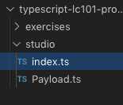

# Studio: TypeScript

Let\'s practice TypeScript by creating classes for rocket cargo
calculations.

## Starter Code

If you have not already done so, follow the instructions given in the
`TypeScript exercises <TS-repo>`{.interpreted-text role="ref"} to fork
the GitHub repository.

Use the terminal to check that you are in the `master` branch, then
navigate into the `studio` folder.

``` bash
$ git branch
   * master
   solutions
$ pwd
   /typescript-lc101-projects
$ ls
   exercises       studio
$ cd studio
$ ls
   index.ts    Payload.ts
```

From the file tree in VSCode, open the `index.ts` file.



## Requirements

1.  Create classes for `Astronaut`, `Cargo`, and `Rocket`. (Details
    below).
    a.  All classes should be defined in their own files.
2.  Use the new classes to run a simulation in the `index.ts` file.

In the starter code, you will notice that an interface named `Payload`
has been declared. This interface ensures that any class that implements
it will have a `massKg` property.

## Classes

1.  Create three new files\-\--`Astronaut.ts`, `Cargo.ts`, and
    `Rocket.ts`. To do this in VSCode, click the \"New File\" button and
    enter the file name. Another option is to run the command
    `touch new_file_name` in the terminal.

    

2.  Define each class (`Astronaut`, `Cargo`, `Rocket`) in a separate
    file. Each class should be exported using `export`.

    ``` js
    export class Astronaut {
       // properties and methods
    }
    ```

3.  As needed, the classes can be imported using `import`.

    ``` js
    import { Astronaut } from './Astronaut';
    ```

### Astronaut Class

1.  Defined in `Astronaut.ts`
2.  Implements the `Payload` interface
3.  Properties
    a.  `massKg` should be a number.
    b.  `name` should be a string.
4.  Constructor
    a.  Parameter `massKg` should be a number.
    b.  Parameter `name` should be string.
    c.  Sets value of `this.massKg` and `this.name`.

### Cargo Class

1.  Defined in `Cargo.ts`
2.  Implements the `Payload` interface
3.  Properties
    a.  `massKg` should be a number.
    b.  `material` should be a string.
4.  Constructor
    a.  Parameter `massKg` should be a number.
    b.  Parameter `material` should be a string.
    c.  Sets value of `this.massKg` and `this.material`

### Rocket Class

1.  Defined in `Rocket.ts`.
2.  Properties:
    a.  `name` should be a string.
    b.  `totalCapacityKg` should be a number.
    c.  `cargoItems` should be an array of `Cargo` objects.
        -   Should be initialized to an empty array `[]`
    d.  `astronauts` should be an array of `Astronaut` objects.
        -   Should be initialized to an empty array `[]`
3.  Constructor:
    a.  Parameter `name` should be a string.
    b.  Parameter `totalCapacityKg` should be a number.
    c.  Sets value of `this.name` and `this.totalCapacityKg`
4.  Methods:
    a.  `sumMass( items: Payload[] ): number`
        -   Returns the sum of all `items` using each item\'s `massKg`
            property
    b.  `currentMassKg(): number`
        -   Uses `this.sumMass` to return the combined mass of
            `this.astronauts` and `this.cargoItems`
    c.  `canAdd(item: Payload): boolean`
        -   Returns `true` if
            `this.currentMassKg() + item.massKg <= this.totalCapacityKg`
    d.  `addCargo(cargo: Cargo): boolean`
        -   Uses `this.canAdd()` to see if another item can be added.
        -   If `true`, adds `cargo` to `this.cargoItems` and returns
            `true`.
        -   If `false`, returns `false`.
    e.  `addAstronaut(astronaut: Astronaut): boolean`
        -   Uses `this.canAdd()` to see if another astronaut can be
            added.
        -   If `true`, adds `astronaut` to `this.astronauts` and returns
            `true`.
        -   If `false`, returns `false`.

## Simulation in `index.ts`

Paste the code shown below into `index.ts`.

``` {.js linenos=""}
import { Astronaut } from './Astronaut';
import { Cargo } from './Cargo';
import { Rocket } from './Rocket';

let falcon9: Rocket = new Rocket('Falcon 9', 7500);

let astronauts: Astronaut[] = [
   new Astronaut(75, 'Mae'),
   new Astronaut(81, 'Sally'),
   new Astronaut(99, 'Charles')
];

for (let i = 0; i < astronauts.length; i++) {
   let astronaut = astronauts[i];
   let status = '';
   if (falcon9.addAstronaut(astronaut)) {
      status = "On board";
   } else {
      status = "Not on board";
   }
   console.log(`${astronaut.name}: ${status}`);
}

let cargo: Cargo[] = [
   new Cargo(3107.39, "Satellite"),
   new Cargo(1000.39, "Space Probe"),
   new Cargo(753, "Water"),
   new Cargo(541, "Food"),
   new Cargo(2107.39, "Tesla Roadster"),
];

for (let i = 0; i < cargo.length; i++) {
   let c = cargo[i];
   let loaded = '';
   if (falcon9.addCargo(c)) {
      loaded = "Loaded"
   } else {
      loaded = "Not loaded"
   }
   console.log(`${c.material}: ${loaded}`);
}

console.log(`Final cargo and astronaut mass: ${falcon9.currentMassKg()} kg.`);
```

## Compile and Run `index.ts`

1.  Use the terminal in VSCode to compile your `index.ts` file. This
    will also compile the modules you imported into the file
    (`Astronaut.ts`, `Rocket.ts`, etc.).
2.  Use the command `node index.js` to run the JavaScript file created
    during the build process.

``` bash
$ ls
   Astronaut.ts    Cargo.ts        Payload.ts      Rocket.ts       index.ts
$ tsc index.ts
$ ls
   Astronaut.js    Cargo.js        Payload.js      Rocket.js       index.js
   Astronaut.ts    Cargo.ts        Payload.ts      Rocket.ts       index.ts
$ node index.js
```

### Expected Console Output

    Mae: On board
    Sally: On board
    Charles: On board
    Satellite: Loaded
    Space Probe: Loaded
    Water: Loaded
    Food: Loaded
    Tesla Roadster: Not loaded
    Final cargo and astronaut mass: 5656.78 kg.

## Submitting Your Work

1.  Once you have your project working, use the terminal to commit and
    push your changes up to your forked GitHub repository.
2.  Login to your account and navigate to your project. Copy the URL.
3.  In Canvas, open the TypeScript studio assignment and click the
    \"Submit\" button. An input box will appear.
4.  Paste the URL for your GitHub project into the box, then click
    \"Submit\" again.
